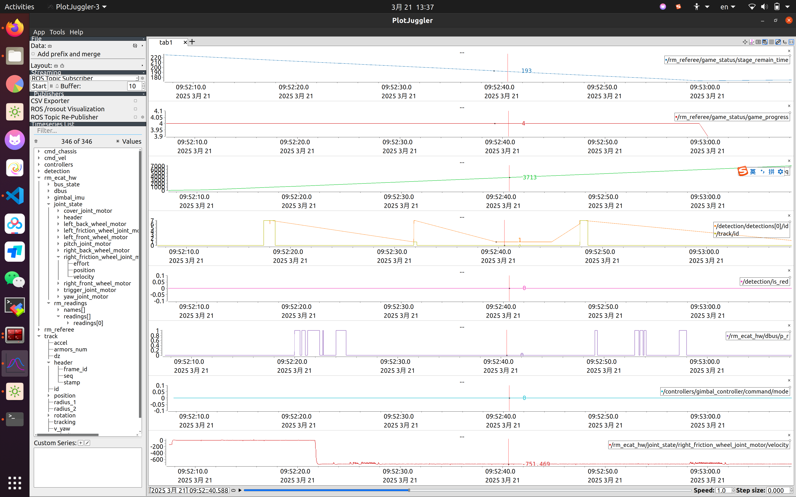
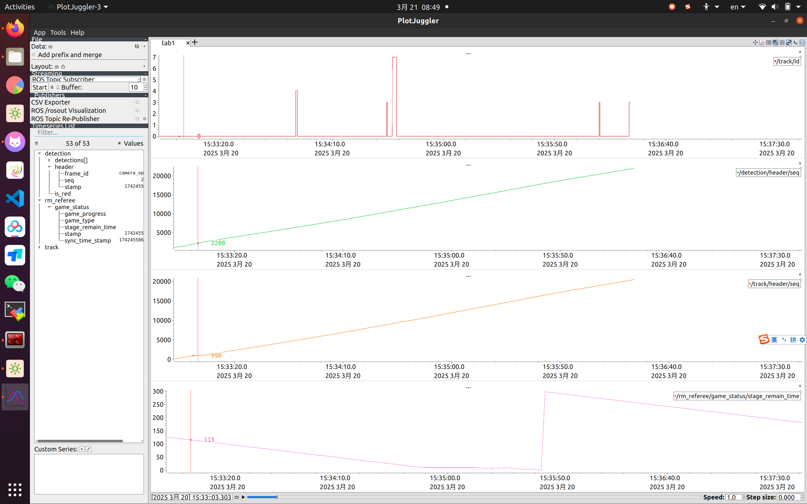

## 录bag和跑bag

1. 录bag前
   * 不要开rqt或者plotjuggler录
   * 看下海康原图和/detection的帧率先

2. 跑程序后，在车上`rosbag record topic1 topic2 ....`,录完之后bag会存在当前文件夹下
    **视觉一般需要录的topic：**
    * 相机的compressed
    * 相机的camera_info
    * /Processor/digtialimg_proc/debug_image/compressed
    * /processor/result_msg
    * /deteciton
    * /track
    * /change
    * /tf和/tf_static
    * /controllers/shooter_controller/command(里面有mode可以看REANDY和PUSH)
    * /controllers/gimbal_controller/error
  
    ```shell
    rosbag record /hk_camera/camera/camera_info /Processor/digtialimg_proc/debug_image/compressed /processor/result_msg /detection /track /change /tf /tf_static /controllers/shooter_controller/command /controllers/gimbal_controller/error
    ```

3. scp移到自己电脑上

4. 在自己电脑上播放bag
   1. `rosparam set /use_sim_time true` —— 同步时间，为了对上tf的时间戳
   2. `rosbag play xxxxx -l --clock --topic <topic1>`
    * `-r 0.5`:0.5倍速播放
    * `-l`:循环播放
    * `--clock`:设置虚拟时间，为了同步时间
    * `--topic <topic1>`:指定topic播放
    * `-s t`:在bag的t秒开始播放
    
    ```shell
    rosbag play xxx.bag -l --topics /processor/result_msg /hk_camera/camera/camera_info /track /tf /tf_static
    ```

5. 验证bag
   1. 看海康原图的帧率(165左右)
   2. 看/detection帧率

## 看场上的bag
**先看ros的bag，看哪个时间点视觉死了，再去对应的系统日志看视觉有没有死的消息**

### ros的bag
* 位置：/Ducument/control
* 算bag对应的时间:记录比赛开始的时间，减8h即为bag时间(不用加2min)
* 操作：把对应的bag拉下来，加载进plotjuggler看曲线(可以把bag一次性加载进plotjuggler)(拉下来后可以先`rosbag info`看下时间点对不对)


  * /rm_referee/game_status/stage_remain_time：可以看比赛开始的时间(读了裁判系统)，联盟赛从300s开始倒数(比赛时间5min)，对抗赛从420s开始倒数(比赛时间7min)
  * /rm_referee/game_status/game_progress:比赛开始的标志位(4:比赛开始  1:准备中)
  * 可以看detection和track下的id看有无识别到装甲板
  * /detection/is_red: 0:我方为红方  1：我方不是红方
  * /rm_ecat_hw/dbus/p_r:鼠标右键
  * /controllers/gimbal_controller/command/mode: 0:RATE(速率模式) 1:TRACK(跟踪)
  * track和detection下的header/seq若没有数据：掉识别了(记住此时的时间戳，去系统日志看是什么节点死了)
  * track平的 && detection一直有数据：关控了

### 系统日志
* 位置：/Ducument/syslog(没有再去看/var/log/syslog)
* 操作
  * 把syslog拉下来看(也可以在车上用vim看)
  * 定位对应的时间点看是什么节点死了
  * Tips:一堆@表示关机(用vim看)

## bag修复
**标志：** bag的后缀为.bag.active
**步骤：(要在车上修复，因为车上才有对应的topic)** 
1. `rosbag reindex 1.bag.active`
2. `rosbag fix 1.bag.active 1.bag` 

## bag截取
`rosbag filter 2.bag 2_output.bag "(topic =='/hk_camera/camera/image_raw/compressed' or topic =='/hk_camera/camera/camera_info') and (t.to_sec() >= 1742546121.004289 and t.to_sec() <=  1742546135.004289)"`
* t.to_sec():bag中ros对应的时间戳，需要播放bag在终端复制


