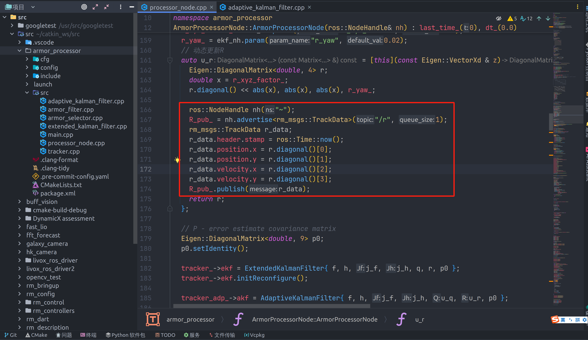
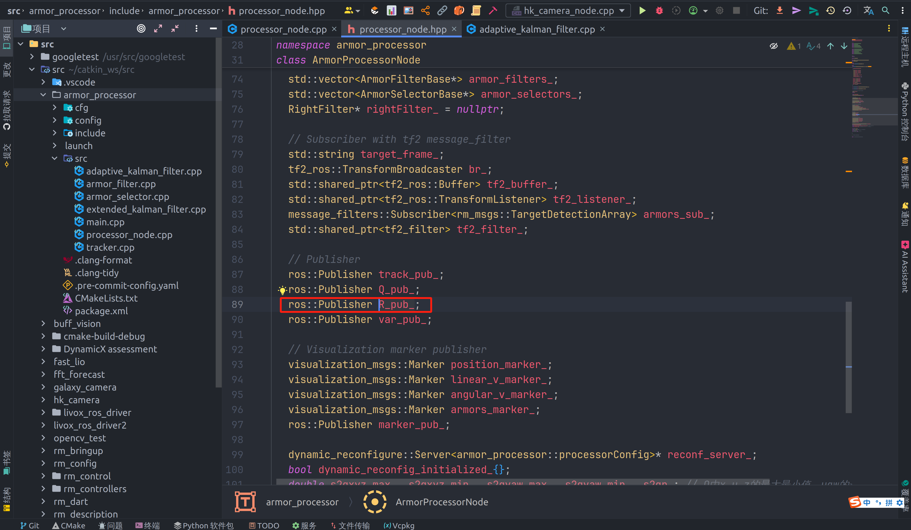

### 步骤
1. 创建一个发布者(一般在头文件中)
2. 用句柄advertise到一个topic上(一般在构造函数中) [类似于建立一个通道]
3. 创建一个消息，并往消息中填你想发出来的数据(注意消息类型要和advertise的一样)
4. 用发布者publish出来

**Tips:** 通道(advertise)一定要先于publish创建，不然会报错。也要注意是不是通道销毁后才publish