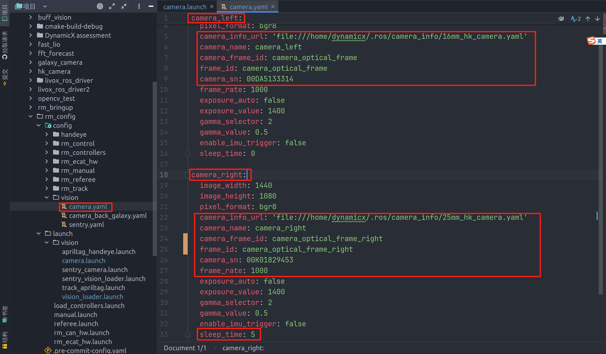
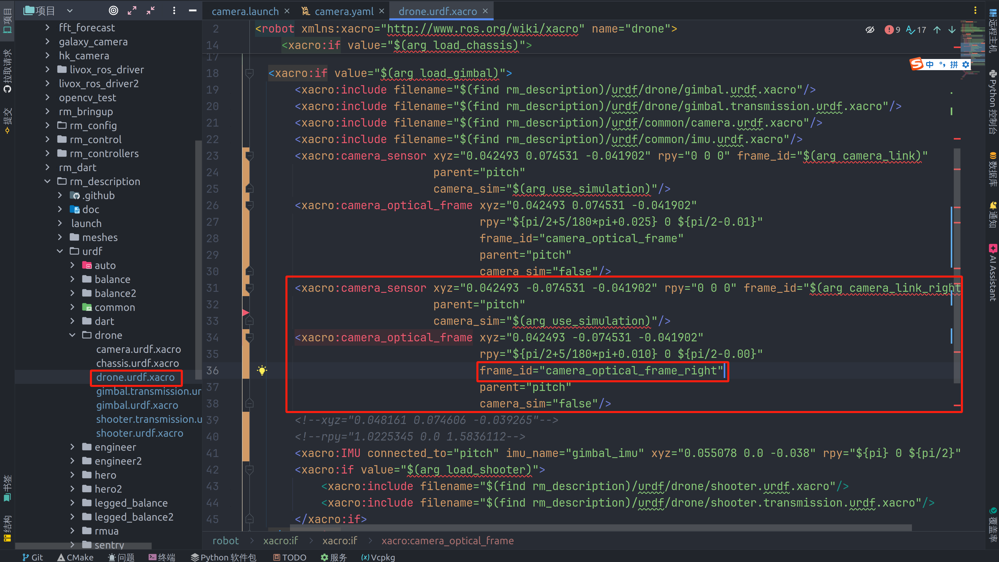
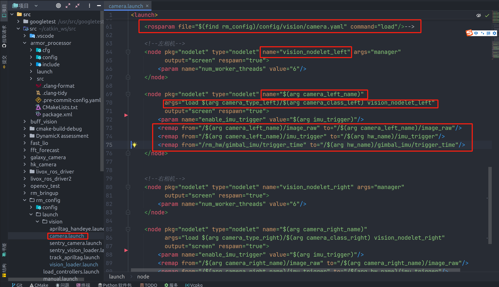
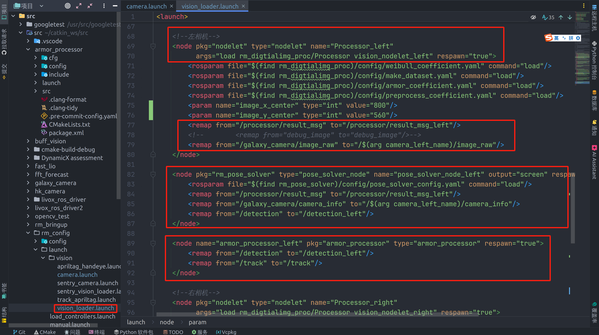
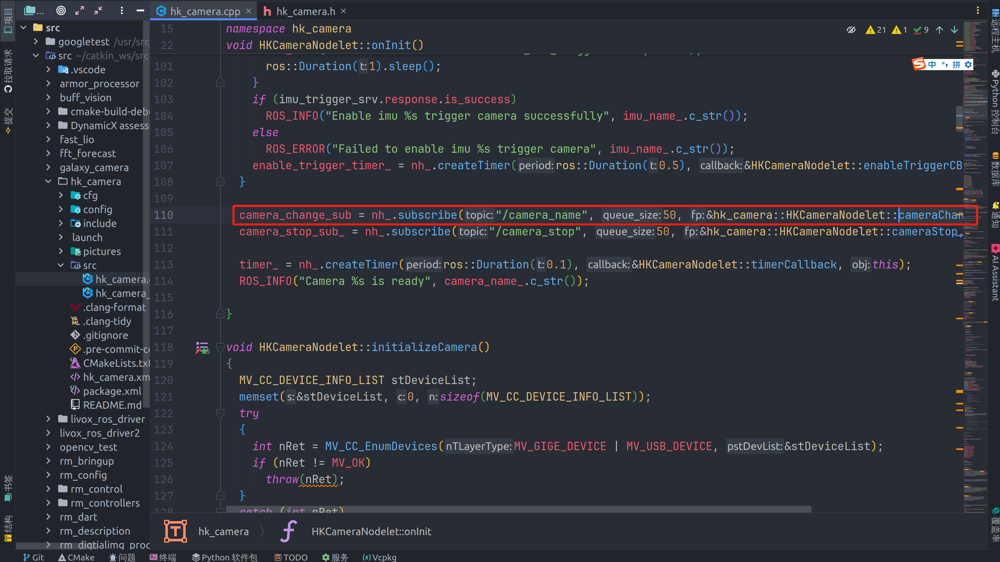
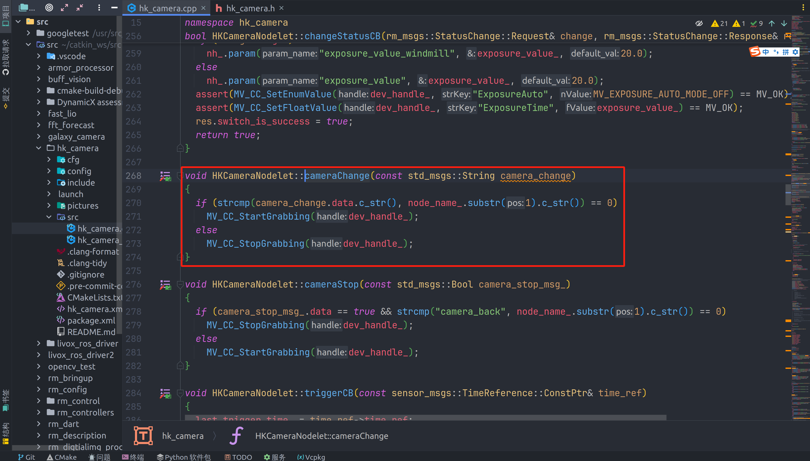

## 同时开双相机 —— 写两个相机节点

### 1. camera.yaml

* 第二个相机要多写一个frame_id和camera_frame_id,且两个值相同(具体看hk包)
* namespace(camera_left)要与launch中的节点名字(node中的name)对应(不然读不进来参的)

### 2. 相机的urdf

* 改urdf中第二个相机的frame_id
* camera_sensor是用来跑仿真用的，不用管

### 3. camera.launch

* 修改节点名字和remap

### 4. vision_loder.launch

* 同理

## 切双相机(以按键切换为例)

* 让控制发到对应topic，消息类型是字符串。发什么就切哪个相机

