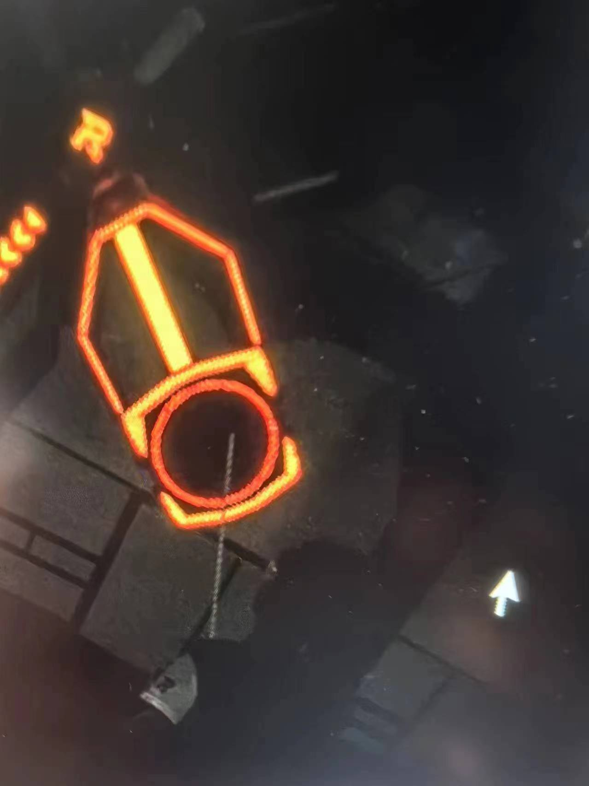
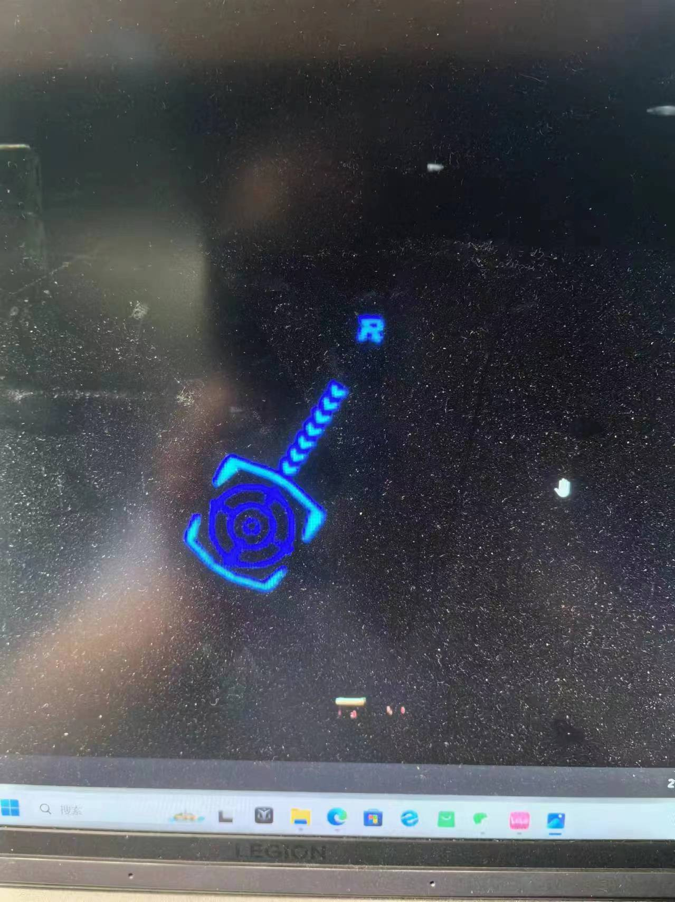

### 步骤

1. Open Dir，选择对应的文件夹
2. Edit->Create Polygons(可以用快捷键)
3. 绘制(见视频)
4. 输入名字
5. Ctrl+S保存(与图片相同的文件夹)
6. 下一张

### Tips

**图案与对应的名字**
下图标为red_action(不用管红蓝，就是red)

下图标为red_activate(不用管红蓝，就是red)
  

**标点顺序一定要和视频里的一样**
顺序不同生成的json文件会不一样(具体可以点进去看看)

**隔3张标一张**

**图案被遮挡了不用标**
