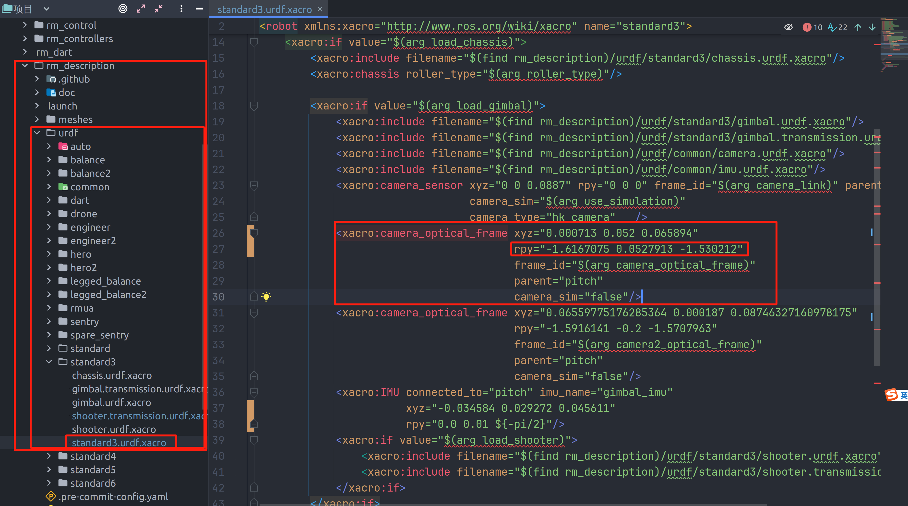
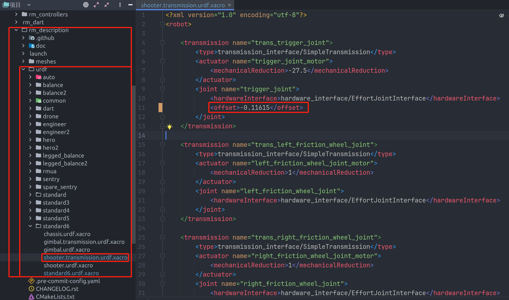
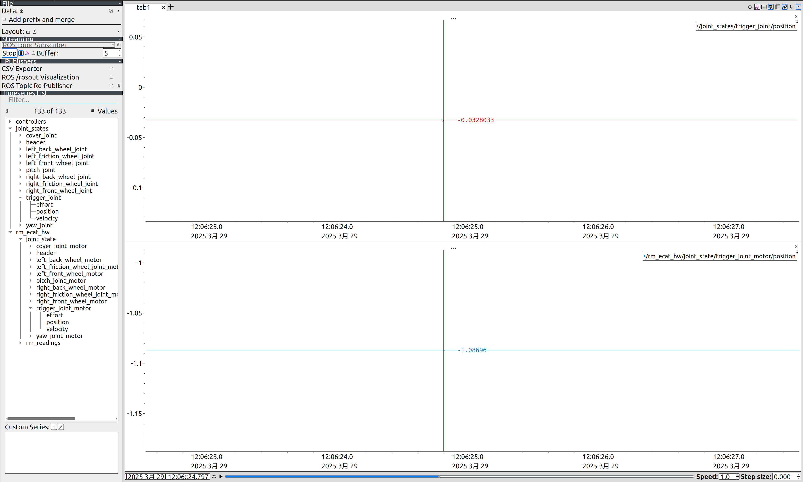

# 自瞄笔记

## 调相机光心

* 前提：静止靶下
* 方法：只动ry，上给大下给小、左给大右给小(想子弹往上大就调大，想子弹往左打就给大)**(算上前面的负号)**，改动小数点第二位(改动0.01-0.02即可)
* 步兵第一个瞄、第二个符，英雄第一个平地、第二个斜坡

## 调射频

* 1表示1hz(1s打一颗弹)，若要改射频5个都要改

-----------------------------
**下述视觉不要求**

## 调offset

### 原理
理想状态下，拨盘到摩擦轮的距离为弹丸直径的整数。但实际上有时不是整数倍，导致弹丸过紧或过松，导致双发或者打不出来。
* offset为拨盘电机(3508)实际位置和校准0值的差，用来补偿拨盘的校准。

#### 步骤
1. 将offset改成0上传
  
2. 手动校准拨盘(摩擦轮要抵住)
3. 重启控制器trigger_calibration_controller
  
4. 拉曲线
  
  红色曲线对应的数即为offset，填上去即可
  * rm_ecat_hw:电机实际位置，所以蓝色曲线为拨盘实际位置
  * joint_states:电机补偿后的值(此处的position为校准0值)，所以将红色曲线的值填上去后可校准为0

## 调云台

### 先调通用的超前和滞后

* 前提
  * 关掉提前枪(调ban_shoot_duration使其等于gimbal_switch_duration)
  * 转速从80r/s往下慢慢减到30r/s，使之在高转速和低转速下都可以跟随
* track_rotate_target_delay(旋转的delay)：超前调小
* track_move_target_delay(平移的delay):测试架平移的时候调，超前调小(一般不用调)

### 调提前枪
* 转速85r/s左右
* 将ban_shoot_duration调为0，慢慢往上给，每次都录慢动作

## 初步准备

1. 测重复度
2. 修正odom坐标，在车urdf-imu-rpy处，三个值都有可能要改，优先调整roll的值
3. 调yaw和pitch的pid，要求精度：位置环pid pos-error在0.004-0.006左右，尖刺可以不管，看大概趋势
4. 调pitch重力补偿，位置环给0，开控制器
5. 调零飘：config/rm_ecat_hw/device_configurations，xyz置0，开控开摩擦轮，看angular_velosity，moving average给1000静置，分别记录xyz的平均值(max+min)/2

## 开瞄

1. 先给视觉调，看debug_image/depressed的识别图像，调曝光，达到静止靶稳定识别、识别框不闪
2. 调静止靶光心，在 车体urdf 的相机处，只动ry，上给大下给小、左给大右给小，步兵第一个瞄、第二个符，英雄第一个平地、第二个斜坡
3. track_rotate_target_delay、track_move_target_delay：跟随模式下旋转和平移的delay
4. delay：跟随模式下的发单延迟
5. gimbal_switch_duration：云台切换角所需时间（0.1）开自瞄和pl读值
6. ban_shoot_duration：在云台切换时间内的禁止发射的时间，这段时间内一定打不中，所以禁止，在过了这段时间后，发射是有可能打中下一块装甲板的，枪口和下一块相遇运动（0.04）
7. max_switch_angle、min_switch_angle：云台的最大切换角、最小切换角（max 50，min 2）
8. max_track_target_vel：最大跟随速度，即跟随模式和中心模式的临界点（12）
9. max_chassis_angular_vel：自身的陀螺速度，最终作用在切换角上，自身陀螺速度越高、切换角越小（12）
10. wait_next_armor_delay、wait_diagnoal_armor_delay：在中心模式下，等待下一块装甲板和下两块装甲板的delay。给一个远高于临界值的转速，调下两块的delay；再给一个较快的中心模式速度，调下一块的
11. min_shoot_beforehand_vel：最小提前枪速度，对方转速低到一定值时，提前枪反而会降低命中率，所以低速下不需要提前枪
10. min_fit_switch_count：视觉数据有尖刺，所以让判断帧数大于3帧，避免误判
