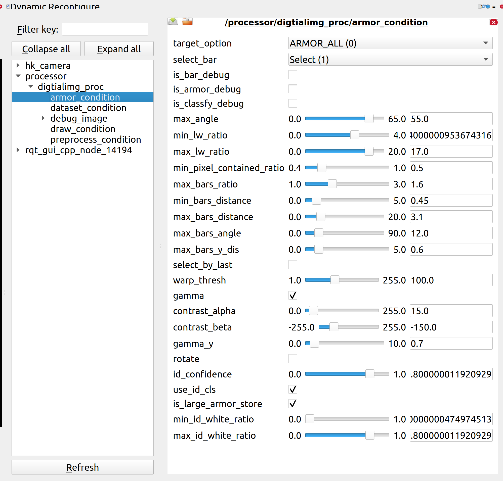
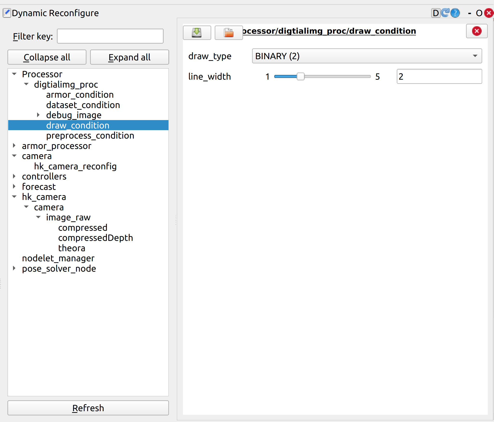
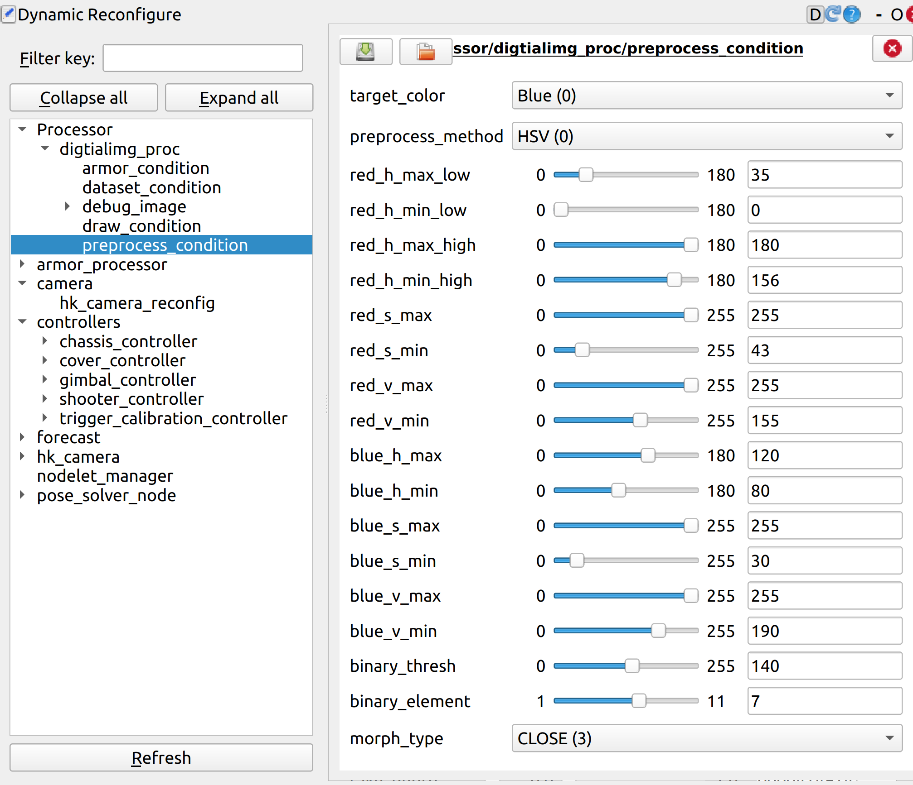
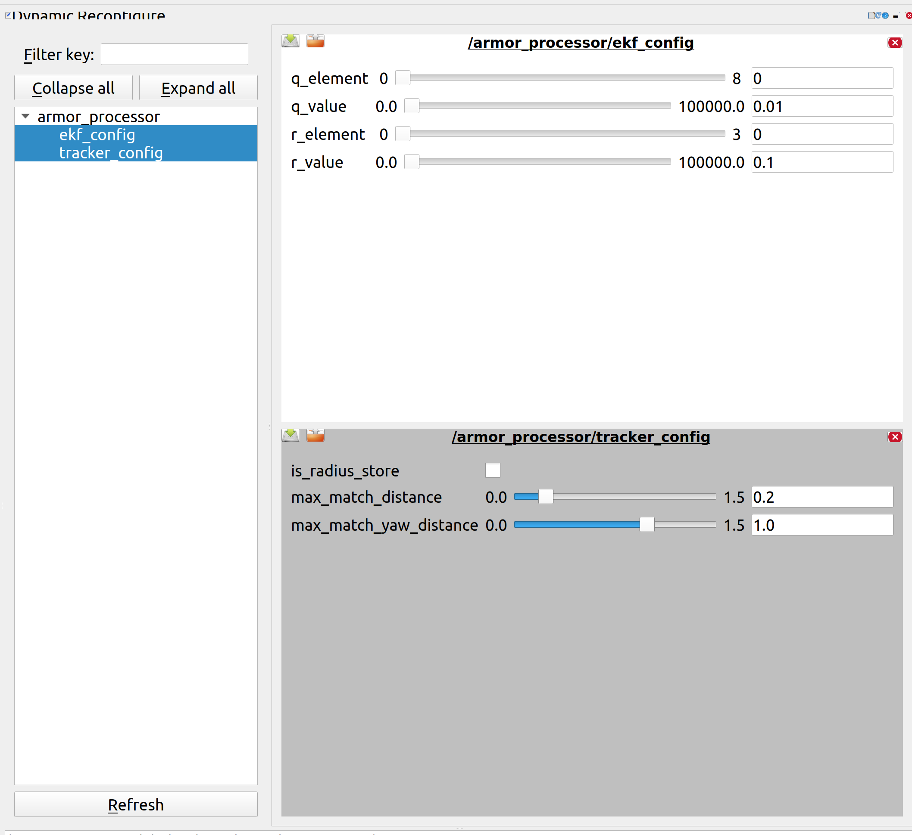
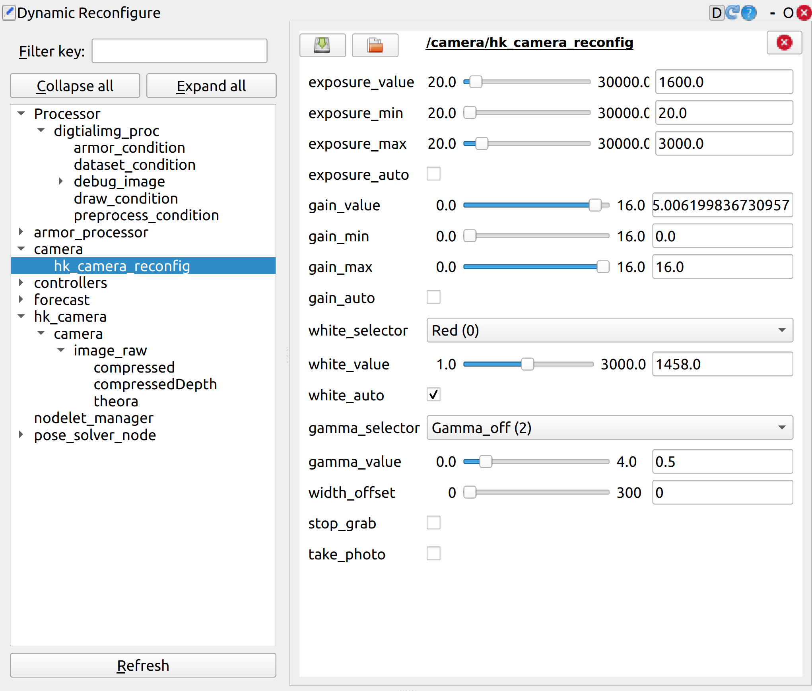
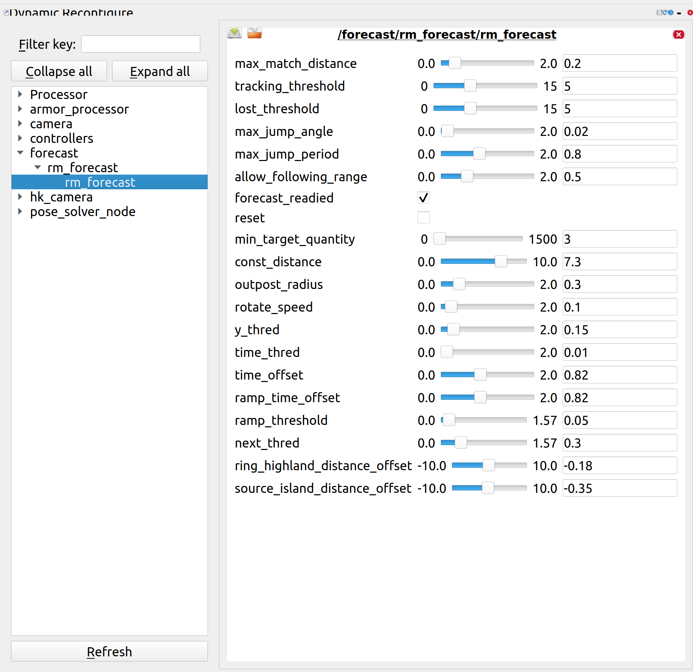

## 各动态参数的意思

### /Processor
#### /digtialimg_proc
##### /armor_condition —— 装甲板配置

max_bars_ratio等:调整相邻灯条的长宽比，距离，角度
gamma:伽马值(通过+-e^x^使亮暗过渡区域更亮或更暗)
rotate:相机倒置则勾选
use_id_cls:数字分类

##### /dataset_condition —— 录数据集
make_dataset:勾选表示开始录数据集(利用此开关开始和停止录数据集)
continue:勾选表示连续录数据集(若没勾选则再次勾选make_dataset会覆盖前面录的数据集)
image_num：表示一次性录多少张数据集

##### /draw_condition —— 切换模式

draw_type:
>DISABLE:无图像
RAW:原图像
BINARY:二值化后的图像
MORPHOLOGY:
BARS:框出灯条
ARMORS:框出装甲板
ARMORS_VERTEXES:
BARS_ARMORS:
WARP:数字的二值化图像
PROJECT:预测

line_width：画线的粗细

##### /preprocess_condition —— 图像预处理

target_color:目标装甲板红方还是蓝方
red_s_max:红方装甲板的饱和度(一般调和s有关的)

### /armor_processor —— 卡尔曼滤波
#### /ekf_config

Q(process noise covariance matrix):过程噪声协方差矩阵(9个数)
R(measurement noise covariance matrix):测量噪声协方差矩阵(4个数)


```shell
q: xc  yc  zc  yaw(裝甲板上一時刻的yaw角)  vxc  vyc  vzc  vyaw(上一時刻裝甲板的角速度)  r
r: xa  ya  za  yaw(此時觀察到的裝甲板的yaw角)

# 在yaml中
    q: [0.01, 0.01, 0.01, 0.02, 0.05, 0.05, 0.0001, 0.04, 0.001]
    r: [0.1, 0.1, 0.1, 0.2]
```

q_element：q矩阵中对应的元素下标
q_value：下标对应的元素值
r_element：r矩阵中对应的元素下标
r_value：下标对应的元素值


### /camera
#### /hk_camera_reconfig

exposure_auto:勾选表示开启自动曝光(一般不开启)
exposure_value:曝光值
exposure_max:曝光最大值(调车时一般先拉满，再去调value)
gamma_value:伽马值(这里一般在Processor中调，因为相机的伽马值不太行)

### /forecast
#### /rm_forecast/rm_forecast

max_jump_angle:(不用变)
max_jump_period:目标跳跃的最大时间间隔(不变)
allow_following_range:允许跟随的目标范围(不变)

forecast_readied:预测模块是否准备就绪(不变)
reset: false:是否重置系统

**min_target_quantity**:识别到正对装甲板的帧数，大于此值则判定此时为正对装甲板 **(常调)**
const_distance:固定距离(不变)
outpost_radius:前哨半径(不变)
rotate_speed:旋转速度(不变)

**y_thred**:决定了何时认为机器人正对装甲板 **(常调)**  
增大可更容易判断为"正对"状态 ——> suggest_fire有更多跳变 ——> 更多机会击打 

**time_offset**:时间偏移量 **(常调)**

ramp_time_offset:坡道时间偏移量
ramp_threshold:坡道阈值
next_thred:下一步阈值
ring_highland_distance_offset:环形高地距离偏移量
source_island_distance_offset:资源岛距离偏移量

### /pose_solver_node
#### /armor_condition
装甲板实际长和宽
is_interpolation:是否使用插值法

## 自瞄比较重要的topic
### 图像
* 海康的原图(image_raw)和compressed
* /Processor/digitalimg_proc/debug_image/compressed
### 视觉信息
* /processor/result_msg
* /detection
* /track(/change)

## 开视觉的步骤
1. draw_type调成5(在*Processor/digitalimg_proc/draw_condition*中)
2. target_color调红蓝方(在*preprocess_condition*中)
3. 不行restartvi
4. 再不行往下看

## 识别方面 —— rm_visplugin

### 相机识别不到(没图像)
先听下对应的话题有没有帧率(`rostopic hz /hk_xxx`)，若没有则停了视觉(`stopvi`)后单跑相机(`mon launch hk_xxx`),再做进一步检查

**特殊情况:** 若为哨兵，可能是其.bashrc中同时有无线连车的IP，导致IP冲突数据映射不过来
**验证方法**:小电脑中echo相机话题有数据，本机中echo为空


### 如果识别出问题
1. 先查看二值化的图像(binary)：在*Processor/digitalimg_proc/draw_condition中的draw_type*


2. 若二值化没问题则调相机的光圈(0.8-2.4之间)和对焦环(将画面调亮之后转对焦环直到看清楚灯条)
  
3. 根据二值化的图像来调整其曝光度(在*camera/hk_camera_reconfig*中)和 hsv(在*Processor/digitalimg_proc/preprocess_condition*)(主要是调_s_有关参数)(**一般调曝光就够了，hsv一般不用调，除非光线环境较特殊需要硬调**)

基本只需要调s就OK了(s:饱和度)


4. 若曝光太高导致帧率太低——调gamma_y提升亮暗中间区域
在/processor/digtialimg_proc/armor_condition中


5. 关掉数字分类

==Tips:记得调装甲板的红蓝方！==

### 常见情况

#### 发现识别一闪一闪的
**原因1：** 可能是K房开灯，灯亮的频率低于相机频率导致画面一闪一闪，一亮一暗。暗的一瞬间可能会导致识别不到导致装甲板识别闪烁
**验证方法：** 在旁边开手电筒补光，若识别效果提升则说明确实是开灯问题
**解决方法：** 换场地或者关灯

**原因2：** 若相机有竖线，即相机的CMOS感光芯片有问题(多是大恒)
**验证和解决方法：** 换相机

**原因3：** 可能是数字分类导致的置信度问题
**验证和解决方法：** 关掉数字分类后调置信度

#### 关掉数字分类后误识别成大装甲板(硬调)
**原因：** 筛选条件不够严格
**解决方法：** 减小max_bars_angle(在/processor/digtialimg_proc/armor_condition中)

#### 发现基本识别不到(且灯条和二值化没问题)
**原因：** 可能环境光不均匀导致的
**验证方法：** 在旁边开手电筒补光，若识别效果提升则说明是环境光问题
**解决方法：** 换地方(场上的灯光一般是均匀的)

#### 总是掉瞄(瞄不上)
* 可能是镜头松了or曝光没调


### 相机调完参数后
在rm_config/config/vision/camera.yaml中改参数(车上)
```yaml
camera:
  image_width: 1440
  image_height: 1080
  pixel_format: bgr8
  camera_info_url: ''
  camera_name: hk_camera
  camera_frame_id: camera_optical_frame
  camera_sn: KE0220040170
  frame_rate: 1000
  exposure_auto: false
  exposure_value: 1600
  exposure_value_windmill: 3000
  gamma_selector: 2
  gamma_value: 0.5
  enable_imu_trigger: true
```

## 预测方面(普通装甲板) —— armor_processor

### 开瞄前模型飘

#### 车中心不稳+半径预测不准
* 开plotjugller看下两个radius的曲线
  若radius偏大(一般是0.25和0.18之间不断交换)->关掉is_interpolation，然后将blue_small_height/red_small_height调小(在pose_solve_node动态调参里)

#### 整个全车观测器有点斜
* 先检查相机相对于地面有没有歪(可能是放车的时候就有点歪了，也可能是本身车的机械结构歪)——站在相机前面看  

### 开瞄后出问题
==首先检查相机有无标定==

#### 开瞄后直接飘，且角度极大不规律
* 听一下相机的原图帧率(/hk_camera/camera/camera_info)，若帧率很低(如28或24hz)——说明是相机帧率过低导致送进全车观测器中的数据是一两秒前的，导致预测不是实时的直接飘
* 验证方法：单跑相机包，若帧率还是低说明是相机与小电脑的连接有问题，可能是相机or相机线or小电脑的接口(USB2.0)出问题
* 解决方法：一个个排查是哪里出问题

#### 开瞄后左右or上下抖
* 开rviz:开控后，看markarray是否左右偏
* 开plotjuggler：看postion的x,y和v_yaw的曲线的偏移


**调参思路：**(不用怎么调的)
感觉跟不上——>状态噪声给大点or观测噪声给小点
感觉尖刺多有点抖——>状态噪声给小点or观测噪声给大点

### 打弹

#### 弹丸偏上/下
1. 先检查有没有调相机光心(一般都调了)
2. 拉曲线看下dz(两装甲板的高度差)符不符合实际(量一下)，若不符合则在tracker.cpp里改代码 ——> `dz *= 1.25`(改下数字)
3. 可能是base_link和odom不平行

## 预测方面(前哨站)——rm_forecast

基本只用调三个参——y_thred(决定何时认为机器人正对装甲板)和time_offset(时间偏移量)和min_target_quantity(识别到正对装甲板的帧数)

* y_thred:增大可更容易判断为"正对"状态 ——> suggest_fire有更多跳变 ——> 提升击打频率
* time_offset:若滞后 ——> 调小
* min_target_quantity:调小 ——> 提升击打频率

