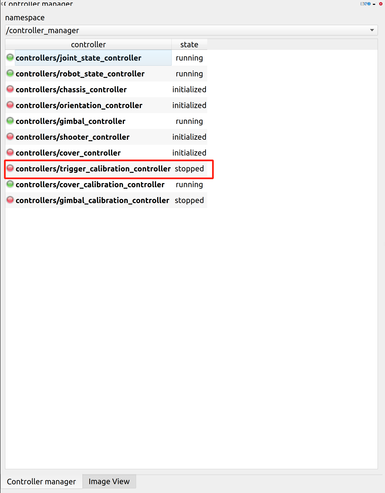
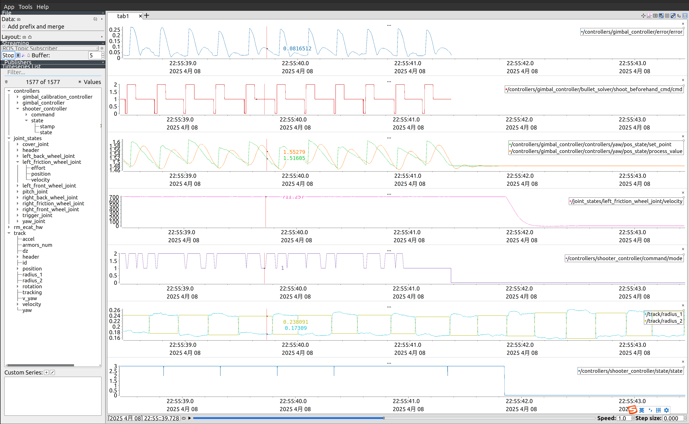

## 调拨盘的offset

### 原理
理想状态下，拨盘到摩擦轮的距离为弹丸直径的整数。但实际上有时不是整数倍，导致弹丸过紧或过松，导致双发或者打不出来。
* offset为拨盘电机(3508)实际位置和校准0值的差，用来补偿拨盘的校准。

### 步骤
1. 将offset改成0上传
  
2. 手动校准拨盘(摩擦轮要抵住)
3. 重启控制器trigger_calibration_controller
  
4. 拉曲线
  
  红色曲线对应的数即为offset，填上去即可
  * rm_ecat_hw:电机实际位置，所以蓝色曲线为拨盘实际位置
  * joint_states:电机补偿后的值(此处的position为校准0值)，所以将红色曲线的值填上去后可校准为0

## 调imu

### 步骤
1. 开rviz看下odom和base_link是否在同一平面，不在同一平面则需要调imu
2. 调imu的rpy
   

## 打静止靶
* 前提：
  * 把弹速给在23.5左右(看主控)
* 步骤：
  1. 调弹速：在rqt里调摩擦轮转速直至弹速在23.5左右(看主控)，调完上传
    _1.png)
    _2.png)
  2. 调射频  
    
     * 1表示1hz(1s打一颗弹)，若要改射频5个都要改(一般给10)
  3. 调光心：只动ry，上给大下给小、左给大右给小(想子弹往上大就调大，想子弹往左打就给大)**(算上前面的负号)**，改动小数点第二位(改动0.01-0.02即可)弹速
    
     * 步兵第一个瞄、第二个符，英雄第一个平地、第二个斜坡

## 调云台

### 奕欣的方法
#### 调跟随
* 前提
  * 转速80r/s左右
  * 关掉提前枪(gimbal_switch_duration == 0)
  * 发弹延迟先给0(delay == 0)
  * track_armor_error_tolerance给0.06(想打得准尽量就别改)

* 操作:打的时候看云台切换的时候有没有打弹，若有delay慢慢往上加，直到没有

**Tips:** track_armor_error_tolerance(即gimbal_controller_xxx_error)(简称error):落点的实际位置和期望位置的差
 
#### 调提前枪
* 原理
  * gimbal_swich_duration(云台切过去所用的时间) = 云台切换时的时间点(yaw_pos:setpoints) - 云台跟随上的时间点(即gimbal_controller_xxx_error的最小值)(0.1左右)
  * ban_shoot_duration：是gimbal_swich_duration的子集，是提前枪的前半段时间(不能打)(0.04左右)
  * min_shoot_beforehand_vel:这个速度之下不打提前枪(敌方的小陀螺转速)

* 步骤：
  1. 将ban_shoot_duration调为0，慢慢往上给(录慢动作)，直到能打中
  2. 拉曲线看两个时间点，将两个时间点相减即为云台切换时间
  3. 将敌方的转速慢慢往下调直到提前枪打不中为止，此时敌方的转速即为min_shoot_beforehand_vel

* 验证
  * 看shootbeforehand的曲线

#### 调通用的超前和滞后
* track_rotate_target_delay(旋转的delay)：超前调小
* track_move_target_delay(平移的delay):测试架平移的时候调，超前调小(一般不用调)

### 中心模式

#### "下一块"

#### "下两块"

### 冠霖的方法(粗调+细调)

#### 粗调 —— 50rad/s下
##### 步骤

* shootbeforehand_cmd/cmd:击打状态
  * 2:allow_shoot:提前枪强制开火(gimbal_swich_duration的后半段)
  * 1:跟随
  * 0:禁止开火(前半段为delay，后半段为ban_shoot_duration)
* error:落点的实际位置和期望位置的差(突然上升则为提前枪)
* set_points:云台的期望位置
* process_value:云台的实际位置
* left_friction_wheel_joint/velocity:摩擦轮转速 若降低则为打出了弹
* mode:开火状态
  * 2:PUSH
  * 1:READY(开摩擦轮)
  * 0:STOP(正常模式)

1. track_armor_error_tolerance给0.08
   
2. 拉曲线算gimbal_swich_duration
   set_point和process_value一起看，在两者相差最大和两者重合的时间戳之间的时间即为gimbal_swich_duration **(取多几个算平均)**
3. 算delay和ban_shoot_duration
   盯打弹时的error正不正常(若高于自己设的error则不正常)，若不正常则看是在cmd的哪个时刻打的(一般是1->0时太慢或0->2太快)。若1->0太慢(即想要1落快一点)则delay给小，若0->2太快(想要2晚点上去)，则ban_shoot_duration给大一点

* 若cmd有问题 
  * 原因1：视觉的半径交换(观测)有问题
    解决方法：调pnp(pose_solver)
  * 原因2：曝光不是最佳
    解决方法：细调曝光  

#### 细调 —— 80rad/s
调通用的超前和滞后
* track_rotate_target_delay(旋转的delay，类似于发弹的提前量)：滞后调大
* track_move_target_delay(平移的delay):测试架平移的时候调，滞后调大

## 初步准备

1. 测重复度
2. 修正odom坐标，在车urdf-imu-rpy处，三个值都有可能要改，优先调整roll的值
3. 调yaw和pitch的pid，要求精度：位置环pid pos-error在0.004-0.006左右，尖刺可以不管，看大概趋势
4. 调pitch重力补偿，位置环给0，开控制器
5. 调零飘：config/rm_ecat_hw/device_configurations，xyz置0，开控开摩擦轮，看angular_velosity，moving average给1000静置，分别记录xyz的平均值(max+min)/2

## 开瞄

1. delay：跟随模式下的发单延迟
2. gimbal_switch_duration：云台切换角所需时间（0.1）开自瞄和pl读值
3. ban_shoot_duration：在云台切换时间内的禁止发射的时间，这段时间内一定打不中，所以禁止，在过了这段时间后，发射是有可能打中下一块装甲板的，枪口和下一块相遇运动（0.04）
4. max_switch_angle、min_switch_angle：云台的最大切换角、最小切换角（max 50，min 2）
5. max_track_target_vel：最大跟随速度，即跟随模式和中心模式的临界点（12）
6. max_chassis_angular_vel：自身的陀螺速度，最终作用在切换角上，自身陀螺速度越高、切换角越小（12）
7.  wait_next_armor_delay、wait_diagnoal_armor_delay：在中心模式下，等待下一块装甲板和下两块装甲板的delay。给一个远高于临界值的转速，调下两块的delay；再给一个较快的中心模式速度，调下一块的
8.  min_shoot_beforehand_vel：最小提前枪速度，对方转速低到一定值时，提前枪反而会降低命中率，所以低速下不需要提前枪
9.  min_fit_switch_count：视觉数据有尖刺，所以让判断帧数大于3帧，避免误判
