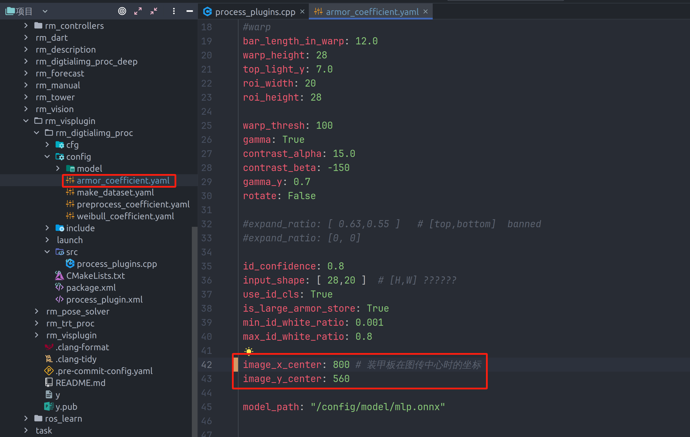

## 调两个方面

### 曝光度
一般为1800(1500~2000之间)(在 */camera/hk_camera_reconfig中的exposure_value* )
赛场照明度为170左右 **(烧饼建图时带上验光计)**

### 位姿解算中的装甲板的实际尺寸
调小装甲板实际尺寸->pnp算出的在相机坐标系中的装甲板会离相机更近->全车观测器中的半径会变化
调整装甲板的实际高度使得算出的半径更贴合实际半径，一般为0.052(大半径为0.25, 小半径为0.18)(在/pose_solver_node/armor_condition中的blue_small_height)

## 装甲板在图传中心时的坐标
由于选择器选择的是ClosestToImageCenterSelector(选择离光心最近的装甲板)，而操作手看到的是图传，所以需要选择离图传中心最近的点。代码中已将图传映射到光心上，但是由于每台车的相机相对图传的位置不一样，所以每次装完车需要重新给出装甲板在图传中心时的坐标

跑代码会自动打印其坐标armorxy(代码中已写)

### 标定问题
最好在比赛前把所有相机标定一遍，确保pnp算出来的坐标更准确