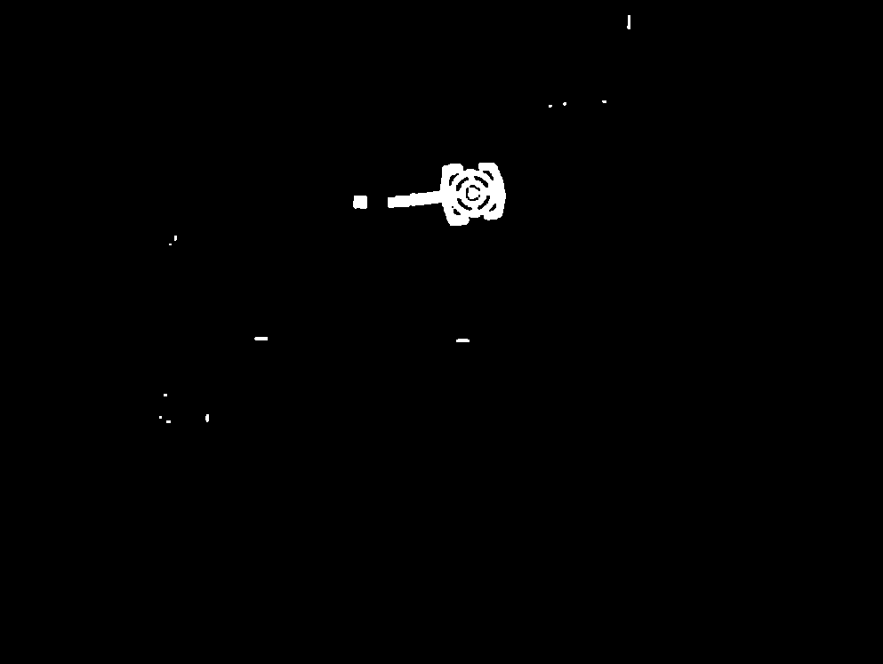
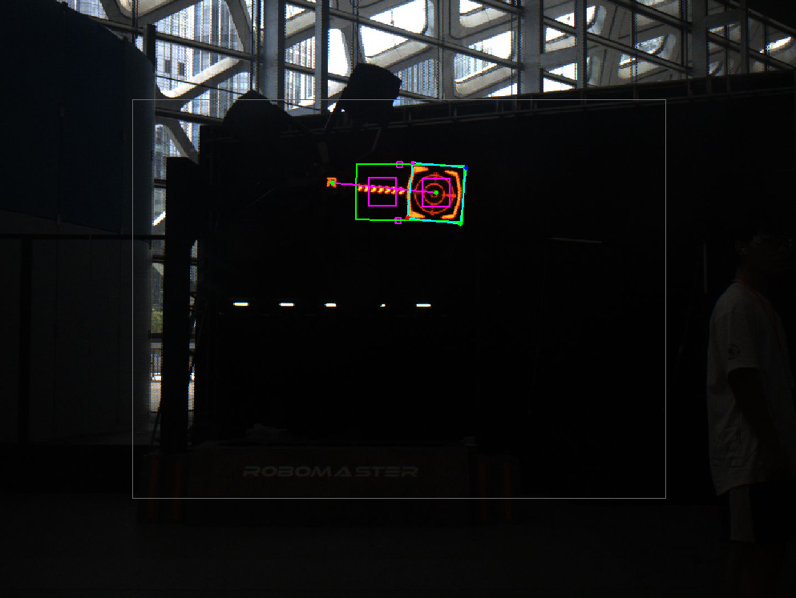
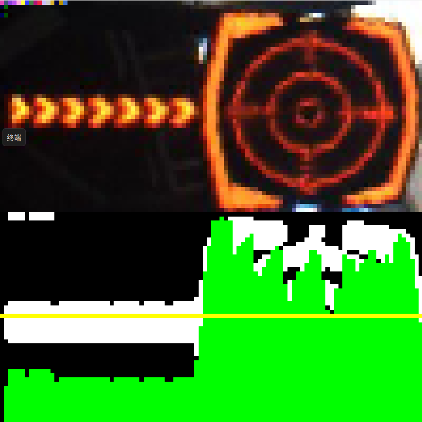

​        该软件包有三个节点，分别为：image_converter（图像预处理）、buff_recognizer（寻找未激活扇叶和R标）、pnp_solver（pnp部分已经交给预测部分来处理，这里只作从扇叶的ROI中提取顶点）。

# 寻找未激活扇叶和R标

​现在以识别效果来辅助说明寻找未激活扇叶和R标的逻辑。





​在二值化图像中，确保未激活扇叶的装甲板的轮廓与该扇叶的其他灯条相连。获取二值化图像后，首先通过面积大小、长宽比例、白色像素点在最小外接矩形（绿色矩形框）内的比例来初步筛选疑似未激活扇叶的轮廓。**hammer_min_area_、hammer_max_area_、、hammer_min_rect_ratio_、hammer_max_rect_ratio_、min_white_ratio_、max_white_ratio_** 可以动态调参。

```c++
if((area > hammer_min_area_ && area < hammer_max_area_) && (rect_ratio > hammer_min_rect_ratio_ && rect_ratio < hammer_max_rect_ratio_) && (white_ratio > min_white_ratio_ && white_ratio < max_white_ratio_))
{
    ......
}
```

​然后将这个绿色矩形框一分为二，分别在两个部分中计算大紫色矩形框所截下来的ROI的均值（cv::maen），**big_rect_size_** 用于调整大紫色框的边长，可以动态调参。均值大的为疑似未激活扇叶的装甲板，均值小的疑似为未激活扇叶的流动灯条。

```c++
cv::Mat dst_1 = (sel)(rect_1);
int sum1 = static_cast<int>(cv::mean(dst_1).val[0]);
cv::Mat dst_2 = (sel)(rect_2);
int sum2 = static_cast<int>(cv::mean(dst_2).val[0]);

cv::Point x_target;
if(sum1 > sum2)
    x_target = split_center_1;
else
    x_target = split_center_2;
```

​接着在包含疑似未激活扇叶的部分中，计算两个小的紫色矩形框所截下来的ROI的均值，**small_rect_size_**用于调整小紫色框的边长，可以动态调参。如果有其中一个均值大于**intensity_**，则视作找到的扇叶为已激活扇叶；反之则为疑似的未激活扇叶。**intensity_** 可以动态调参

```c++
cv::Point2f pt1, pt2;
pt1 = small_rect_move_ * (points[3] - points[0]) + points[0];
pt2 = small_rect_move_ * (points[2] - points[1]) + points[1];

rect_1 = cv::Rect(pt1.x - small_rect_size_, pt1.y - small_rect_size_, 2 * small_rect_size_, 2 * small_rect_size_);
rect_2 = cv::Rect(pt2.x - small_rect_size_, pt2.y - small_rect_size_, 2 * small_rect_size_, 2 * small_rect_size_);

dst_1 = (sel)(rect_1);
sum1 = static_cast<int>(cv::mean(dst_1).val[0]);
dst_2 = (sel)(rect_2);
sum2 = static_cast<int>(cv::mean(dst_2).val[0]);
if(sum1 > intensity_ || sum2 > intensity_)
    continue;
```

​下一步是寻找疑似的R标以及进一步检查找到的疑似未激活扇叶。根据长宽比例、面积大小、长度来筛选疑似的R标。r_icon_min_rect_ratio_、r_icon_max_rect_ratio_、r_icon_min_area_、r_icon_max_area_、r_icon_min_length_、r_icon_max_length_可以动态调参。

```c++
std::vector<cv::Point2f> maybe_r_center{};
bool r_is_found = false;
// locate item looks like r icon
for (auto& item : ext_contours)
{
    // Previously, any contour which is possible to be a hammer , hammer has already had its first element marked.
    // Just skip it.
    auto bounding_rect = cv::boundingRect(item);
    if(item[0].x == -1 || bounding_rect.size().area() > r_icon_max_area_)
      continue;
    float rect_ratio = bounding_rect.width >= bounding_rect.height ? bounding_rect.width / bounding_rect.height : bounding_rect.height / bounding_rect.width;
    float area = bounding_rect.size().area();
    float length = 2 * bounding_rect.width + 2 * bounding_rect.height;

    if((rect_ratio > r_icon_min_rect_ratio_ && rect_ratio < r_icon_max_rect_ratio_) && (area > r_icon_min_area_ && area < r_icon_max_area_) && (length > r_icon_min_length_ && length < r_icon_max_length_))
      maybe_r_center.push_back((bounding_rect.tl() + bounding_rect.br()) / 2);
}
```

​根据装甲板中心和R标构成的向量与疑似未激活扇叶外接矩形框的方向向量之间的夹角大小、装甲板中心与R标之间的长度来找最终确认的未激活扇叶和R标。**min_rc_distance_、max_rc_distance_** 可以动态调参。

```c++
for(auto& hammer : is_hammer_)
{
    cv::Point2f x_target;
    hammer.returnCenter(x_target);
    cv::Point2f hammer_vector;
    hammer.returnTargetVector(hammer_vector);

    for(auto& r_icon : maybe_r_center)
    {
      float rc_distance = sqrt(pow(x_target.x - r_icon.x, 2) + pow(x_target.y - r_icon.y, 2));
      cv::Point2f rc_vector = x_target - r_icon;

      float theta = abs(asin(hammer_vector.cross(rc_vector) / (norm(hammer_vector) * norm(rc_vector))));
      constexpr float rad_15_deg = 15. / 180. * CV_PI;
      constexpr float rad_0_deg = 0;

      if ((theta < rad_15_deg && theta > rad_0_deg) && (rc_distance > min_rc_distance_ && rc_distance < max_rc_distance_))
      {
        r_center_ = r_icon;
        r_is_found = true;
        hammer_ = hammer;
        is_found_ = true;

        hammer_.getCenter(x_target);
        hammer_.getTargetVector(hammer_vector);
        hammer_.getRCVector(rc_vector);

        break;
      }
    }

    if(r_is_found)
      break;
}
```

​根据夹角大小来旋转未激活扇叶的外接矩形框，使得该矩形框更近似于平行未激活扇叶，蓝色矩形框即为修正效果。

# 提取顶点



​这里也是用HSV对截取的ROI进行二值化处理，pnp_solver_nodelet有独立于image_converter_nodelet的有关HSV参数的动态调参。

​获取二值化图像后，对binary进行归一化处理，然后使用投影方法对归一化后的数组进行求和操作，并将结果存储在proj中，用于计算变异系数。其中黄线代表均值，绿线象征每一列的白色像素个数。如果变异系数大于**coefficient_of_variation_typ_**或者标准差大于**stddev_typ**_，则图像会出现红色的大叉，不会进行后面的顶点提取。

```c++
cv::normalize(binary, binary, cv::NORM_MINMAX);
cv::Mat_<int> proj;  // use projection method
cv::reduce(binary, proj, 0 /* reduced to a single row */, cv::REDUCE_SUM, CV_32S);

cv::Scalar mean;
cv::Scalar stddev;

cv::meanStdDev(proj, mean, stddev, proj != 0 /* only nonzero element counts */);
double coefficient_of_variation = stddev[0] / mean[0];

if (!(coefficient_of_variation > coefficient_of_variation_typ_ || stddev[0] > stddev_typ_))
{
    ......
        
    return FAILED;
}
```

​        最后以第一个高于黄色线的作为分界线，提取装甲板的四个近似的顶点。

​        在pnp_solver.h中可以修改ros::Rate rate_来控制发布到 **/prediction** 的帧率。
