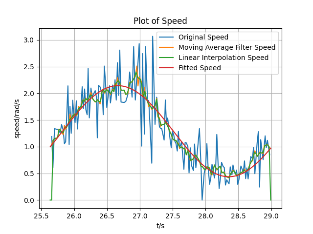
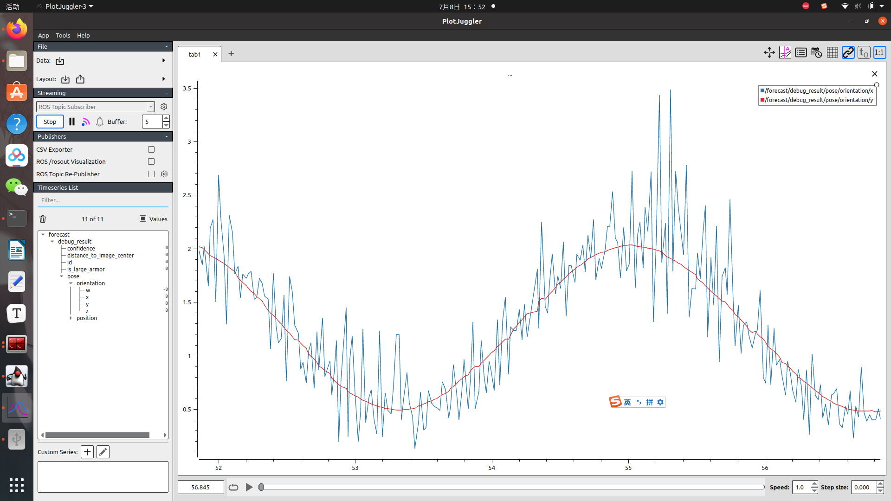

# 确定输入信号的周期是否近似于一个周期

​        用于快速傅里叶变换的输入信号，其周期需要近似于理想信号的周期的整数倍。forecast.yaml里的一个参数**tracking_threshold**用于设置信号长度。

​        如何确认设定的信号长度使得采集的原始角速度信号接近一个周期？

​        该软件包有一个**目录visualize**，其中**目录txt**用于储存代码写入的原始角速度信号、滑动平均滤波处理后的角速度信号、线性插值处理后的角速度、拟合的正弦函数的参数；**visualize.py**用于读取**目录txt**的内容，绘制曲线图；**speed.png**为**visualize.py**绘制的曲线图。

​        在动态调参中勾选**write**，即可让代码将拟合过程中的相关数据写入**目录txt**内。然后从车上将目录txt拉下来，跑**visualize.py**，绘制的曲线图如下：



​        如果拟合的曲线近似于原始角速度信号的分布，即可继续后面的调试，将**write**关闭；不满足的话需要调整**tracking_threshold**。在**forecast.yaml**中已给出可参考帧率，传统识别和深度识别均可以限制发布到**/prediction**的帧率。

# 动态显示拟合曲线

​        在plotjuggler中，找到话题**/forecast/debug_result/pose/orientation**，其中**/x**发布原始角速度信号，**/y**发布拟合曲线的角速度信号，如图所示：



​        边打边拟合的曲线近似于原始角速度信号的分布的话，那么可以调整动态调参中的**delay_time**，该参数用于拟合曲线的定积分计算中来预测大符的旋转角度；也可用于控制小符的旋转角度，官方提供的小符角速度为**PI / 3**，小符旋转角度设置为**PI / 3 * delay_time**。

# 拟合曲线的逻辑

​        除了拟合曲线的代码，其余代码与rm_forecast相似，这里主要描述拟合曲线的逻辑。

​        预测小符时，其旋转角度设置为**PI/3*delay_time**。

​        预测大符时，在第一轮中采集完设定的信号长度的角速度信号后，代码对采集的角速度信号作平均滑动滤波，其作用是降噪。可在forecast.yaml中调整**window_size**来控制平均滑动滤波的窗口大小。

```c++
std::vector<finalTarget> output = moving_average_filter_->output(history_info_);
```

​        然后是对过滤后的角速度信号作线性插值处理，这是因为快速傅里叶变换要求输入信号必须满足等间隔采样。其中**marked_seconds_**用于记录第n轮采集的结束时间。

```c++
double sampling_frequency = 1 / sampling_dt_; // 采样频率
std::vector<double> interpolated_value;
int N = tracking_threshold_; // 信号长度
interpolated_value.reserve(N);
for (int i = 0; i < interpolated_value.capacity(); ++i)
    interpolated_value[i] = linear_interpolation_.output(output, marked_seconds_ + (i + 1) * sampling_dt_);
```

​        接着是对线性插值后的角速度信号作汉明窗处理，其作用是减少频谱泄漏的影响。

```c++
applyWindow(interpolated_value, HAMMING);
```

​        最后是用经过窗函数处理后的角速度信号作快速傅里叶变换，将振幅、角频率、直流偏置历史队列的平均值用于最小二乘法中拟合相位，使得拟合的曲线更加接近原始角速度信号的分布。**forecast.yaml**中的**update_size**可控制三个历史队列的长度。

```c++
FFT(interpolated_value, N, sampling_frequency); // 傅里叶变换
amplitude_ = std::accumulate(amplitude_history_.begin(), amplitude_history_.end(), 0.0) / amplitude_history_.size();
angular_frequency_ = std::accumulate(angular_frequency_history_.begin(), angular_frequency_history_.end(), 0.0) / angular_frequency_history_.size();
offset_ = std::accumulate(offset_history_.begin(), offset_history_.end(), 0.0) / offset_history_.size();
predict(interpolated_value, sampling_dt_); // 最小二乘法
```

​        从第二轮拟合起，每一次拟合前首先要删除原始角速度信号队列的前**update_queue**个角速度，加上新采集的**update_queue**个原始角速度信号后再作拟合曲线，**forecast.yaml**中有**update_queue**这个参数可以调整。一段时间识别不到风车后，代码则会重新采集**tracking_threshold**个原始角速度信号进行拟合。

# 给控制发送的速度

​        如果要发送速度，其设置如下：

​        预测小符时，角速度写死为**CV_PI / 3**，然后直接在预测点位置上分解该角速度在X轴和Y轴上的角速度。

​        预测大符时，在曲线拟合完成前，也是发送角速度**CV_PI / 3**在预测点位置上的分解速度。曲线拟合完成后，则会发送拟合曲线的角速度的分解速度。
