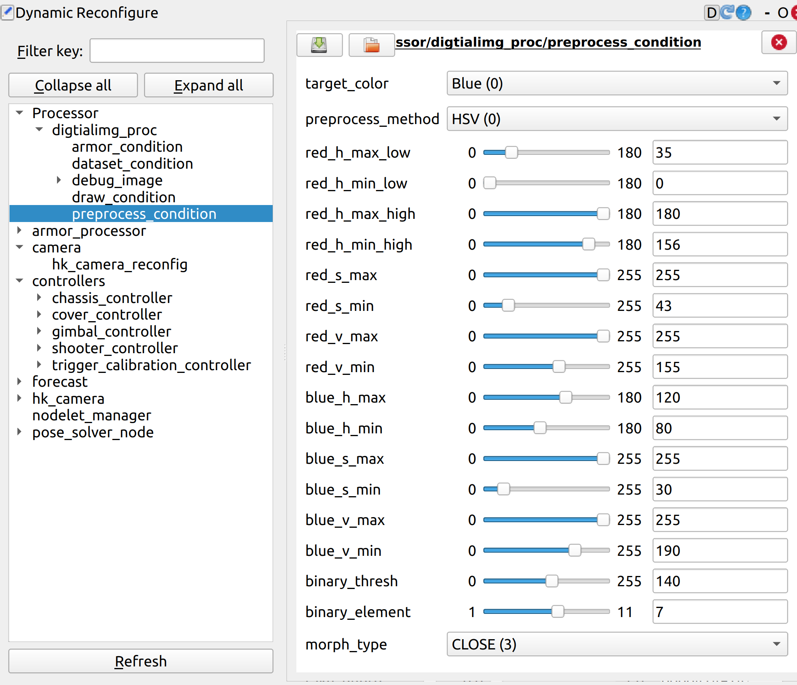

## 开视觉的步骤
1. draw_type调成5(在*Processor/digitalimg_proc/draw_condition*中)
2. target_color调红蓝方(在*preprocess_condition*中)
3. 不行restartvi
4. 再不行往下看

## 相机识别不到(没图像)
先听下对应的话题有没有帧率(`rostopic hz /galaxy_xxx`)，若没有则停了视觉(`stopvi`)后单跑相机(`mon launch hk_xxx`)


## 如果识别出问题
先查看二值化的图像(binary)：在*Processor/digitalimg_proc/draw_condition中的draw_type*


根据二值化的图像来调整其曝光度(在*camera/hk_camera_reconfig*中)和 hsv(在*Processor/digitalimg_proc/preprocess_condition*)(主要是调_s_有关参数)(**主要是调曝光度和hsv**)



Tips:记得调装甲板的红蓝方！

## 各动态参数的意思

### Processor/
#### digtialimg_proc/
##### armor_condition/ ——装甲板配置
max_bars_ratio等:调整相邻灯条的长宽比，距离，角度
gamma:伽马值(通过+-e^x^使亮暗过渡区域更亮或更暗)
rotate:相机倒置则勾选
use_id_cls:数字分类

##### dataset_condition/ ——录数据集
make_dataset:勾选表示开始录数据集(利用此开关开始和停止录数据集)
continue:勾选表示连续录数据集(若没勾选则再次勾选make_dataset会覆盖前面录的数据集)
image_num：表示一次性录多少张数据集

##### draw_condition/ ——切换模式

draw_type:
>DISABLE:无图像
RAW:原图像
BINARY:二值化后的图像
MORPHOLOGY:
BARS:框出灯条
ARMORS:框出装甲板
ARMORS_VERTEXES:
BARS_ARMORS:
WARP:数字的二值化图像
PROJECT:预测

line_width：画线的粗细

##### preprocess_condition/ ——图像预处理

target_color:目标装甲板红方还是蓝方
red_s_max:红方装甲板的饱和度(一般调和s有关的)

## armor_processor/
### ekf_config/
q_value:值更大表示更加相信状态量(即上一帧)(预测)的结果(值越大会有延迟，因为更加相信预测出来的值)

## camera/
### hk_camera_reconfig/

exposure_auto:勾选表示开启自动曝光(一般不开启)
exposure_value:曝光值
exposure_max:曝光最大值(调车时一般先拉满，再去调value)
gamma_value:伽马值(这里一般在Processor中调，因为相机的伽马值不太行)

## pose_solver_node/
### armor_condition/
装甲板实际长和宽

## 相机调完参数后
在rm_config/config/vision/camera.yaml中改参数(车上)
```yaml
camera:
  image_width: 1440
  image_height: 1080
  pixel_format: bgr8
  camera_info_url: ''
  camera_name: hk_camera
  camera_frame_id: camera_optical_frame
  camera_sn: KE0220040170
  frame_rate: 1000
  exposure_auto: false
  exposure_value: 1600
  exposure_value_windmill: 3000
  gamma_selector: 2
  gamma_value: 0.5
  enable_imu_trigger: true
```


