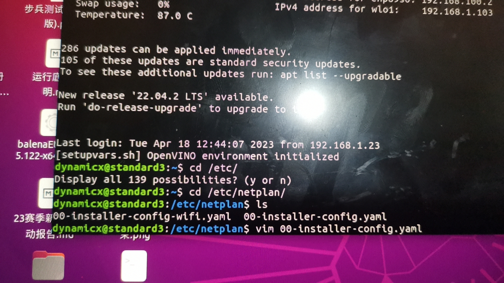

```
# This is the network config written by 'subiquity'
network:
  ethernets:
    enp89s0:
      dhcp4: false
      optional: true
      addresses: [192.168.100.2/24]
      optional: true
      nameservers:
         addresses: [255.255.255.0]
  version: 2
```

```
ssh -o StrictHostKeyChecking=no -l "dynamicx" "192.168.100.2"
```

## 多台电脑调试一台车
修改wifi设置的address和gateway的尾数为其他数字(如都更改为192.168.100.5)


