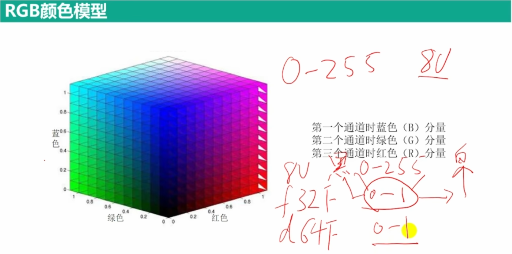
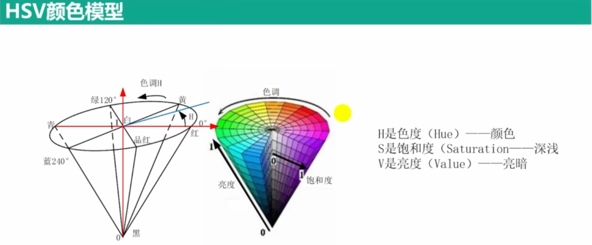

## 1.Mat对象

### Mat结构


### Mat中能存储的数据类型  


### Mat类的创建  
       
#### 利用矩阵的宽和高和类型参数创建
    
    Mat a(rows, cols, type) //type是矩阵中存储的数据类型，如CV_8UC1/CV_64FC4,C后面的数字表示通道数

#### 利用Size()结构
    
    Mat b(Size(3,3), type) //type同上 

#### 利用已有的Mat类


    eg:Mat b;  
       Mat g(b, Range(2,5), Range(2,5)) //b为已知Mat类
            

#### 利用Mat_
    
    cv::Mat_<cv::Vec3b>red(400, 600);       
         
                    
### Mat类的赋值  

#### 创建时赋值  
    
    Mat f(rows, cols, type, Scalar(0, 0, 255)) //Scalar为给通道赋值(可利用此函数创建空白图像)      

#### 类方法赋值
    
    Mat::zeros(Size(8,8), CV_8UC1)   
    Mat::ones(Size(8,8), CV_8UC1)


#### 枚举法赋值
    Mat b = Mat_<double>(2,3)<<1.0,2.1,3.2,4.0,5.1,6.2 //创建了一个2×3的矩阵,存放输入的数，先将矩阵中的第一行存满，之后再存入第二行、第三行

#### 直接拷贝进去
```cpp
unsigned char rgb_data[12] = {1, 2, 3,
                            4, 5, 6,
                            7, 8, 9,
                            10, 11, 12};
cv::Mat3b rgb_img(1, 4);
memcpy(rgb_img.data, rgb_data, 3 * 4 * sizeof(uchar)); 
//memcpy:void *memcpy(void*dest, const void *src, size_t n);
//由src指向地址为起始地址的连续n个字节的数据
//复制到以dest指向地址为起始地址的空间内
//data：uchar类型的指针，指向Mat数据矩阵的首地址。可以理解为标示一个房屋的门牌号；   
```      

### Mat类数据的读取  

#### Mat数据在内存中的存放形式  


#### Mat类矩阵常用属性  

通道数（灰度：1 ；彩色：3）：Mat对象.channels()  
a                
    
#### Mat元素的读取  
    
    //数组方式
    at方法读取：at(int row, int col)
    单通道：
    ·int value = (int)a.at<uchar>(0,0);//uchar为数据类型，at将像素（字节类型uchar）转化为int
    多通道：
    ·cv :: Vec3b vc3 = b.at<cv::Vec3b>(0,0);//可将vc3看成数组，可理解为将二维数组转化为一维数组
    ·int first = (int)vc3.val[0];//同样要进行类型转换

指针方式


### Mat支持的运算  

#### 四则运算  
     


#### 运算函数  
 


### 两种复制对象的方法  

#### 克隆：不会改变原来对象  
    Mat m1 = src.clone()  

#### 复制：不会改变原来对象  
    Mat m2;  
    src.copyTo(m2) src复制给m2  


## 2.图像的读取，显示和保存  
    
### imread:读取图像  
    imread("图片路径", flags)  //flags可选择灰度IMREAD_GRAYSCALE）

### namedWindow:可用于调整窗口大小  
    namedWindow("输入窗口"，WINDOW_FREERATIO)  

### imshow：展示图片且无法更改比例  
    imshow("输出窗口", 数据对象) 

### imwrite: 图像另存为  
    imwrite("图像保存路径（绝对路径）", 保存对象, 保存图片的属性)   

### waitKey:让图片不要一闪而过  
    waitKey(0):一直停留

### destroyAllWindow:销毁所有显示窗口  
    destroyAllWindows();    
    
              

## 3.图像颜色空间变换  

### 各种颜色空间  
#### RGB  
 

#### HSV
 

#### 灰度Gray  
   

### 图像数据类型间的转换  
   

### 色彩空间转换函数         


    code:如COLOR_BGR2BGRA(A表示透明度)， 
           COLOR_BGR2RGB(把BGR转化为RGB)，
           COLOR_BGR2GRAY(转为灰度图像)

```cpp
Mat img = imread("路径");
Mat HSV;
cvtColor(img, HSV, COLOR_BGR2HSV);    
Mat gray0;
cvtColor(img, gray0, COLOR_BGR2GRAY);    
```
        
## 4.多通道的分离和合并

### 多通道分离：将多通道分离成单通道  


### 多通道合并  
       

```cpp
//eg:
Mat img = imread("路径");
Mat imgs[3];

split(img, imgs);

Mat img0, img1, img2;

img0 = imgs[0];
img1 = imgs[1];
img2 = imgs[2];

Mat img_H;
merge(imgs, 3, img_H); //要多一个参数（在中间），指明维度
```

## 5.两张图像像素比较  

### 两个图像像素的比较函数  

    dst：输出的矩阵（图像）


### 图像最大最小值的寻找  

mask：相当于划定一个区域来比较   

```cpp
//eg:
Mat img = imread("路径");
Mat white = imread("路径"); //掩码矩阵（未灰度化）
Mat black = imread("路径"); 

Mat Min, Max;
min(img, white, Min);
max(img, black, Max);

Mat gray, gray_white; //定义一个掩码矩阵gray_white（未灰度化）
cvtColor(img, gray, COLOR_BGR2GRAY);
cvtColor(white, gray_white, COLOR_BGR2GRAY); //将掩码矩阵灰度化


double minVal, maxVal;
Point minLoc, maxLoc; //Point是一个类，里面有数据类型x和y，可通过minLoc.x调用x坐标
minMaxLoc(gray, &minVal, &maxVal, &minLoc, &maxLoc, gray_white);
```

## 6.像素的逻辑运算  

### 运算规则  


### 像素逻辑运算函数  
             


```cpp
//eg:
Mat a = (Mat_<uchar>(1,2) << 0 ,5);
Mat b = (Mat_<uchar>(1,2) << 0 ,6);

Mat Xor, Or, Not, And;

bitwise_not(a, Not);

cout << "a Not" << Not << endl;

bitwise_and(a, b, And);
bitwise_or(a, b, Or);
bitwise_xor(a, b, Xor);

cout << And << endl;
cout << Or << endl;
cout << Xor << endl;

Mat img = imread("路径");
Mat mark = imread("路径");

Mat result;
bitwise_and(img, mark, result);

Mat img_inv;
bitwise_not(img, img_inv);
```

## 7.图像二值化  
    
### [Tips]
二值图像：只有黑和白，表现在像素上就是只有0和255.
灰度图像：有不同深度的灰色和黑白两色。
彩色图像：RGB图像，有255 * 255 * 255种颜色。
        
### 固定阈值二值化  

    

### 固定阈值二值化函数  


### 自适应阈值二值化函数  
        
    
```cpp
Mat img = imread("路径");

Mat gray;
cvtColor(img, gray, COLOR_BGR2GRAY);
Mat img_B, img_B_V, gray_B, gray_B_V, gray_T, gray_T_V, gray_TRUNC;

//彩色图像二值化
threshold(img,img_B, 125,255,THRESH_BINARY);
threshold(img,img_B_V,125,255,THRESH_BINARY_INV);
imshow("img_B",img_B);
imshow("img_B_V",img_B_V);

//灰度图BINARY二值化
threshold(gray, gray_B, 125, 255,THRESH_BINARY);
threshold(gray, gray_B_V,125,255,THRESH_BINARY_INV);
imshow("gray_B", gray_B);
imshow("gray_B_V",gray_B_V);

//灰度图像TOZERO变换
threshold(gray, gray_T, 125, 255,THRESH_TOZERO);
threshold(gray, gray_T_V,125,255,THRESH_TOZERO_INV);
imshow("gray_T", gray_T);
imshow("gray_T_V",gray_T_V);

//灰度图像TRUNC变换
threshold(gray, gray_TRUNC,125,255,THRESH_TRUNC);
imshow("gray_TRUNC", gray_TRUNC);

//灰度图像大津法和三角形法二值化
Mat img_Thr = imread("路径",IMREAD_GRAYSCALE);
Mat img_Thr_O,img_Thr_T;
threshold(img_Thr, img_Thr_O,100,255,THRESH_BINARY|THRESH_OTSU);
threshold(img_Thr, img_Thr_T, 125,255,THRESH_BINARY |THRESH_TRIANGLE);
imshow("img_Thr",img_Thr);
imshow("img_Thr_0", img_Thr_O);
imshow("img_Thr_T",img_Thr_T);

//自适应阈值二值化
Mat adaptive_mean, adaptive_gauss;

adaptiveThreshold(img_Thr, adaptive_mean, 255, ADAPTIVE_THRESH_MEAN_C, THRESH_BINARY, 55, 0);
adaptiveThreshold(img_Thr, adaptive_gauss, 255, ADAPTIVE_THRESH_GAUSSIAN_C, THRESH_BINARY, 55, 0);

imshow("adaptive_mean", adaptive_mean);
imshow("adaptive_gauss", adaptive_gauss);
```

### 将二值图转化为原来图像  
    遍历原图像的像素点，提取后再赋值给二值图（分水岭中有详细代码）

## 8.LUT查找表  

### 原理——本质是映射  


### 函数  
     

```cpp
//LUT查找表第一层
uchar lutFirst[256];
for (int i = 0; i < 256; i++) {
    if (i <= 100)
    lutFirst[i] = 0;
    if (i > 100 && i <= 200)
    lutFirst[i] = 100;
    if (i > 200)
    lutFirst[i] = 255;
}
Mat lutOne(1,256,CV_8UC1,lutFirst);

//LUT查找表第二层
uchar lutSecond[256];
for (int i= 0; i<256;i++) {
    if (i <= 100)
        lutSecond[i] = 0;
    if (i > 100 && i <= 150)
        lutSecond[i] = 100;
    if (i > 150 && i <= 200)
        lutSecond[i] = 150;
    if (i > 200)
        lutSecond[i] = 255;
}
Mat lutTwo(1,256,CV_8UC1,lutSecond);

//LUT查找表第三层
uchar lutThird[256];
for (int i = 0; i<256;i++) {
    if (i <= 100)
        lutThird[i] = 100;
    if (i > 100 && i <= 200)
        lutThird[i] = 200;
    if (i > 200)
        lutThird[i] = 255;
}
Mat lutThree(1, 256,CV_8UC1, lutThird);

//拥有三通道的LUT查找表矩阵
vector<Mat> mergeMats;
mergeMats.push_back(lutOne);
mergeMats.push_back(lutTwo);
mergeMats.push_back(lutThree);
Mat LutTree;
merge(mergeMats, LutTree);

//计算图像的查找表
Mat img = imread("lena.png");
Mat gray, out0, out1, out2;
cvtColor(img, gray,COLOR_BGR2GRAY);
LUT(gray, lutOne, out0);
LUT(img,lutOne,out1);
LUT(img, LutTree, out2);
imshow("out0",out0);
imshow("out1",out1);
imshow("out2",out2);
waitKey(0);
```

## 9.图像尺寸变换  

### 图像插值原理  


### 函数  


    interpolation
    INTER_NEAREST:最近邻方法
    INTER_LINEAR:双线性插值方法
    INTER_CUBIC:双三次插值方法  


    hconcat()：横向拼接（要求高度一致）
    vconcat()：纵向拼接（要求宽度一致）

```cpp
Mat gray = imread("lena.png",IMREAD_GRAYSCALE);
Mat smallImg, bigImgO, bigImg1, bigImg2;
resize(gray, smallImg, Size(15,15),0,0,INTER_AREA);//先将图像缩小
resize(smallImg, bigImgO, Size(30, 30),0, 0, INTER_NEAREST);//最近邻差值
resize(smallImg, bigImg1,Size(30, 30),0,0,INTER_LINEAR); //双线性差值
resize(smallImg, bigImg2,Size(30, 30),0, 0, INTER_CUBIC);//双三次差值
Mat img_x, img_y, img_xy;
flip(gray,img_x, 0); //沿x轴对称
flip(gray,img_y, 1); //沿y轴对称
flip(gray,img_xy, -1); //先x轴对称，再y轴对称
Mat img00 = imread("lena00.png");
Mat img01 = imread("lena01.png");
Mat img10 = imread("lena10.png");
Mat img1l = imread("lenal1.png");
//显示4个子图像

//图像连接
Mat img, imgO,img1;
//图像横向连接
hconcat(img00,img01,imgO);
hconcat(img10, img1l, img1);
//横向连接结果再进行竖向连接
vconcat(imgO, imgl,img);
//显示连接图像的结果

```   

## 10.图像仿射变换  

### 仿射变换原理


### 函数  
    


```cpp
Mat img = imread("路径");
Mat rotationO, img_warp0;
double angle = 30;//设置图像旋转的角度
Size dst_size(img.rows,img.cols);//设置输出图像的尺寸
Point2f center(img.rows / 2.0, img.cols / 2.0);//设置图像的旋转中心
rotationO =getRotationMatrix2D(center,angle,1);//计算放射变换矩阵
warpAffine(img, img_warp0, rotationO,dst_size);//进行仿射变换
imshow("img_warp0",img_warp0);

//根据定义的三个点进行仿射变换
Point2f src_points[3];
Point2f dst_points[3];
src_points[0]= Point2f(0,0);//原始图像中的三个点
src_points[1]= Point2f(0,(float) (img.cols- 1));
src_points[2]= Point2f((float)(img.rows - 1),(float)(img.cols- 1));
dst_points[0]= Point2f((float)(img.rows)*0.11,(float)(img.cols)*0.20);//放射变换后图像中的三个点
dst_points[1]= Point2f((float)(img.rows)*0.15,(float)(img.cols)*0.70);
dst_points[2]= Point2f((float)(img.rows)*0.81,(float)(img.cols)*0.85);
Mat rotationl, img_warp1;
rotationl = getAffineTransform(src_points,dst_points);//根据对应点求取仿射变换矩阵
warpAffine(img,img_warp1,rotationl,dst_size); //进行仿射变换
imshow("img_warpl", img_warp1);
waitKey(0);
``` 
    

### [图像平移]


```cpp
// 图像平移

Mat image = imread("路径");
// 获取图像的高度和宽度
int height = image.cols;
int width = image.rows;

// 获取平移的tx和ty值
float tx = float(width) / 4;
float ty = float(height) / 4;
// 使用tx和ty创建平移矩阵
float warp_values[] = { 1.0, 0.0, tx, 0.0, 1.0, ty };
Mat translation_matrix = Mat(2, 3, CV_32F, warp_values);

// 将结果保存在translated_image矩阵中
Mat translated_image;
// 使用平移矩阵对原始图像应用仿射变换
warpAffine(image, translated_image, translation_matrix, image.size());

imshow("Translated image", translated_image);
imshow("Original image", image);
waitKey(0);
```


## 11.图像透视变换/投影变换  

### 原理  
 

### 函数  


```cpp
Mat img = imread("路径");
Point2f src_points[4];
Point2f dst_points[4];

//通过Image Watch查看的二维码四个角点坐标
src_points[0]=Point2f(94.0,374.0);
src_points[1]= Point2f(506.0,381.0);
src_points[2]= Point2f(1.0,624.0);
src_points[3] = Point2f(627.0,627.0);

//期望透视变换后二维码四个角点的坐标
dst_points[0]= Point2f(0.0,0.0);
dst_points[1]= Point2f(627.0,0.0);
dst_points[2]= Point2f(0.0,627.0);
dst_points[3] = Point2f(627.0,627.0);

Mat rotation, img_warp;
rotation = getPerspectiveTransform(src_points,dst_points);//计算透视变换矩阵
warpPerspective(img,img_warp,rotation, img.size());//透视变换投影
imshow("img", img);
imshow("img_warp",img_warp);
waitKey(0);
```        


## 12.图像中绘制基础图形  
 


    fontFace：0表示FONT_HERSHEY_SIMPLEX, 1表示FONT_HERSHEY_PLAIN    

```cpp
Mat img = Mat::zeros(Size(512,512), CV_8UC3);//生成一个黑色图像用于绘制几何图形
//绘制圆形
circle(img,Point(50,50),25,Scalar(255,255,255),-1);//绘制一个实心圆
circle(img,Point(100,50),20,Scalar(255,255,255),4); //绘制一个圆

//绘制直线
line(img,Point(100,100),Point(200,100),Scalar(255,255,255),2, LINE_4,0);//绘制一条直线

//绘制椭圆
ellipse(img,Point (300,255),Size(100,70),0, 0,100,Scalar(255,255,255),-1);//绘制实心椭圆的一部分

//绘制矩形
rectangle(img,Point(50,400),Point(100,450),Scalar(125,125,125),-1);

//绘制多边形
Point pp[2][6];
pp[0][0] = Point(72,200);
pp[0][1] = Point(142, 204);
pp[0][2] = Point(226,263);
pp[0][3] = Point(172,310);
pp[0][4] = Point(117,319);
pp[0][5] = Point(15,260);
pp[1][0] = Point(359,339);
pp[1][1] = Point(447,351);
pp[1][2] = Point(504,349);
pp[1][3] = Point(484,433);
pp[1][4] = Point(418,449);
pp[1][5] = Point(354,402);
Point pp2[5];
pp2[0] = Point(350,83);
pp2[1] = Point(463,90);
pp2[2] = Point(500, 171);
pp2[3] = Point(421,194);
pp2[4] = Point(338,141);

const Point* pts[3] = { pp[0],pp[1],pp2 }; //pts变量的生成
int npts[]= { 6,6,5 }; //顶点个数数组的生成
fillPoly(img,pts,npts,3,Scalar(125,125,125),8);//绘制3个多边形

//生成文字
putText(img,"Learn OpenCV 4",Point(100,400),2,1,Scalar(255,255,255));
imshow("", img);
waitKey(0);
```
    

    polylines函数：是绘制一个多边形的函数  

```cpp
//函数原型
void polylines(Mat& img, const Point** pts, const int* npts, 
int ncontours, bool isClosed, const Scalar& color, 
int thickness=1, int lineType=8, int shift=0 );		
    
//其中每个参数表示的意思是：
img：在img表示的图像上绘制
pts：是指向多边形数组的指针，必须是const修饰的
npts：是多边形顶点个数的数组名
ncontours：绘制多边形的个数
isClosed：表示多边形是否闭合，1表示闭合，0表示不闭合
color：是填充的颜色

//创建一个二维数组，每一行存储一个多边形的点,总共存储了两个多边形的点
Point p[2][5] = {{Point(100, 100), Point(150, 50), Point(180, 90), Point(10, 190), Point(200, 267)},
                    {Point(360, 410), Point(700, 650), Point(334,456), Point(531, 463), Point(384, 634)}};
const Point *pp[] ={p[0], p[1]};//这个指针数组存储每一个多边形的定点所在的一维数组的地址
int n[] = {5, 5};//这个数组存储每一个多边形的定点个数
polylines(src, pp, n, 2, 1, Scalar(255, 255, 0), 1);//绘制两个不填充的多边形
```

## 13.ROI区域截取  

     
```cpp
Mat img = imread("C:/opencv/learn0penCV/lena.png");
Mat noobcv = imread("C:/opencv/learn0penCV/noobcv.jpg");

Mat ROI1, ROI2, ROI2_copy, mask, img2, img_copy;
resize(noobcv, mask,Size(200,200));
img2 = img;//浅拷贝

// 深拷贝的两种方式
img.copyTo(img_copy);

//两种在图中截取ROI区域的方式
Rect rect(206, 206,200,200);//定义ROI区域
ROI1 = img(rect); //截图

ROI2= img(Range(300,500),Range(300,500));//第二种截图方式

img(Range(300,500),Range(300,500)).copyTo(ROI2_copy); //深拷贝

mask. copyTo(ROI1);//在图像中加入部分图像

imshow("加入noobcv后图像",img);
imshow("深拷贝的img_copy",img_copy);

imshow("ROI对ROI2的影响",ROI2);
imshow("深拷贝的ROI2_copy",ROI2_copy);

circle(img,Point(300,300),20,Scalar(0,0,255),-1);//绘制一个圆形

imshow("浅拷贝的img2",img2);

imshow("画圆对ROI1的影响",ROI1);

waitKey(0);
```

## 14.深拷贝和浅拷贝

### 深拷贝：创建一个新的数据空间（会浪费空间） 


    mask：即用range()截取矩阵中想要的部分  
     
### 浅拷贝：原对象改变，拷贝对象也会改变（相当于指针指向新的对象）  
    Mat m4 = m3;
       

## 15.高斯图像金字塔（模糊类型）

### 原理  
 

### 高斯金字塔函数  


```cpp
Mat img = imread("路径");
vector<Mat> Guass;
int level = 3;

Guass.push_back(img);

for (int i = 0;i< level; i++) {
    Mat guass;
    pyrDown(Guass[i], guass);
    Guass.push_back(guass);
}

for (int i = 0; i< level; i++) {
    string name = to_string(i); 
    //to_string 函数：将数字常量转换为字符串，返回值为转换完毕的字符串
    imshow(name, Guass[i]);
}
```  

## 16.拉普拉斯图像金字塔  

### 原理——高斯金字塔逆运算后得到图像，再将原图像减去这张图像  


### 函数       


```cpp
Mat img = imread("路径");
vector<Mat> Guass;
int level = 3;

Guass.push_back(img);

for (int i = 0;i< level; i++) 
{
    Mat guass;
    pyrDown(Guass[i], guass);
    Guass.push_back(guass);
}

vector<Mat> Lap;

for (int i = Guass.size()-1; i>0 ;i--)
{
    Mat lap, upGuass;
    
    if (i == Guass.size() - 1)
    {
        Mat down;
        pyrDown(Guass[i],down);
        pyrUp(down, upGuass);
        lap = Guass[i]- upGuass;
        Lap.push_back(lap);
    }    
    
    pyrUp(Guass[i],upGuass);
    lap = Guass[i - 1]- upGuass;
    Lap. push_back (lap);       
}

for (int i= 0;i<Guass.size(); i++)
{
    string name = to_string(i);
    imshow("G"+ name,Guass[i]);
    imshow("L"+name,Lap[Guass.size()-1-i]);
}   
```   

## 17.图像直方图  

### 直方图  


### 统计直方图的函数         


inRange():将图像中的像素值限制在指定的范围内

```cpp
dst = cv2.inRange(src, lowerb, upperb[, dst])
/*
src：输入图像，可以是灰度图像或彩色图像。
lowerb：表示下界的阈值，可以是一个标量值或与输入图像通道数相同的数组。对于灰度图像，lowerb是一个标量值。对于彩色图像，你可以通过传递一个数组，每个元素分别表示每个通道的下界阈值。
upperb：表示上界的阈值，与lowerb的类型相同，指定上界阈值。对于灰度图像，upperb是一个标量值。对于彩色图像，你可以通过传递一个数组，每个元素分别表示每个通道的上界阈值。
dst（可选）：输出图像，用于存储计算得到的阈值图像。它应该具有与输入图像相同的尺寸和数据类型。

返回值：
dst：阈值图像，与输入图像具有相同的尺寸和数据类型。如果提供了dst参数，则返回值与dst相同。
*/
```

```cpp
Mat img = imread("apple.jpg");
Mat gray;
cvtColor(img,gray,COLOR_BGR2GRAY);

//设置提取直方图的相关变量
Mat hist; //用于存放直方图计算结果
const int channels[1]={0};//通道索引
const int bins[1]= { 256 };//直方图的维度，其实就是像素灰度值的最大值
float inRanges[2] = { 0,255 };
const float* ranges[1]= { inRanges }; //像素灰度值范围

calcHist(&gray,1, channels,Mat(), hist, 1, bins,ranges); //计算图像直方图

//准备绘制直方图
int hist_w=512;
int hist_h = 400;
int width = 2;
Mat histImage = Mat::zeros(hist_h, hist_w,CV_8UC3);//创建一张黑色图像

/*
for (int i = 1; i<= hist.rows; i++){
    rectangle(histImage, Point(width*(i - 1),hist_h - 1),
                Point(width*i - 1, hist_h - cvRound(hist.at<float>(i - 1) / 15)),
                Scalar(255, 255,255), -1); //cvRound函数：四舍五入函数
}
*/

//归一化
Mat hist_INF;
normalize(hist,hist_INF,1,0,NORM_INF,-1,Mat());//normalize()：归一化函数
for (int i = 1;i<= hist_INF.rows; i++) {
    rectangle(histImage, Point(width * (i - 1), hist_h - 1),
                Point(width * i - 1, hist_h - cvRound(hist_h * hist_INF.at<float>(i - 1)) - 1),
                Scalar(255, 255, 255), -1); //不用除以15
}
```    

### 直方图均衡化  

#### 像素距离拉伸  
 

#### 直方图均衡化函数  
 

```cpp
void drawHist(Mat &hist, int type, string name)//归一化并绘制直方图函数
{
    int hist_w = 512;
    int hist_h = 400;
    int width = 2;
    Mat histImage = Mat::zeros(hist_h, hist_w, CV_8UC3);
    normalize(hist, hist, 1, 0, type, -1, Mat());
    for (int i = 1; i <= hist.rows; i++) {
        rectangle(histImage, Point(width * (i - 1), hist_h - 1),
                    Point(width * i - 1, hist_h - cvRound(hist_h * hist.at<float>(i - 1)) - 1),
                    Scalar(255, 255,255),-1);
    }
    imshow(name, histImage);
}

int main(int argc, char** argv)
{
    Mat img = imread("/home/haomo/Pictures/RGB.png");
    Mat gray, hist, hist2;
    cvtColor(img, gray,COLOR_BGR2GRAY);
    Mat equalImg;
    equalizeHist(gray,equalImg);//将图像直方图均衡化
    const int channels[1]={0};
    float inRanges[2] = { 0,255 };
    const float* ranges[1]= { inRanges };
    const int bins[1]= { 256};

    calcHist(&gray,1,channels,Mat(),hist, 1, bins, ranges);
    calcHist(&equalImg, 1,channels,Mat(),hist2, 1, bins, ranges);

    drawHist(hist,NORM_INF,"hist");
    drawHist(hist2,NORM_INF,"hist2");

    imshow("原图",gray);
    imshow("均衡化后的图像",equalImg);
    waitKey(0);

    return 0;
}
```     

### 直方图匹配  

#### 原理  
  

```cpp
Mat img1 = imread("histMatch.png");
Mat img2 = imread("equalLena.png");
Mat hist1, hist2;

//计算两张图像直方图
const int channels[1]={0};
float inRanges[2]= { 0,255 };
const float* ranges[1] = { inRanges };
const int bins[1]={ 256 };
calcHist(&img1, 1,channels,Mat(),hist1, 1, bins, ranges);
calcHist (&img2, 1, channels, Mat(), hist2, 1, bins, ranges);

//归一化两张图像的直方图"
drawHist(hist1,NORM_L1,"hist1");
drawHist(hist2,NORM_L1,"hist2");

//计算两张图像直方图的累积概率
float hist1_cdf[256]= { hist1.at<float>(0) };
float hist2_cdf[256] = { hist2.at<float>(0) };
for (int i = 1;i< 256;i++) 
{
    hist1_cdf[i] = hist1_cdf[i - 1] + hist1.at<float>(i);
    hist2_cdf[i] = hist2_cdf[i - 1] + hist2.at<float>(i);
}

//构建累积概率误差矩阵
float diff_cdf[256][256];
for (int i = 0;i< 256;i++)
{
    for (int j = 0; j < 256; j++)
    {
        diff_cdf[i][j] = fabs(hist1_cdf[i] - hist2_cdf[j]);
    }
}

//生成LUT映射表
Mat lut(1,256,CV_8U);
for (int i = 0; i< 256;i++) {    //查找源灰度级为i的映射灰度
    // 和i的累积概率差值最小的规定化灰度
    float min = diff_cdf[i][0];
    int index = 0;
    //寻找累积概率误差矩阵中每一行中的最小值
    for (int j = 1; j < 256; j++) {
        if (min > diff_cdf[i][j])
        {
            min = diff_cdf[i][j];
            index = j;
        }
    }
    lut.at<uchar>(i) = (uchar) index;
}

Mat result, hist3;
LUT(1, lut, result);
imshow("待匹配图像",img1);
imshow("匹配的模板图像",img2);
imshow("直方图匹配结果",result);
calcHist(&result,1, channels,Mat(),hist3, 1, bins, ranges);
drawHist(hist3,NORM_L1,"hist3");//绘制匹配后的图像直方图
waitKey(0);
```

## 18.模板匹配  

### 原理


### 模板匹配函数
 


```cpp
Mat img = imread("lena.png");
Mat temp = imread("lena_face.png");

Mat result;

matchTemplate(img, temp, result,TM_CCOEFF_NORMED);
double maxVal,minVal;

Point maxLoc, minLoc;

minMaxLoc(result, &minVal,&maxVal,&minLoc,&maxLoc);

rectangle(img, Point(maxLoc.x,maxLoc.y),Point(maxLoc.x+ temp. cols, maxLoc.y + temp.rows),Scalar(0, 0,255),2);

imshow("原图像",img);
imshow("模板",temp);
imshow("result", result);
waitKey(0);
```  

## 19.图像卷积  

### 原理 (会使图像变模糊) 


### 卷积函数  


```cpp
//待卷积矩阵
uchar points[25] = { 1,2, 3,4, 5,
                        6, 7,8,9,10,
                        11,12,13,14,15,
                        16,17,18,19,20,
                        21,22,23,24,25};
Mat img(5,5,CV_8UC1,points);

//卷积模板
Mat kernel = (Mat_<float>(3,3)<< 1,2,1,2.0,2.1,2,1);
Mat kernel_norm = kernel/ 12;//卷积模板归一化

//未归一化卷积结果和归一化卷积结果
Mat result, result_norm;
filter2D(img, result,CV_32F,kernel,Point(-1,-1),2,BORDER_CONSTANT);
filter2D(img,result_norm,CV_32F,kernel_norm,Point(-1,-1),2,BORDER_CONSTANT);
cout << "result:"<< endl << result << endl;
cout << "result_norm:"<< endl << result_norm<< endl;

//图像卷积
Mat lena = imread("lena.png");
Mat lena_fillter;
filter2D(lena,lena_fillter,-1, kernel_norm, Point(-1,-1),2,BORDER_CONSTANT);
imshow("lena_fillter",lena_fillter);
imshow("lena",lena);
waitKey(0);
```        

## 20.图像噪声  

### 噪声简介  


### 椒盐噪声的产生  
 

### 高斯噪声的产生  


```cpp
//盐噪声函数
void saltAndPepper(cv::Mat image, int n) {
    for (int k = 0; k < n / 2; k++) {
        //随机确定图像中位置
        int i, j;
        i = cvflann::rand_int() % image.cols;//取余数运算，保证在图像的列数内
        j = cvflann::rand_int() % image.rows; //取余数运算，保证在图像的行数内
        int write_black = std::rand() % 2; //判定为白色噪声还是黑色噪声的变量


        if (write_black == 0) {//添加白色噪声
            if (image.type() == CV_8UC1)//处理灰度图像
            {
                image.at<uchar>(j, i) = 255; //白色噪声
            } else if (image.type() == CV_8UC3) {//处理彩色图像
                image.at<cv::Vec3b>(j, i)[0] = 255; //cv::Vec3b为opencv定义的一个3个值的向量类型
                image.at<cv::Vec3b>(j, i)[1] = 255; //[]指定通道，B:0，G:1，R:2
                image.at<cv::Vec3b>(j, i)[2] = 255;
            }
        } else //添加黑色噪声
        {
            if (image.type() == CV_8UC1) {
                image.at<uchar>(j, i) = 0;
            } else if (image.type() == CV_8UC3) {
                image.at<cv::Vec3b>(j,i)[0] = 0; //cv::Vec3b为opencv定义的一个3个值的向量类型
                image.at<cv::Vec3b>(j,i)[1] = 0;//[]指定通道，B:0，G:1，R:2
                image.at<cv::Vec3b>(j,i)[2] = 0;
            }
        }
    }
}

int main(int argc, char** argv)
{
    Mat lena = imread("lena.png");
    Mat equalLena = imread("equalLena.png",IMREAD_ANYDEPTH);
    if (lena.empty() || equalLena.empty ()) {
        cout << "请确认图像文件名称是否正确" << endl;
        return -1;
    }
    Mat lena_G, equalLena_G;
    lena.copyTo(lena_G);
    equalLena. copyTo(equalLena_G);

    imshow("lena原图",lena);
    imshow("equalLena原图",equalLena);

    saltAndPepper(lena,10000);//彩色图像添加椒盐噪声
    saltAndPepper(equalLena,10000);//灰度图像添加椒盐噪声

    imshow("lena添加噪声",lena);
    imshow("equalLena添加噪声",equalLena);

    Mat lena_noise = Mat::zeros(lena.rows, lena.cols,lena.type());
    Mat equalLena_noise = Mat::zeros(equalLena.rows, equalLena.cols,equalLena.type());
    imshow("lena原图",lena_G);
    imshow("equalLena原图",equalLena_G);

    RNG rng; //创建一个RNG类
    rng.fill(lena_noise,RNG::NORMAL,10,20);//生成三通道的高斯分布随机数
    rng.fill(equalLena_noise,RNG::NORMAL,15,30);//生成三通道的高斯分布随机数

    imshow("三通道高斯噪声",lena_noise);
    imshow("单通道高斯噪声", equalLena_noise);

    lena_G = lena_G+lena_noise;//在彩色图像中添加高斯噪声
    equalLena_G = equalLena_G+ equalLena_noise; //在灰度图像中添加高斯噪声

    //显示添加高斯噪声后的图像
    imshow("lena添加噪声",lena_G);
    imshow("equalLena添加噪声",equalLena_G);
    return 0;
}
```

## 21.滤波——去噪声  


### 线性滤波  

#### 均值滤波和方框滤波——平滑图像，但会变模糊


#### 高斯滤波  
      
  

```cpp
Mat equalLena = imread("equalLena.png",IMREAD_ANYDEPTH);
Mat equalLena_gauss =imread("equalLena_gauss. png",IMREAD_ANYDEPTH);
Mat equalLena_salt = imread("equalLena_salt.png",IMREAD_ANYDEPTH);

Mat result_3,result_9;//存放不含噪声滤波结果，后面数字代表滤波器尺寸
Mat result_3gauss, result_9gauss; //存放含有高斯噪声滤波结果，后面数字代表滤波器尺寸
Mat result_3salt, result_9salt;//存放含有椒盐噪声滤波结果，后面数字代表滤波器尺寸

//调用均值滤波函数blur()进行滤波
blur(equalLena,result_3,Size (3,3));
blur(equalLena,result_9,Size(9,9));
blur(equalLena_gauss, result_3gauss,Size(3,3));
blur(equalLena_gauss, result_9gauss, Size(9,9));
blur (equalLena_salt, result_3salt,Size(3,3));
blur(equalLena_salt, result_9salt,Size(9,9));

//显示不含噪声图像
imshow("equalLena ",equalLena);
imshow("result_3",result_3);
imshow("result_9", result_9);
//显示含有高斯噪声图像
imshow("equalLena_gauss",equalLena_gauss);
imshow("result_3gauss",result_3gauss);
imshow("result_9gauss",result_9gauss);
//显示含有椒盐噪声图像
imshow("equalLena_salt",equalLena_salt);
imshow("result_3salt",result_3salt);
imshow("result_9salt",result_9salt);

cout<<"接下来是方框滤波"<<endl;
waitKey(0);

Mat resultNorm, result;
//方框滤波boxFilter()和sqrBoxFilterO I
boxFilter (equalLena, resultNorm, -1, Size(3,3),Point(-1,-1),true);//进行归一化
boxFilter (equalLena, result,-1, Size(3,3),Point(-1,-1),false); //不进行归一化

//显示处理结果
imshow("resultNorm",resultNorm);
imshow("result", result);

cout<<"接下来是高斯滤波"<< endl;
waitKey(0);

Mat result_5_G,result_9_G;//存放不含噪声滤波结果，后面数字代表滤波器尺寸
Mat result_5gauss_G, result_9gauss_G;//存放含有高斯噪声滤波结果，后面数字代表滤波器尺寸
Mat result_5salt_G, result_9salt_G; ////存放含有椒盐噪声滤波结果，后面数字代表滤波器尺寸

//调用高斯滤波函数GaussianBlur()进行滤波I
GaussianBlur (equalLena, result_5_G,Size(5, 5),10,20);
GaussianBlur(equalLena,result_9_G,Size(9,9),10,20);
GaussianBlur(equalLena_gauss,result_5gauss_G,Size(5,5),10,20);
GaussianBlur(equalLena_gauss,result_9gauss_G,Size(9,9),10,20);
GaussianBlur (equalLena_salt,result_5salt_G,Size(5,5),10,20);
GaussianBlur(equalLena_salt,result_9salt_G,Size(9,9),10,20);

//显示不含噪声图像
imshow("equalLena ",equalLena);
imshow("result_5", result_5_G);
imshow("result_9",result_9_G);
//显示含有高斯噪声图像
imshow("equalLena_gauss",equalLena_gauss);
imshow("result_5gauss",result_5gauss_G);
imshow("result_9gauss",result_9gauss_G);
//显示含有椒盐噪声图像
imshow("equalLena_salt",equalLena_salt);
imshow("result_5salt", result_5salt_G);
imshow("result_9salt",result_9salt_G);
```

### 非线性滤波  

#### 中值滤波

##### 原理——可用来去除椒盐噪声  
 

##### 函数  
    

```cpp
Mat img = imread("lena_salt.png",IMREAD_ANYCOLOR);
Mat gray = imread("equalLena_salt.png", IMREAD_ANYCOLOR);
Mat gray_g = imread("equalLena_gauss.png",IMREAD_ANYCOLOR);

Mat imgResult3, imgResult9,grayResult3, grayResult9, gray_gResult3, gray_gResult9;

medianBlur(img,imgResult3,3);
medianBlur(gray,grayResult3,3);
medianBlur(gray_g,gray_gResult3,3);

medianBlur(img,imgResult9,9);
medianBlur(gray, grayResult9,9);
medianBlur(gray_g, gray_gResult9,9);

imshow("imgResult3",imgResult3);
imshow("grayResult3",grayResult3);
imshow("gray_gResult3", gray_gResult3);

imshow("imgResult9",imgResult9);
imshow("grayResult9",grayResult9);
imshow("gray_gResult9", gray_gResult9);

waitKey(0);
```     

#### 双边滤波

##### 意义
双边滤波在滤波的同时能保证一定的边缘信息，提供比高斯滤波更好的边缘保留特性

##### 函数  
 


### 滤波的可分离性  
  


```cpp
float points[25]= { 1,2,3,4,5,
                    6,7,8,9,10,
                    11,12,13,14,15,
                    16,17,18,19,20,
                    21,22,23,24,25};
Mat data(5,5,CV_32FC1,points);

//X方向、Y方向和联合滤波器的构建
Mat a = (Mat_<float>(3,1)<< -1,3,-1);
Mat b = a.reshape(1,1);
Mat ab =a*b;

//线性滤波的可分离性
Mat dataYX, dataY, dataXY,dataXY_sep;

filter2D(data,dataY, -1, a, Point(-1,-1),0, BORDER_CONSTANT);
filter2D(dataY,dataYX,-1,b,Point(-1,-1),0, BORDER_CONSTANT);

filter2D(data,dataXY, -1, ab,Point(-1,-1),0,BORDER_CONSTANT);

sepFilter2D(data,dataXY_sep,-1, b, b,Point(-1,-1),0, BORDER_CONSTANT);

//验证高斯滤波的可分离性
Mat gaussX = getGaussianKernel(3,1);
Mat gaussData, gaussDataXY;
GaussianBlur (data, gaussData, Size(3,3),1,1,BORDER_CONSTANT);
sepFilter2D(data,gaussDataXY, -1, gaussX, gaussX,Point(-1,-1),0,BORDER_CONSTANT);

//输入两种高斯滤波的计算结果
cout << "gaussData="<< endl
        << gaussData <<endl;
cout << "gaussDataXY="<< endl
        <<gaussDataXY <<endl;

//输出分离滤波和联合滤波的计算结果
cout << "dataY="<< endl
        << dataY <<endl;
cout << "dataYX="<< endl
        << dataYX << endl;
cout << "dataXY="<< endl
        << dataXY << endl;
cout << "dataXY_sep="<< endl
        << dataXY_sep << endl;

//对图像的分离操作
Mat img = imread("lena.png");
if (img.empty()) {
    cout << "请确认图像文件名称是否正确" << endl;
    return -1;
}
Mat imgYX, imgY,imgXY;
filter2D(img,imgY,-1,a,Point(-1,-1),0, BORDER_CONSTANT);
filter2D(imgY,imgYX,-1,b,Point(-1,-1),0,BORDER_CONSTANT);

filter2D(img, imgXY,-1,ab,Point(-1,-1),0,BORDER_CONSTANT);

imshow("img",img);
imshow("imgY", imgY);
imshow("imgYX", imgYX);
imshow("imgXY", imgXY);
```                
            

## 22.边缘检测  
### 原理  


### Sobel算子和Scharr算子  
   
 


```cpp
//读取图像，黑白图像边缘检测结果较为明显
Mat img = imread("equalLena.png",IMREAD_ANYCOLOR);

Mat resultX, resultY, resultXY;

//X方向一阶边缘
Sobel(img, resultX,CV_16S,1,0,1);
convertScaleAbs(resultX,resultX);//convertScaleAbs:求绝对值

//Y方向一阶边缘
Sobel(img, resultY,CV_16S,0,1,3);
convertScaleAbs(resultY, resultY);

//整幅图像的一阶边缘
resultXY = resultX + resultY;

//显示图像
imshow("resultX", resultX);
imshow("resultY", resultY);

//显示图像
imshow("resultX", resultX);
imshow("resultY", resultY);
imshow("resultXY", resultXY);
cout <<"接下来进行Scharr边缘的检测" <<endl;
waitKey(0);

//X方向一阶边缘
Scharr(img,resultX,CV_16S,1,0);
convertScaleAbs(resultX,resultY);

//Y方向一阶边缘
Scharr(img, resultY,CV_16S,0,1);
convertScaleAbs(resultY, resultY);

//整幅图像的一阶边缘
resultXY = resultX + resultY;

//显示图像
imshow("resultX", resultX);
imshow("resultY", resultY);
imshow("resultXY", resultXY);

cout << "接下来生成边缘检测器" << endl;
waitKey(0);
```  

### Laplacian算子  


### Canny算子  


```cpp
//读取图像，黑白图像边缘检测结果较为明显
Mat img = imread("equalLena. png",IMREAD_ANYDEPTH);

Mat result, result_g,result_G;

//未滤波提取边缘
Laplacian(img,result,CV_16S,3,1,0);
convertScaleAbs(result,result);

//滤波后提取Laplacian边缘
GaussianBlur(img,result_g,Size(3,3),5,0); //高斯滤波
Laplacian(result_g, result_G,CV_16S, 3,1,0);
convertScaleAbs(result_G,result_G);

//显示图像
imshow("result", result);
imshow("result_G",result_G);

cout <<"接下来进行Canny边缘检测" << endl;
waitKey(0);

Mat resultHigh, resultLow, resultG;

//大阈值检测图像边缘
Canny(img, resultHigh,100,200,3);

//小阈值检测图像边缘
Canny(img, resultLow,20,40,3);

//高斯模糊后检测图像边缘
GaussianBlur(img,resultG,Size(3,3),5);
Canny(resultG,resultG,100,200,3);

//显示图像
imshow("resultHigh", resultHigh);
imshow("resultLow", resultLow);
imshow("resultG",resultG);
```    
            
## 23.连通域分析  
### 原理  


### 函数  
    


```cpp
//读取图像
Mat img = imread("rice.png");

Mat rice, riceBW;

//将图像转成二值图像，用于统计连通域
cvtColor(img,rice,COLOR_BGR2GRAY);
threshold(rice,riceBW, 50, 255,THRESH_BINARY);

//生成随机颜色，用于区分不同连通域
RNG rng(10086);
Mat out;
int number = connectedComponents(riceBW, out,8,CV_16U);//统计图像中连通域的个数
vector<Vec3b> colors;
for (int i = 0; i < number; i++) {
    //使用均匀分布的随机数确定颜色
    Vec3b vec3 = Vec3b(rng.uniform(0, 256), rng.uniform(0, 256), rng.uniform(0, 256));
    colors.push_back(vec3);
}

//以不同颜色标记出不同的连通域
Mat result = Mat::zeros(rice.size(),img.type());
int w = result.cols;
int h = result.rows;
for (int row = 0;row<h; row++) {
    for (int col = 0; col < w; col++) {
        int label = out.at<uint16_t>(row, col);
        if (label == 0) { //背景的黑色不改变
            continue;
        }
        result.at<Vec3b>(row, col) = colors[label];
    }
}

//显示结果
imshow("原图",img);
imshow("标记后的图像",result);

cout <<"接下来统计连通域信息"<< endl;
waitKey(0);

Mat stats, centroids;
number = connectedComponentsWithStats(riceBW, out, stats, centroids,8,CV_16U);
vector<Vec3b> colors_new;
for (int i = 0;i< number; i++) {
    //使用均匀分布的随机数确定颜色
    Vec3b vec3 = Vec3b(rng.uniform(0,256),rng.uniform(0,256),rng.uniform(0, 256));
    colors_new.push_back(vec3);
}

//以不同颜色标记出不同的连通域
for (int i = 1;i< number; i++) {
    // 中心位置
    int center_x = centroids.at<double>(i, 0);
    int center_y = centroids.at<double>(i, 1);
    //矩形边框
    int x = stats.at<int>(i, CC_STAT_LEFT);
    int y = stats.at<int>(i, CC_STAT_TOP);
    int w = stats.at<int>(i, CC_STAT_WIDTH);
    int h = stats.at<int>(i, CC_STAT_HEIGHT);
    int area = stats.at<int>(i, CC_STAT_AREA);
    // 中心位置绘制
    circle(img, Point(center_x, center_y),2,Scalar(0, 255,0),2,8,0);
    // 外接矩形
    Rect rect(x, y, w, h);
    rectangle(img, rect, colors_new[i],1,8, 0);
    putText(img, format("%d", i),Point(center_x, center_y),
            FONT_HERSHEY_SIMPLEX, 0.5, Scalar(0, 0,255),1);
    cout << "number:" << i << ", area: "<< area << endl;
}
//显示结果
imshow("标记后的图像",img);
```    

## 24.图像距离变换  


```cpp
    //构建建议矩阵，用于求取像素之间的距离
Mat a = (Mat_<uchar>(5,5)<< 1,1,1,1,1,
        1,1,1,1,1,
        1,1,0,1, 1,
        1,1,1,1,1,
        1,1,1,1,1);
Mat dist_L1,dist_L2,dist_C, dist_L12;

//计算街区距离
distanceTransform(a,dist_L1,1,3,CV_8U);
cout << "街区距离:" << endl << dist_L1 << endl;

//计算欧式距离
distanceTransform(a,dist_L2,2,5,CV_8U);
cout << "欧式距离:" << endl << dist_L2 << endl;

//计算棋盘距离
distanceTransform(a,dist_C,3,5,CV_8U);
cout << "棋盘距离:" << endl << dist_C<< endl;

cout<< "对图像进行距离变换" << endl;
waitKey(0);

Mat rice = imread("rice.png",IMREAD_GRAYSCALE);

Mat riceBW, riceBW_INV;

//将图像转成二值图像，同时把黑白区域颜色互换
threshold(rice, riceBW, 50,255,THRESH_BINARY);
threshold(rice, riceBW_INV, 50, 255,THRESH_BINARY_INV);

//距离变换
Mat dist, dist_INV;
distanceTransform(riceBW,dist,1,3,CV_32F); //为了显示清晰，将数据类型变成CV_32F
distanceTransform(riceBW_INV,dist_INV,1, 3,CV_8U);

//显示变换结果
imshow("riceBW",riceBW);
imshow("dist",dist);
imshow("riceBW_INV",riceBW_INV);
imshow("dist_INV",dist_INV);
```


## 25.形态学操作  

### 图像腐蚀  

#### 原理  
  

#### 函数  
   
    

```cpp
//绘制包含区域函数
void drawState(Mat &img, int number,Mat centroids, Mat stats, String str) {
    RNG rng(10086);
    vector<Vec3b> colors;
    for (int i = 0; i < number; i++) {
        //使用均匀分布的随机数确定颜色
        Vec3b vec3 = Vec3b(rng, uniform(0，256)，rng.uniform(0，256)，rng.uniform(0, 256));
        colors.push_back(vec3);
    }

    for (int i = 1; i < number; i++) {
        // 中心位置
        int center_x = centroids.at<double>(i, 0);
        int center_y = centroids.at<double>(i, 1);
        //矩形边框
        int x = stats.at<int>(i, CC_STAT_LEFT);
        int y = stats.at<int>(i, CC_STAT_TOP);
        int w = stats.at<int>(i, CC_STAT_WIDTH);
        int h = stats.at<int>(i, CC_STAT_HEIGHT);

        // 中心位置绘制
        circle(img, Point(center_x, center_y),2, Scalar(0,255,0),2,8,0);
        //外接矩形
        Rect rect(x, y, w, h);
        rectangle(img, rect, colors[i],1.8,0);
        putText(img, format("%d", i), Point(center_x, center_y),
                FONT_HERSHEY_SIMPLEX, 0.5, Scalar(0, 0, 255),1);
    }
    imshow(str, img);
}


int main(int argc, char** argv)
{
    //生成用于腐蚀的原图像
    Mat src = (Mat_<uchar>(6,6)<< 0,0,0,0,2550,
            0,255,255,255,255, 255,
            0,255,255,255,255,0,
            0,255,255,255,255,0,
            0,255,255,255,255,0,
            0,0,0, 0, 0,0);
    Mat struct1, struct2;
    struct1 = getStructuringElement (0,Size(3,3));//矩形结构元素
    struct2 = getStructuringElement(1,Size(3,3));//十字结构元素

    Mat erodeSrc; //存放腐蚀后的图像
    erode(src, erodeSrc, struct2);
    namedWindow("src",WINDOW_GUI_NORMAL);
    namedWindow("erodeSrc",WINDOW_GUI_NORMAL);
    imshow("src",src);
    imshow("erodeSrc",erodeSrc);

    cout <<"文字腐蚀验证" << endl;
    waitKey(0);

    Mat LearnCV_black = imread("LearnCV_black.png",IMREAD_ANYCOLOR);

    Mat erode_black1,erode_black2;
    //黑背景图像腐蚀
    erode (LearnCV_black, erode_black1,struct1);
    erode (LearnCV_black, erode_black2,struct2);
    imshow("LearnCV_black",LearnCV_black);
    imshow("erode_blackl", erode_black1);
    imshow("erode_black2",erode_black2);

    cout<< "验证腐蚀对小连通域的去除" <<endl;
    waitKey(0);

    Mat img = imread("rice.png");

    Mat img2;
    copyTo(img,img2,img);//克隆一个单独的图像，用于后期图像绘制
    Mat rice, riceBW;

    //将图像转成二值图像，用于统计连通域
    cvtColor(img, rice,COLOR_BGR2GRAY);
    threshold(rice, riceBW, 50, 255,THRESH_BINARY);

    Mat out, stats, centroids;
    //统计图像中连通域的个数
    int number = connectedComponentsWithStats(riceBW, out, stats, centroids,8,CV_16U);
    drawState(img, number, centroids,-stats,"未腐蚀时统计连通域"); //绘制图像

    erode(riceBW, riceBW, struct1);//对图像进行腐蚀
    number = connectedComponentsWithStats(riceBW, out, stats, centroids,8,CV_16U);
    drawState(img2,number, centroids, stats,"腐蚀后统计连通域"); //绘制图像
    waitKey(0);
    return 0;
}
```           

### 图像膨胀  

#### 原理  
   

#### 函数  
     


### 形态学的应用  

#### 原理  
  
 


#### 函数  


```cpp
cout << "用图像验证形态学操作效果" <<endl;
waitKey(0);

Mat keys = imread("keys. jpg", IMREAD_GRAYSCALE);
imshow("原图像",keys);
threshold(keys, keys, 80, 255,THRESH_BINARY);
imshow("二值化后的keys",keys);

//5X5矩形结构元素
Mat kernel_keys = getStructuringElement(0, Size(5,5));
Mat open_keys, close_keys, gradient_keys, tophat_keys, blackhat_keys, hitmiss_keys;

//对图像进行开运算
morphologyEx(keys,open_keys,MORPH_OPEN,kernel_keys);
imshow("open_keys",open_keys);

//对图像进行闭运算
morphologyEx(keys, close_keys,MORPH_CLOSE,kernel_keys);
imshow("close_keys",close_keys);

//对图像进行梯度运算
morphologyEx(keys, gradient_keys,MORPH_GRADIENT,kernel_keys);
imshow("gradient_keys",gradient_keys);

//对图像进行顶帽运算
morphologyEx(keys,tophat_keys,MORPH_TOPHAT,kernel_keys);
imshow("tophat_keys",tophat_keys);

//对图像进行黑帽运算
morphologyEx(keys,blackhat_keys,MORPH_BLACKHAT,kernel_keys);
imshow("blackhat_keys",blackhat_keys);

//对图像进行击中击不中变换
morphologyEx(keys, hitmiss_keys,MORPH_HITMISS,kernel_keys);
imshow("hitmiss_keys",hitmiss_keys);

waitKey(0);
```    

## 26.图像细化  

### 原理  


### 函数  


```cpp
//中文字进行细化
Mat img = imread("LearnCV_black.png",IMREAD_ANYCOLOR);

//英文字+实心圆和圆环细化
Mat words = Mat::zeros(100,200,CV_8UC1);//创建一个黑色的背景图片
putText(words,"Learn",Point(30,30),2,1,Scalar(255),2); //添加英文
putText(words,"OpenCV 4",Point(30,60),2,1,Scalar(255),2);
circle(words,Point(80,75),10,Scalar(255),-1);//添加实心圆
circle(words,Point(130,75),10,Scalar(255),3);//添加圆环

//进行细化
Mat thin1, thin2;
ximgproc::thinning(img,thin1,0); //注意类名
ximgproc::thinning(words,thin2,0);

//显示处理结果
imshow("thinl",thin1);
imshow("img", img);
namedWindow("thin2", WINDOW_NORMAL);
imshow("thin2",thin2);
namedWindow("words",WINDOW_NORMAL);
imshow("words", words);
waitKey (0);
```  


## 27.轮廓

### 轮廓检测  

#### [检测和绘制轮廓的步骤]


#### 概念  


#### 函数  

   

**mode:**
RETR_EXTERNAL:提取最外层轮廓
RETR_LIST:提取轮廓但不给出轮廓之间的关系  
RETR_CCOMP:将轮廓分成最外层轮廓和非外层轮廓两类
RETR_TREE:提取所有轮廓并给出轮廓之间的关系

**method:**
CHAIN_APPROX_NONE:如果像素点距离为1就认为是一个轮廓中的像素点（保存物体边界上所有连续的轮廓点到contours向量内）
CHAIN_APPROX_SIMPLE:使用4个点来描述轮廓（仅保存轮廓的拐点信息，把所有轮廓拐点处的点保存入contours向量内，拐点与拐点之间直线段上的信息点不予保留）


```cpp
Mat img = imread("keys.jpg");

imshow("原图",img);

Mat gray, binary;
cvtColor(img, gray, COLOR_BGR2GRAY);//转化成灰度图
GaussianBlur(gray,gray, Size(13,13),4,4); //平滑滤波
threshold(gray, binary, 170, 255,THRESH_BINARY|THRESH_OTSU);//自适应二值化

// 轮廓发现与绘制
vector<vector<Point>>contours; //轮廓
vector<Vec4i> hierarchy;//存放轮廓结构变量
findContours(binary,contours, hierarchy, RETR_TREE,CHAIN_APPROX_SIMPLE,Point());

//绘制轮廓
for (int i = 0; i < hierarchy.size();i++) {
    cout << hierarchy[i] << endl;
}

for (int t = 0;t < contours.size() ; t++) {
    drawContours(img, contours, t,Scalar(0, 0, 255),2,8);
    imshow("轮廓检测结果",img);
    waitKey(0);
}
```    
    
### 轮廓信息统计  


```cpp
system("color FO"); //更改输出界面颜色
//用四个点表示三角形轮廓
vector<Point>contour;
contour.push_back (Point2f(0,0));
contour.push_back (Point2f(10,0));
contour.push_back(Point2f(10,10));
contour.push_back (Point2f(5,5));
double area = contourArea(contour);
cout << "area =" << area<<endl;

double lengthO =arcLength(contour, true);
double length1 = arcLength(contour,false);
cout << "length0 =" << lengthO << endl;
cout << "length1 =" << length1 <<endl;

cout << "图像轮廓面积" << endl;
waitKey(0);

Mat img = imread("keys.jpg");
if (img.empty ()) {
    cout << "请确认图像文件名称是否正确" << endl;
    return -1;
}

Mat gray, binary;
cvtColor(img,gray,COLOR_BGR2GRAY); //转化成灰度图
GaussianBlur(gray,gray,Size(9,9),2,2); //平滑滤波
threshold(gray,binary,170, 255,THRESH_BINARY|THRESH_OTSU); //自适应二值化

//轮廓检测
vector<vector<Point>> contours; //轮廓
vector<Vec4i> hierarchy; //存放轮廓结构变量
findContours(binary,contours,hierarchy,RETR_TREE,CHAIN_APPROX_SIMPLE,Point());

//输出轮廓面积
for (int t = 0;t< contours.size();t++) {
    double area1 = contourArea(contours[t]);
    cout << "第" << t << "轮廓面积=" << area1 << endl;
}

//输出轮廓长度
for (int t = 0;t<contours.size();t++) {
    double length2 = arcLength(contours[t],true);
    cout << "第" << t << "个轮廓长度 = " << length2 << endl;
}
```    

### 轮廓外接多边形  

    

```cpp
void drawapp(Mat result, Mat img2) 
{
    for (int i = 0; i < result.rows; i++) {
        //最后一个坐标点与第一个坐标点连接
        if (i == result.rows - 1) {
            Vec2i point1 = result.at<Vec2i>(i);
            Vec2i point2 = result.at<Vec2i>(0);
            line(img2,point1, point2, Scalar(0, 0,255),2,8,0);
            break;
        }
        Vec2i pointl = result.at<Vec2i>(i);
        Vec2i point2 = result.at<Vec2i>(i + 1);
        line(img2, pointl, point2, Scalar(0, 0, 255),2,8,0);
    }
}

int main (int argc, char** argv)
{
    Mat img = imread("stuff.jpg");

    Mat img1, img2;
    img.copyTo(img1); //深拷贝用来绘制最大外接矩形
    img.copyTo(img2); //深拷贝用来绘制最小外接矩形
    imshow("img",img);

    // 去噪声与二值化
    Mat canny;
    Canny(img,canny, 80, 160, 3,false);
    imshow("",canny);

    //膨胀运算，将细小缝隙填补上
    Mat kernel = getStructuringElement (0,Size(3,3));
    dilate(canny, canny, kernel);

    // 轮廓发现与绘制
    vector<vector<Point>>contours;
    vector<Vec4i> hierarchy;
    findContours(canny,contours, hierarchy, 0, 2,Point());

    //寻找轮廓的外接矩形
    for (int n = 0; n<contours.size();n++) {
        // 最大外接矩形
        Rect rect = boundingRect(contours[n]); //能够返回包围轮廓的矩形的边界信息
        rectangle(img1, rect, Scalar(0, 0, 255), 2, 8, 0);

        // 最小外接矩形
        RotatedRect rrect = minAreaRect(contours[n]); //该函数能绘制轮廓的最小包围矩形框，矩形可能会发生旋转,以保证区域面积最小
        Point2f points[4];
        rrect.points(points); //读取最小外接矩形的四个顶点
        Point2f cpt = rrect.center; //最小外接矩形的中心

        // 绘制旋转矩形与中心位置
        for (int i = 0; i < 4; i++) {
            if (i == 3) {
                line(img2, points[i], points[0], Scalar(0, 255, 0), 2, 8, 0);
                break;
            }
            line(img2, points[i], points[i + 1], Scalar(0, 255, 0), 2, 8, 0);
        }
        //绘制矩形的中心
        circle(img2, cpt, 4, Scalar(255, 0, 0), -1, 8, 0);
    }

    //输出绘制外接矩形的结果
    imshow("max",img1);
    imshow("min", img2);

    cout << "下面是多边形拟合" <<endl;
    waitKey(0);

    Mat approx = imread("approx. png");

    // 边缘检测
    Mat canny2;
    Canny(approx, canny2,80,160, 3,false);

    //膨胀运算
    Mat kernel2 = getStructuringElement (0,Size(3,3));
    dilate(canny2,canny2,kernel2);

    // 轮廓发现与绘制
    vector<vector<Point>>contours2;
    vector<Vec4i> hierarchy2;
    findContours(canny2,contours2,hierarchy2, 0, 2,Point());

    //绘制多边形
    for (int t = 0; t< contours2.size();t++) { ;
        //用最小外接矩形求取轮廓中心
        RotatedRect rrect = minAreaRect(contours2[t]);
        Point2f center = rrect.center;
        circle(approx, center, 2, Scalar(0, 255,0), 2,8,0);

        Mat result;
        approxPolyDP(contours2[t],result, 4, true);//多边形拟合
        drawapp(result, approx);
        cout << "corners :" << result.rows << endl;

        //判断形状和绘制轮廓
        if (result.rows == 3){
            putText(approx, "triangle", center, 0, 1, Scalar(0,255,0),1,8);
        }
        if (result.rows ==4) {
                putText(approx, "rectangle", center, 0.
                1, Scalar(0,255, 0),1,8);
        }
        if (result.rows == 8) {
            putText(approx, "poly-8", center, 0, 1, Scalar(0,255, 0),1,8);

        }
        if (result.rows>12) {
            putText(approx, "circle",center, 0, 1, Scalar(0,255,0),1,8);
        }
    }
    imshow("result",approx);\

    //输出绘制外接矩形的结果
    imshow("max",img1);
    imshow("min",img2);
    waitKey(0);
    return 0;
}
```    

### 凸包检测  


```cpp
Mat img = imread("C:/opencv/learn0penCV/learn0penCV/hand.png");
if (img.empty()) {
    cout << "请确认图像文件名称是否正确" << endl;
    return -1;
}

//二值化
Mat gray, binary;
cvtColor(img,gray,COLOR_BGR2GRAY);
threshold(gray,binary,105,255,THRESH_BINARY);

//开运算消除细小区域
Mat k = getStructuringElement(MORPH_RECT,Size(3,3),Point(-1,-1));
morphologyEx(binary,binary,MORPH_OPEN,k);
imshow("binary",binary);

// 轮廓发现
vector<vector<Point>>contours;
vector<Vec4i> hierarchy;
findContours(binary,contours, hierarchy,0, 2,Point());
for (int n = 0; n<contours.size();n++) {
    //计算凸包
    vector<Point> hull;
    convexHull(contours[n], hull);
    //绘制凸包
    for (int i = 0; i < hull.size(); i++) {
        //绘制凸包顶点
        circle(img,hull[i],4, Scalar(255, 0, 0),2,8,0);
        //连接凸包
        if (i == hull.size() - 1) {
            line(img, hull[i],hull[0],Scalar(0, 0,255),2,8,0);
            break;
        }
        line(img, hull[i],hull[i + 1],Scalar(0, 0, 255),2,8,0);
    }
}
imshow("hull", img);
waitKey(0);
```    

### [ fillConvexPoly填充函数 ]


### 直线检测  
#### 原理  


#### 函数 


```cpp
//标准霍夫变换
void drawLine(Mat &img, //要标记直线的图像
        vector<Vec2f> lines, //检测的直线数据
        double rows, //原图像的行数(高)
        double cols, //原图像的列数(宽)
        Scalar scalar, //绘制直线的颜色
        int n) //绘制直线的线宽
{
    Point pt1, pt2;
    for (size_t i = 0; i < lines.size();i++){
        float rho = lines[i][0];//直线距离坐标原点的距离
        float theta = lines[i][1];//直线过坐标原点垂线与x轴夹角
        double a = cos(theta);//夹角的余弦值
        double b = sin(theta);//夹角的正弦值
        double x0 = a * rho,y0 = b * rho; //直线与过坐标原点的垂线的交点
        double length = max(rows, cols);//图像高宽的最大值

        //计算直线上的一点
        pt1.x = cvRound(x0 + length * (-b));
        pt1.y = cvRound(y0 + length * (a));
        //计算直线上另一点
        pt2.x = cvRound(x0 - length * (-b));
        pt2.y = cvRound(y0 - length * (a));
        //两点绘制一条直线
        line(img,pt1,pt2,scalar, n);
    }
}
int main (int argc, char** argv)
{
    Mat img = imread("HoughLines. jpg", IMREAD_GRAYSCALE);
    Mat edge;

    //检测边缘图像，并二值化
    Canny(img, edge,80, 180,3,false);

    //用不同的累加器进行检测直线
    vector<Vec2f> lines1,lines2;
    HoughLines(edge,lines1,1,CV_PI/ 180,50,0.0);
    HoughLines (edge,lines2,1,CV_PI/ 180,150,0.0);

    //在原图像中绘制直线
    Mat img1, img2;
    img.copyTo(img1);
    img.copyTo(img2);
    drawLine(img1,lines1, edge.rows, edge.cols,Scalar(255),2);
    drawLine(img2,lines2,edge.rows, edge.cols,Scalar(255),2);

    //显示图像
    imshow("img",img);
    waitKey(0);
    imshow("edge", edge);
    waitKey(0);
    imshow("img1",img1);
    waitKey(0);
    imshow("img2",img2);
    waitKey (0);
    return 0;
}

//渐进概率式霍夫变换
Mat img = imread("HoughLines.jpg",IMREAD_GRAYSCALE);

Mat edge;

//检测边缘图像，并二值化
Canny(img,edge,80,180,3,false);

//利用渐进概率式霍夫变换提取直线
vector<Vec4i> linesP1,linesP2;
HoughLinesP(edge,linesP1, 1, CV_PI/ 180,150,30,10);//两个点连接最大距离10
HoughLinesP(edge,linesP2, 1, CV_PI/ 180,150,30,30);//两个点连接最大距离30

//绘制两个点连接最大距离10直线检测结果
Mat img1;
img.copyTo(img1);
for (size_t i = 0; i < linesP1.size();i++) {
    line(img1, Point(linesP1[i][0],linesP1[i][1]),
    Point(linesP1[i][2],linesP1[i][3]),Scalar(255),3);
}
//绘制两个点连接最大距离30直线检测结果
Mat img2;
img.copyTo(img2);
for (size_t i = 0;i< linesP2.size();i++) {
    line(img2, Point(linesP2[i][0], linesP2[i][1]),
            Point(linesP2[i][2], linesP2[i][3]), Scalar(255), 3);
}

//显示图像
imshow("img1", img1);
imshow("img2",img2);
waitKey(0);
```

### [ 圆形检测——霍夫圆变换 ]
```cpp
void HoughCircles(InputArray image,OutputArray circles, 
int method, double dp, double minDist, double param1=100,
double param2=100, int minRadius=0, int maxRadius=0 )
```  


#### Tips:
HoughCircles(binary, cv2.HOUGH_GRADIENT, 4,25, param1=100, param2=40, minRadius=8, maxRadius=15)   
注意看参数,测试的话 可以把参数卡的死一点
* dp =4  因为要检测的圆比较小
* minDist 要检测的圆之间圆心之间的距离 自己目测看吧 越准确越好。如果这个值过大或者过小，会发现很多圆都偏移的厉害（这个算法对设置的参数非常看重，有些地方明明没有圆，只要设置了这个参数，有点的差不多的都给你画出个圆来）
* param1 是跟着一个教程走的 
* param2 如果你的图中的圆非常标准 这个数就可以大点，越大表示所要检测的圆越标准
* minRadius和maxRadius就根据自己图的实际情况来定就好


```cpp
Mat src, dst, gray;

//霍夫直线检测（不推荐）
void Hough_Line()
{
    //1、边缘检测
    Canny(src, dst, 50, 200, 3);
    imshow("canny edge", dst);

    //2、霍夫变换
    vector<Vec2f> lines;        //定义一个矢量结构lines用于存放得到的线段矢量集合
    HoughLines(dst, lines, 1, CV_PI / 180, 150);
    //                                  距离精度(像素)   角度精度(弧度)     累加平面阈值

    //3、依次绘制每条线段
    for (size_t i = 0; i < lines.size(); i++)
    {
        float rho = lines[i][0], theta = lines[i][1];       //距离精度、角度精度
        Point pt1, pt2;                                               //定义两点p1和p2
        double a = cos(theta), b = sin(theta);           //a:cos  b:sin
        //以x0和y0作为参照点，求出(x1, y1)和(x2, y2)
        double x0 = a * rho, y0 = b * rho;
        pt1.x = cvRound(x0 - 1000 * (-b));
        pt1.y = cvRound(y0 - 1000 * (a));
        pt2.x = cvRound(x0 + 1000 * (-b));
        pt2.y = cvRound(y0 + 1000 * (a));
        line(dst, pt1, pt2, Scalar(200, 0, 0), 3);          //绘制直线
    }
    imshow("Hough", dst);
}


//霍夫线段检测（推荐）
void Hough_LineP()
{
    //1、边缘检测
    Canny(src, dst, 50, 200, 3);
    imshow("canny edge", dst);
    //2、霍夫变换
    vector<Vec4i> lines;        //定义一个矢量结构lines用于存放得到的线段矢量集合
    HoughLinesP(dst, lines, 1, CV_PI / 180, 80, 100, 10);
    //                                  距离精度(像素)   角度精度(弧度)     累加平面阈值  最低线段长度  同一行点与点连接的最大距离

    //3、依次绘制每条线段
    for (size_t i = 0; i < lines.size(); i++)
    {
        Vec4i l = lines[i];
        line(dst, Point(l[0], l[1]), Point(l[2], l[3]), Scalar(255, 0, 0), 3);
    }
    imshow("Hough", dst);
}


//霍夫圆检测
void Hough_Circle()
{
    //1、转化为灰度图并图像平滑
    cvtColor(src, gray, COLOR_BGR2GRAY);
    GaussianBlur(gray, dst, Size(9, 9), 2, 2);
    imshow("滤波", dst);

    //2、霍夫圆变换（用灰度图）
    vector<Vec3f> circles;
    HoughCircles(dst, circles, HOUGH_GRADIENT, 1.5, 10, 50, 100, 0, 0);
    //                                      霍夫梯度法                 dp  圆心间最小距离   高阈值  累加阈值    圆半径最小、最大值
    //HoughCircles(dst, circles, HOUGH_GRADIENT, 1.5, 10, 200, 100, 0, 0);

    //3、依次在图中绘制出圆
    for (size_t i = 0; i < circles.size(); i++)
    {
        Point center(cvRound(circles[i][0]), cvRound(circles[i][1]));   //圆心
        int radius = cvRound(circles[i][2]);                                         //半径
        //绘制圆心
        circle(src, center, 3, Scalar(0, 0, 255), -1);
        //绘制圆轮廓
        circle(src, center, radius, Scalar(0, 0, 255), 3);
    }
    imshow("Hough", src);
}

int main (int argc, char** argv)
{
    src = imread("Resource/4.jpg");
    imshow("原图", src);

    Hough_Line();//霍夫直线检测

    Hough_LineP();//霍夫线段检测

    Hough_Circle();//霍夫圆检测

    waitKey(0);
    return 0;
}
```


### 点集拟合 

#### 点集拟合的含义  


#### 函数  

     


```cpp
system("color FO"); //更改输出界面颜色
Vec4f lines; //存放拟合的直线
vector<Point2f>point;//待检测是否存在直线的所有点
const static float Points[20][2]={
        {0.0f,0.0f },{ 10.0f,11.0f },{ 21.0f,20.0f },{ 30.0f, 30.0f },
        {40.0f,42.0f },{50.0f,50.0f },{ 60.0f,60.0f },{ 70.0f,70.0f },
        {80.0f,80.0f },{90.0f,92.0f },{ 100.0f,100.0f },{ 110.0f,110.0f},
        {120.0f,120.0f },{ 136.0f, 130.0f },{ 138.0f,140.0f },{ 150.0f, 150.0f },
        {160.0f,163.0f }, { 175.0f, 170.0f },{ 181.0f,180.0f },{ 200.0f,190.0f }
};
//将所有点存放在vector中，用于输入函数中
for (int i = 0;i < 20;i++) {
    point.push_back(Point2f(Points[i][0],Points[i][1]));
}
//参数设置
double param = 0; //距离模型中的数值参数C
double reps = 0.01; //坐标原点与直线之间的距离精度
double aeps = 0.01; //角度精度
fitLine(point, lines,DIST_L1,0,0.01,0.01);
double k = lines[1] / lines[0]; //直线斜率
cout <<"直线斜率:"<< k<< endl;
cout <<"直线上一点坐标x:"<< lines[2]<< "，y:"<< lines[3]<< endl;
cout<<"直线解析式:y="<< k << "(x-"<< lines[2]<< ")+" << lines[3]<< endl;

waitKey(0);

Mat img(500,500,CV_8UC3,Scalar::all(0));
RNG& rng = theRNG(); //生成随机点
while (true) {
    int i, count = rng.uniform(1, 101);
    vector<Point> points;
    //生成随机点
    for (i = 0; i < count; i++) {
        Point pt;
        pt.x = rng.uniform(img.cols / 4, img.cols * 3 / 4);
        pt.y = rng.uniform(img.rows / 4, img.rows * 3 / 4);
        points.push_back(pt);
    }

    //寻找包围点集的三角形
    vector<Point2f> triangle;
    double area = minEnclosingTriangle(points, triangle);

    //寻找包围点集的圆形
    Point2f center;
    float radius = 0;
    minEnclosingCircle(points, center, radius);

    //创建两个图片用于输出结果
    img = Scalar::all(0);
    Mat img2;
    img.copyTo(img2);

    //在图像中绘制坐标点
    for (i = 0; i < count; i++) {
        circle(img, points[i], 3, Scalar(255, 255, 255), FILLED, LINE_AA);
        circle(img2, points[i], 3, Scalar(255, 255, 255), FILLED, LINE_AA);
    }

    //绘制三角形
    for (i = 0; i < 3; i++){
        if (i == 2) {
            line(img, triangle[i], triangle[0], Scalar(255, 255, 255), 1, 16);
            break;
        }
        line(img, triangle[i],triangle[i + 1],Scalar(255,255, 255),1,16);
    }

    //绘制圆形
    circle(img2,center,cvRound(radius),Scalar(255,255,255),1,LINE_AA);

    //输出结果
    imshow("triangle", img);
    imshow("circle",img2);

    //按q键或者ESC键退出程序
    char key = (char)waitKey ();
    if (key == 27 || key == 'q'|| key == 'Q')
        break;
}
```   
### matchShapes()形状匹配  
    检测两个形状之间的相似度，返回值越小，越相似


## 28.像素的读写（遍历）  

```C++
//数组方式
void QuickDemo::pixel_visit__demo(Mat &image){
    int w = image.cols;
    int h = image.rows;
    int dims = image.channels();
    for (int row = 0; row < h; row++){
        for (int col = 0;col < w;col++>){
            if (dims == 1){ //灰度图像
            int pv = image.at<uchar>(row, col); //at:将像素（字节类型uchar）转化为int
            image.at<uchar>(row, rol) = 255 -pv;
            }
            if (dims == 3){ //彩色图像
            Vec3b bgr = image.at<Vec3b>(row, col); //三通道的获取值的方法（可将bge看成数组） 
            bgr[0] = 255 - bgr[0]; //第一个通道
            bgr[1] = 255 - bgr[1]; //第二个通道
            bgr[2] = 255 - bgr[2]; //第三个通道
            image.at<Vec3b>(row, col) = bgr; //再转换回去
            }
        }
    }
    imshow("像素读写演示", image);
}
```

```C++
//指针方式
void QuickDemo::pixel_visit__demo(Mat &image){
    int w = image.cols;
    int h = image.rows;
    int dims = image.channels();
    for (int row = 0; row < h; row++) {
		uchar* current_row = image.ptr<uchar>(row); //行指针
		for (int col = 0; col < w; col++) {
			if (dims == 1) { //灰度图像
				int pv = *current_row;
				*current_row++ = 255 - pv; //指针往下移动
			}
			if (dims == 3) { //彩色图像
				*current_row++ = 255 - *current_row; 
				*current_row++ = 255 - *current_row;
				*current_row++ = 255 - *current_row;  //三通道都赋值
			}
		}
	}
    imshow("像素读写演示", image);
}
```
 

## 29.像素算术操作  

add(输入图像，进行的操作，输出窗口)  
subtract, multiply, divide函数同理  
    
saturate_cast：防止溢出 

```cpp
void QuickDemo::pixel_visit__demo(Mat &image)
{
    Mat m = Mat::zeros(image.size(), image.type());
    Mat dst = Mat::zeros(image.size(), image.type());   
    m = Scalar(5, 5, 5);
    divide(image, m, dst);
    int w = image.cols;
	int h = image.rows;
	int dims = image.channels();
	for (int row = 0; row < h; row++) {
		for (int col = 0; col < w; col++) {
			Vec3b p1 = image.at<Vec3b>(row, col);
			Vec3b p2 = m.at<Vec3b>(row, col);
			dst.at<Vec3b>(row, col)[0] = saturate_cast<uchar>(p1[0] + p2[0]); //防止溢出
			dst.at<Vec3b>(row, col)[1] = saturate_cast<uchar>(p1[1] + p2[1]);
			dst.at<Vec3b>(row, col)[2] = saturate_cast<uchar>(p1[2] + p2[2]);
		}
	}
}
```
 

## 30.图像分割  

### 漫水填充  

#### 原理  


#### 漫水填充法分割函数

    [补充：RNG类] 随机数产生器

    RNG(int seed);//使用种子seed产生一个64位随机整数，默认-1

    RNG::uniform();//产生一个均匀分布的随机数

    RNG::gaussian();//产生一个高斯分布的随机数

    RNG::uniform(a, b);//返回一个[a,b)范围的均匀分布的随机数，a,b的数据类型要一致，而且必须是int、float、double中的一种，默认是int。

    RNG::gaussian(σ);//返回一个均值为0，标准差为σ的随机数。    
                     //如果要产生均值为λ，标准差为σ的随机数，可以λ+ 
    
    RNG::gaussian(σ)
    

  
    
    
```cpp
Mat img = imread("/home/haomo/Pictures/1.jpg");
if(!(img.data))
{
    cout << "读取图像错误，请确认图像文件是否正确" << endl;
}

RNG rng(10086);//随机数，用于随机生成像素

int connectivity = 4;//连通领域方式
int maskVal = 255;//掩码图像的数值
int flags = connectivity | (maskVal << 8) | FLOODFILL_FIXED_RANGE; //漫水填充操作方式标志flags

//设置与选中像素点的差值
Scalar loDiff = Scalar(20, 20, 20);
Scalar upDiff = Scalar(20, 20, 20);

//声明掩码矩阵变量
Mat mask = Mat :: zeros(img.rows + 2, img.cols + 2, CV_8UC1);

while (true)
{
    //随机产生图像中某一像素点
    int py = rng.uniform(0, img.rows - 1);
    int px = rng.uniform(0, img.cols - 1);
    Point point = Point(px, py);

    //彩色图像中填充的像素值
    Scalar newVal = Scalar(rng.uniform(0,255), rng.uniform(0,255), rng.uniform(0,255));

    //漫水填充函数
    int area = floodFill(img, mask, point, newVal, 0, loDiff, upDiff, flags);

    //输出像素点和填充的像素数目
    cout << "像素点x： " << point.x << " y:" << point.y
    << "     填充像素数目： " << area << endl;

    //输出填充的图像结果
    imshow("填充的彩色图像", img);
    imshow("掩码图像", mask);

    //判断是否结束程序
    int c = waitKey(0);
    if ((c & 255) == 27){
        break;
    }
}
```  

### 分水岭法

#### 原理


#### 函数

    
```cpp
Mat img, imgGray, imgMask, img_;
Mat maskWaterShed; // watershed()函数的参数
img = imread("lenaw.png");//含有标记的图像
img_ = imread("lena.png"); //原图像
cvtColor(img,imgGray,COLOR_BGR2GRAY);

//二值化并开运算
threshold(imgGray, imgMask,
            254, 255,THRESH_BINARY);
Mat k = getStructuringElement (0,Size (3,3));
morphologyEx(imgMask,imgMask,MORPH_OPEN,k);

imshow("含有标记的图像",img);
imshow("原图像",img_);

vector<vector<Point>>contours;
vector<Vec4i>hierarchy;
findContours(imgMask,contours, hierarchy,RETR_CCOMP,CHAIN_APPROX_SIMPLE);

//在maskWaterShed上绘制轮廓,用于输入分水岭算法
maskWaterShed = Mat::zeros(imgMask.size(),CV_32S);
for (int index = 0; index < contours.size();index++) {
    drawContours(maskWaterShed, contours, index, Scalar::all(index + 1),-1, 8, hierarchy, INT_MAX); //Scalar::all(0)表示给每个通道都赋值0
}
//分水岭算法  需要对原图像进行处理
watershed(img_,maskWaterShed);

vector<Vec3b> colors; // 随机生成几种颜色
for (int i = 0; i< contours.size();i++)
{
        int b = theRNG().uniform(0,255);
        int g = theRNG().uniform(0,255);
        int r = theRNG().uniform(0,255);
        colors.push_back(Vec3b ((uchar)b,(uchar)g,(uchar)r));
}

Mat resultImg = Mat(img.size(),CV_8UC3);//显示图像
for (int i = 0;i<imgMask.rows; i++) {
    for (int j = 0; j < imgMask.cols; j++) {
        // 绘制每个区域的颜色
        int index = maskWaterShed.at<int>(i,j);
        if (index == -1) //区域间的值被置为-1(边界)
        {
            resultImg.at<Vec3b>(i,j) = Vec3b(255,255,255);
        }
        else if (index <= 0 || index > contours.size()) // 没有标记清楚的区域被置为0
        {
            resultImg.at<Vec3b>(i, j) = Vec3b(0, 0, 0);
        }
        else // 其他每个区域的值保持不变:1，2，…，contours.size()
        {
            resultImg.at<Vec3b>(i, j) = colors[index - 1];// 把些区域绘制成不同颜色
        }
    }
}
imshow("resultImg", resultImg);
resultImg = resultImg * 0.8 + img_ * 0.2;
//addWeighted(resultImg,0.8,img_,0.2,0，resultImg);
imshow("分水岭结果",resultImg);
```
     
## 31.单应性矩阵计算函数findHomography

* 目的：计算透视变换矩阵
    


     
        
## 32.Harris角点检测    


```cpp
Mat img = imread("lena. png",IMREAD_COLOR);

//转成灰度图像
Mat gray;
cvtColor(img, gray, COLOR_BGR2GRAY);

//计算Harris系数
Mat harris;
int blockSize = 2;//邻域半径
int apertureSize = 3;
cornerHarris(gray, harris, blockSize, apertureSize, 0.04);

//归一化便于进行数值比较和结果显示
Mat harrisn;
normalize(harris, harrisn, 0,255,NORM_MINMAX);
//将图像的数据类型变成CV_8U
convertScaleAbs(harrisn,harrisn);

//寻找Harris角点
vector<KeyPoint> keyPoints;
for (int row = 0; row < harrisn.rows; row++) {
    for (int col = 0; col < harrisn.cols; col++) {
        int R = harrisn.at<uchar>(row, col);
        if (R > 125) {
            //向角点存入KeyPoint中
            KeyPoint keyPoint;
            keyPoint.pt.y = row;
            keyPoint.pt.x = col;
            keyPoints.push_back(keyPoint);
        }
    }
}

//绘制角点与显示结果
drawKeypoints(img, keyPoints, img);
imshow("系数矩阵",harrisn);
imshow("Harris角点",img);
waitKey(0);
```
     

## 33.shi—Tomas角点检测  


```cpp
Mat img = imread("lena. png" );
Mat gray;
cvtColor(img,gray, COLOR_BGR2GRAY);// Detector parameters

//提取角点
int maxCorners = 100; //检测角点数目
double quality_level = 0.01; //质量等级，或者说阙值与最佳角点的比例关系
double minDistance = 0.04; //两个角点之间的最小欧式距离
vector<Point2f> corners;
goodFeaturesToTrack(gray, corners, maxCorners, quality_level, minDistance, Mat(), 3, false);

//绘制角点
vector<KeyPoint> keyPoints; //存放角点的KeyPoint类，用于后期绘制角点时用

for (int i = 0; i < corners.size(); i++) {
    //将角点存放在KeyPoint类中
    KeyPoint keyPoint;
    keyPoint.pt = corners[i];
    keyPoints.push_back(keyPoint);
}

//用drawKeypoints 0函数绘制角点坐标
drawKeypoints(img, keyPoints, img);
imshow("角点结果",img);
waitKey(0);
return 0;
```
     

## 34.亚像素级别角点位置优化 


```cpp
Mat img = imread("/home/haomo/Pictures/车牌2.png",IMREAD_COLOR);

//彩色图像转成灰度图像
Mat gray;
cvtColor(img,gray, COLOR_BGR2GRAY);

//提取角点
int maxCorners = 100; //检测角点数目
double quality_level = 0.01; //质量等级，或者说阙值与最佳角点的比例关系
double minDistance = 0.04; //两个角点之间的最小欧式距离
vector<Point2f> corners;
goodFeaturesToTrack(gray,corners, maxCorners, quality_level, minDistance, Mat(),3, false);

//计算亚像素级别角点坐标
vector<Point2f> cornersSub = corners; //角点备份，防止被函数修改
Size winSize = Size(5,5);
Size zeroZone = Size(-1,-1);
TermCriteria criteria = TermCriteria(TermCriteria::EPS + TermCriteria::COUNT, 40, 0.001);
cornerSubPix(gray, cornersSub, winSize, zeroZone, criteria);

//输出初始坐标和精细坐标
for (size_t i = 0; i < corners.size(); i++)
{
    string str = to_string(i);
    str = "第" + str + "个角点初始坐标:";
    cout << str << corners[i] << " 精细后坐标: " << cornersSub[i] << endl;
}
return 0;
```

## 35.ORB特征点


```cpp
Mat img = imread("/home/haomo/Pictures/车牌1.png" ) ;

//创建 ORB 特征点类变量
Ptr<ORB> orb = ORB::create(500,//特征点数目
                            1.2f,//金字塔层级之间的缩放比例
                            8,//金字塔图像层数系数
                            31,//边缘闽值
                            0,//原图在金字塔中的层数
                            2,//生成描述子时需要用的像素点数目
                            ORB::HARRIS_SCORE,//使用 Harris 方法评价特征点
                            31,//生成描述子时关键点周围邻域的尺寸代
                            29//计算 FAST 角点时像素值差值的阀值
                            );

//计算 ORB 关键点
vector<KeyPoint> Keypoints;
orb->detect(img,Keypoints); //确定关键点

//计算 ORB 描述子
Mat descriptions;
orb->compute(img,Keypoints, descriptions); //计算描述子

//绘制特征点
Mat imgAngel;
img.copyTo(imgAngel);
//绘制不含角度和大小的结果
drawKeypoints(img,Keypoints, img,Scalar(255,255,255));
//绘制含有角度和大小的结果
drawKeypoints(img, Keypoints, imgAngel, Scalar(255,255,255),DrawMatchesFlags::DRAW_RICH_KEYPOINTS);

//显示结果
imshow("不含角度和大小的结果",img) ;
imshow("含有角度和大小的结果",imgAngel);
waitKey(0);
```

## 36.特征点匹配  


```cpp
void orb_features(Mat &gray, vector<KeyPoint> &keypionts, Mat &descriptions)
{
    Ptr < ORB > orb = ORB::create(1000,1.2f);
    orb->detect(gray, keypionts);
    orb->compute(gray, keypionts, descriptions);
}

int main(int argc, char** argv)
{
    Mat img1, img2;
    img1 = imread("box. png") ;
    img2 = imread("box_in_scene.png");

    //提取ORB特征点v
    vector<KeyPoint> Keypointsl, Keypoints2;
    Mat descriptions1,descriptions2;

    //计算特征点
    orb_features(img1, Keypointsl, descriptions1);
    orb_features(img2,Keypoints2, descriptions2);

    //特征点匹配
    vector<DMatch> matches; //定义存放匹配结果的变量
    BFMatcher matcher(NORM_HAMMING);// 定义特征点匹配的类，使用汉明距离
    matcher.match(descriptions1,descriptions2,matches); //进行特征点匹配
    cout << "matches=" << matches.size() << endl; //匹配成功特征点数目

    //通过汉明距离删选匹配结果
    double min_dist = 10000,max_dist = 0;
    for (int i = 0; i < matches.size(); i++) {
        double dist = matches[i].distance;
        if (dist < min_dist) min_dist = dist;
        if (dist > max_dist) max_dist = dist;
    }

    //输出所有匹配结果中最大汉明距离和最小汉明距离
    cout << "min dist=" << min_dist << endl;
    cout << "max_dist="<< max_dist << endl;

    //将汉明距离较大的匹配点对删除
    vector<DMatch> good_matches;
    for (int i = 0; i < matches.size(); i++)
    {
        if(matches[i].distance <= max(2 * min_dist, 20.0))
        {
            good_matches.push_back(matches[i]);

        }

    }
    cout <<"good min = "<< good_matches.size() << endl; //剩余特征点数目

    //绘制匹配结果
    Mat outimg, outimg1;
    drawMatches(img1, Keypointsl, img2,Keypoints2,matches, outimg);
    drawMatches(img1, Keypointsl, img2, Keypoints2, good_matches, outimg1);

    imshow("未筛选结果",outimg);
    waitKey();
    imshow("最小汉明距离筛选",outimg1);

    waitKey(0);
    return 0;
}
```


## 37.RANSAC优化特征点匹配  


```cpp
void match_min(vector<DMatch> matches, vector<DMatch> & good_matches)
{
    double min_dist = 10000,max_dist = 0;
    for (int i = 0;i < matches.size(); i++)
    {
        double dist = matches[i].distance;
        if (dist < min_dist) min_dist = dist;
        if (dist > max_dist) max_dist = dist;
    }
    cout << " min_dist= " << min_dist << endl;
    cout << " max_dist= " << max_dist << endl;

    for(int i = 0;i < matches.size(); i++)
        if (matches[i].distance <= max(2 *min_dist,20.0))
            good_matches.push_back(matches[i]);
}

//RANSAC算法实现
void ransac(vector<DMatch> matches, vector<KeyPoint> queryKeyPoint, vector<KeyPoint>trainKeyPoint, vector<DMatch> &matches_ransac)
{
    //定义保存匹配点对坐标
    vector<Point2f> srcPoints(matches.size()), dstPoints(matches.size());
    //保存从关键点中提取到的匹配点对的坐标
    for (int i = 0; i<matches.size() ; i++)
    {
        srcPoints[i] = queryKeyPoint[matches[i].queryIdx].pt;
        dstPoints[i] = trainKeyPoint[matches[i].trainIdx].pt;
    }

    //匹配点对进行RANSAC过滤
    vector<int> inliersMask(srcPoints.size());
    //Mat homography;
    //homography = findHomography(srcPoints， dstPoints， RANSAC，5, inliersMask);
    findHomography(srcPoints,dstPoints, RANSAC,5, inliersMask);
    //手动的保留RANSAC过滤后的匹配点对
    for (int i = 0 ; i<inliersMask.size() ; i++)
    {
        if (inliersMask[i])
        matches_ransac.push_back(matches[i]);
    }

}

void orb_features(Mat &gray, vector<KeyPoint> &keypionts, Mat &descriptions)
{
    Ptr < ORB > orb = ORB::create(1000,1.2f);
    orb->detect(gray, keypionts);
    orb->compute(gray, keypionts, descriptions);
}

int main(int argc, char** argv)
{
    Mat img1 = imread("box.png");
    Mat img2 = imread("box_in_secene.png");

    //提取ORB特征点
    vector<KeyPoint> Keypoints1, Keypoints2;
    Mat descriptions1, descriptions2;

    //基于区域分割的ORB特征点提取
    orb_features(img1, Keypoints1,descriptions1);
    orb_features(img2,Keypoints2,descriptions2);

    //特征点匹配
    vector<DMatch> matches, good_min, good_ransac;
    BFMatcher matcher(NORM_HAMMING);
    matcher.match(descriptions1, descriptions2, matches);
    cout <<"matches=" << matches. size() << endl;

    //最小汉明距离
    match_min(matches, good_min);
    cout << "good min=" << good_min.size() << endl;

    //用ransac算法筛选匹配结果
    ransac(good_min, Keypoints1, Keypoints2, good_ransac);
    cout << "good_matches.size= "<< good_ransac.size() << endl;

    //绘制匹配结果
    Mat outimg, outimg1, outimg2;
    drawMatches(img1,Keypoints1,img2,Keypoints2,matches,outimg);
    drawMatches(img1, Keypoints1,img2,Keypoints2,good_min, outimg1);
    drawMatches(img1, Keypoints1,img2,Keypoints2, good_ransac, outimg2);
    imshow("未筛选结果", outimg);
    waitKey() ;
    imshow("最小汉明距离筛选",outimg1);
    waitKey() ;
    imshow("ransac筛选", outimg2);
    waitKey(0); //等待键盘输入

    return 0;
}
```

## 38.相机模型与投影  


```cpp
//输入计算得到的内参矩阵和畸变矩阵
Mat cameraMatrix = (Mat_<float>(3,3) << 532.016297,0,332.172519,
        0,531.565159,233.3880750,0, 1);
Mat distCoeffs = (Mat_<float>(1, 5) << -0.285188, 0.080097, 0.001274
        -0.002415,0.106579);
//代码清单10-10中计算的第一张图像相机坐标系与世界坐标系之间的关系
Mat rvec = (Mat_<float>(1,3) << -1.977853,-2.002220,0.130029);
Mat tvec = (Mat_<float>(1, 3) << -26.88155,-42.79936,159.19703);

//生成第一张图像中内角点的三维世界坐标
Size boardSize = Size(9,6);
Size squareSize = Size(10,10); //棋盘格每个方格的真实尺寸
vector<Point3f> PointSets;
for (int j = 0; j< boardSize.height; j++)
{
    for(int k = 0; k < boardSize.width; k++)
    {
        Point3f realPoint;
        // 假设标定板为世界坐标系的z平面，即z=0
        realPoint.x = j*squareSize.width;
        realPoint.y = k*squareSize.height;
        realPoint.z = 0;
        PointSets.push_back(realPoint);
    }
}

//根据三维坐标和相机与世界坐标系时间的关系估计内角点像素坐标
vector<Point2f> imagePoints;
projectPoints(PointSets, rvec, tvec, cameraMatrix, distCoeffs, imagePoints);

for (int i = 0; i < imagePoints.size(); i++)
{
    cout << "第" << to_string(i) << "个点的坐标" << imagePoints[i] << endl;
}

waitKey(0);
```
     

## 39.单目相机标定  


```cpp
//读取所有图像
vector<Mat> imgs;
string imageName ;
ifstream fin("calibdata. txt");
while (getline(fin, imageName))
{
    Mat img = imread (imageName);
    imgs.push_back(img);
}

Size board_size = Size(9,6); //方格标定板内角点数目(行，列)
vector<vector<Point2f>> imgsPoints;
for (int i = 0; i < imgs.size(); i++)
{
    Mat img1 = imgs[i];
    Mat gray1;
    cvtColor(img1,gray1, COLOR_BGR2GRAY);
    vector<Point2f> img1_points;
    //计算方格标定板角点
    findChessboardCorners(gray1,board_size,img1_points);
    //细化方格标定板角点坐标
    find4QuadCornerSubpix(gray1,img1_points,Size(5,5));
    bool pattern = true;
    drawChessboardCorners(img1, board_size, img1_points, pattern);
    imshow("img1", img1);
    waitKey(0) ;
    imgsPoints.push_back(img1_points);
}

//生成棋盘格每个内角点的空间三维坐标
Size squareSize = Size(10,10); //棋盘格每个方格的真实尺寸
vector<vector<Point3f>> objectPoints;
for (int i = 0; i < imgsPoints.size() ; i++)
{
    vector<Point3f> tempPointSet;
    for (int j = 0; j < board_size.height; j++)
    {
        for (int k = 0; k < board_size.width; k++)
        {
            Point3f realPoint;
            // 假设标定板为世界坐标系的z平面，即z=0
            realPoint.x = j*squareSize.width;realPoint.y = k*squareSize.height;realPoint.z = 0;
            tempPointSet.push_back(realPoint);
        }

    }

    objectPoints.push_back(tempPointSet);
}

/* 初始化每幅图像中的角点数量，假定每幅图像中都可以看到完整的标定板
vector<int> point number;
for (int i = 0; i<imgsPoints.size() ; i++)
{
    point number.push back(board size. width*board size.height);
}*/

//图像尺寸
Size imageSize;
imageSize.width= imgs[0].cols;
imageSize.height = imgs[0].rows;

Mat cameraMatrix = Mat(3,3,CV_32FC1,Scalar::all(0)); //摄像机内参数矩阵
Mat distCoeffs = Mat(1,5,CV_32FC1,Scalar::all(0)); //摄像机的5个畸变系数: kl,k2,pl,p2,k3
vector<Mat> rvecs;//每幅图像的旋转向量
vector<Mat> tvecs; //每张图像的平移量
calibrateCamera(objectPoints, imgsPoints, imageSize, cameraMatrix, distCoeffs, rvecs, tvecs, 0);
cout << "相机的内参矩阵=" << endl << cameraMatrix << endl;
cout << "相机畸变系数" << distCoeffs << endl;
waitKey(0);
```
     

## 40.图像校正


```cpp
//用undistort()函数直接计算校正图像
void undist(vector<Mat> imgs, //所有原图像向量
            Mat cameraMatrix, //计算得到的相机内参
            Mat distCoeffs,// 计算得到的相机畸变系数
            vector<Mat> &undistImgs) //校正后的输出图像
{
    for (int i = 0; i < imgs.size(); i++)
    {
        Mat undistImg;
        undistort(imgs[i], undistImg, cameraMatrix,distCoeffs);
        undistImgs.push_back (undistImg);
    }
}

int main(int argc, char** argv)
{
    ///读取所有图像
    vector<Mat> imgs;
    string imageName ;
    ifstream fin("calibdata. txt");
    while (getline(fin, imageName))
    {
        Mat img = imread (imageName);
        imgs.push_back(img);
    }

    //输入前文计算得到的内参矩阵
    Mat cameraMatrix = (Mat_<float>(3,3) << 532.016297 ,0 ,332.172519 ,
            0 ,531.565159 ,233.388075 ,0.0, 1);
    //输入前文计算得到的畸变矩阵
    Mat distCoeffs = (Mat_<float>(1, 5) << -0.285188, 0.080097, 0.001274,-0.002415, 0.106579);

    vector<Mat> undistImgs;

    //Size imageSize;
    //imageSize.width = imgs[0].cols;
    // imageSize.height = imgs[0].rows:

    //用undistort0函数直接计算校正图像，下一行代码取消注释即可
    undist(imgs,cameraMatrix, distCoeffs, undistImgs);

    //显示校正前后的图像
    for (int i = 0; i < imgs.size(); i++)
    {
        string windowNumber = to_string(i);
        imshow("未校正图像" + windowNumber,imgs[i]);
        imshow("校正后图像"+ windowNumber,undistImgs[i]);
        waitKey(0);
        destroyWindow("未校正图像"+ windowNumber);
        destroyWindow("校正后图像" + windowNumber);
    }
    return 0;
}
```
     

## 41.单目位姿估计介绍  


```cpp
    //读取所有图像
Mat img = imread("left01. jpg" );
Mat gray;
cvtColor(img,gray,COLOR_BGR2GRAY);
vector<Point2f> imgPoints;
Size boardSize = Size(9,6);
findChessboardCorners(gray,boardSize,imgPoints);//计算方格标定板角点
find4QuadCornerSubpix(gray,imgPoints,Size(5,5)); //细化方格标定板角点坐标

//生成棋盘格每个内角点的空间三维坐标
Size squareSize = Size(10,10);//棋盘格每个方格的真实尺寸
vector<Point3f> PointSets;
for (int j= 0; j < boardSize.height; j++)
{
    for (int k = 0; k < boardSize.width; k++)
    {
        Point3f realPoint;
        // 假设标定板为世界坐标系的z平面，即z=0
        realPoint.x = j*squareSize.width;
        realPoint.y = k*squareSize.height ;
        realPoint.z = 0;
        PointSets.push_back(realPoint) ;
    }
}

//输入前文计算得到的内参矩阵和畸变矩阵
Mat cameraMatrix = (Mat_<float>(3,3) << 532.016297,0,332.172519,
        0,531.565159,233.388075,
        0,0, 1) ;
Mat distCoeffs = (Mat_<float>(1,5) << -0.285188,0.080097,0.001274,
        -0.002415,0.106579);

//用PnP算法计算旋转和平移量
Mat rvec,tvec;
solvePnP(PointSets, imgPoints, cameraMatrix, distCoeffs, rvec, tvec);
cout << "世界坐标系变换到相机坐标系的旋转向量:" << rvec << endl;
//旋转向量转换旋转矩阵
Mat R;
Rodrigues(rvec,R);
cout << "旋转向量转换成旋转矩阵:" << endl << R << endl;

//用PnP+Ransac算法计算旋转向量和平移向量
Mat rvecRansac,tvecRansac;
solvePnPRansac(PointSets, imgPoints, cameraMatrix, distCoeffs, rvecRansac, tvecRansac);
Mat RRansac;
Rodrigues(rvecRansac, RRansac);
cout << "旋转向量转换成旋转矩阵:" << endl << RRansac << endl;
waitKey(0);
```

* solvePnP的目的：算出旋转向量rvec和平移向量tvec，从而算出旋转矩阵，即可知道物体距离相机的实际距离
    rvec:存有三维物体的roll，pitch，yaw(精度低)
    tvec:存有三维物体的x，y，z坐标(精度高)
