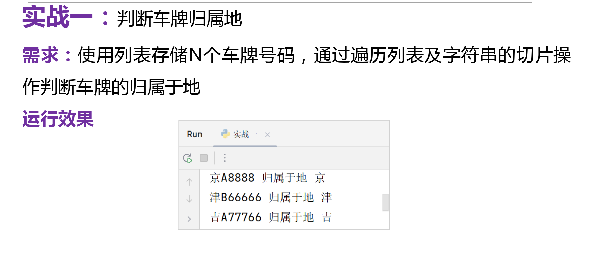
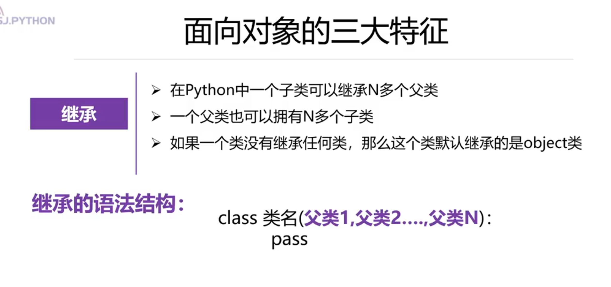
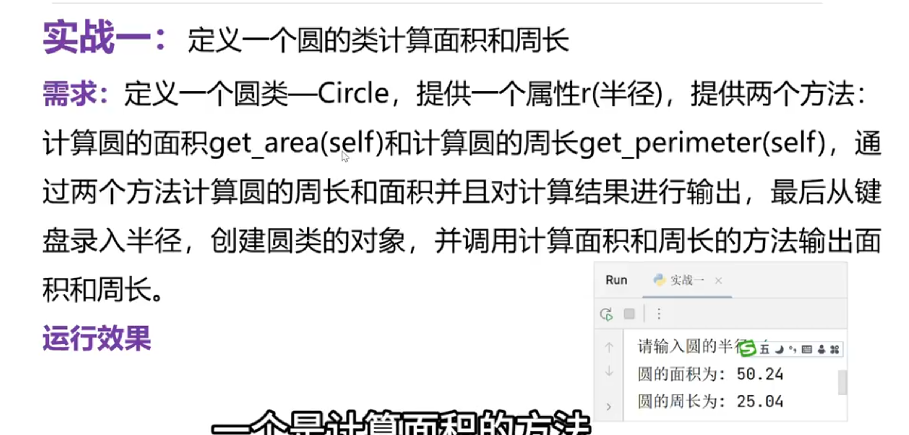
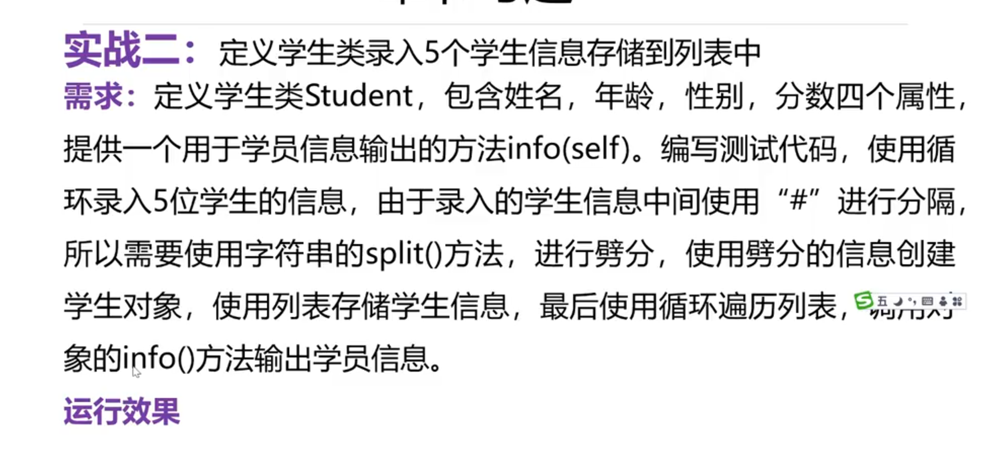
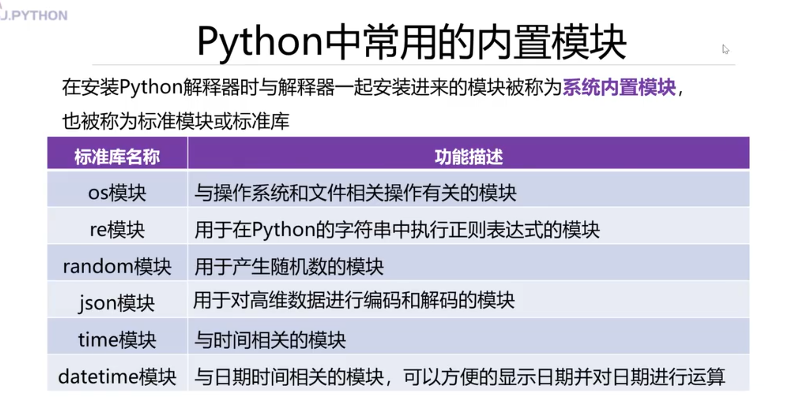
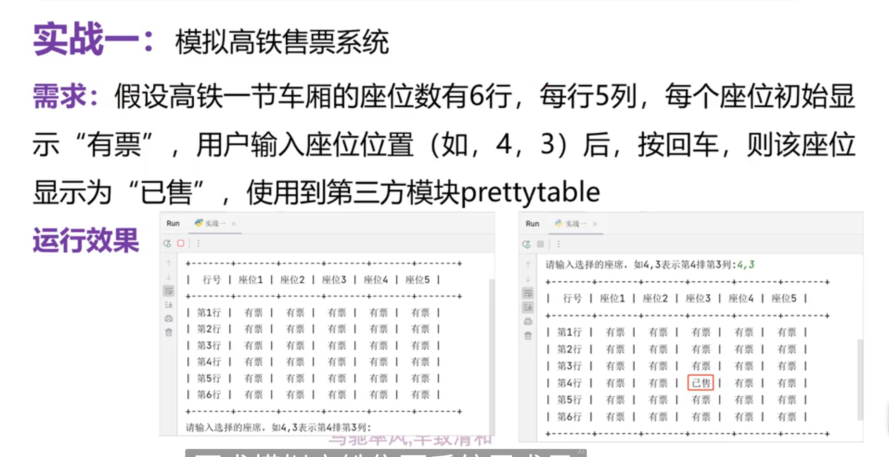
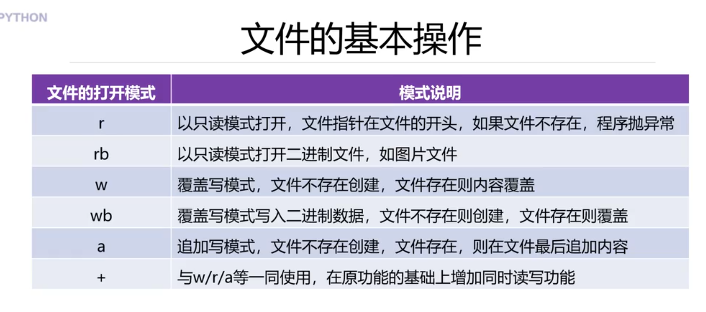

## Python编程基础

### 1.使用print函数进行简单输出

```python
a=100 # 变量a,值为100
b=50 # 变量b,值为50
print(90)
print(a) # 输出的是变量的值 ，a的值是100
print(a*b) # 输出a*b的运算结果，运算结果为5000

print('北京欢迎你！')
print("北京欢迎你！")
print('''北京欢迎你！''')
print("""北京欢迎你！""")
```

### 2.不换行一次输出多个数据

```python
a=100
b=50
print(a,b,'要么出众，要么出局！！！')
```

### 3.输出ASCII码所对应的字符

```python
print('b')   # 直接输出了b
print(chr(98)) # 也输出了b 使用chr()将98转换成ASCII表中的字符
print('C')
print(chr(67))
print(8)
print(chr(56))
print('[')
print(chr(91))
# 中文编码的范围是[u4e00~u9fa5]
```

### 4.使用print函数输出中文Unicode码
```python
print(ord('北'))
print(ord('京'))
print(chr(21271),chr(20140))
```

### 5.使用print函数将内容输出到文件
```python
fp=open('note.txt','w') # 打开文件 w-->write
print('北京欢迎你',file=fp) # 将"北京欢迎你" 输出(写入)到note.txt文件中
fp.close() # 关闭文件

```

### 6.多条print函数输出结果一行显示
```python
print('北京',end='-->')
print('欢迎你') # 没有修改 结束符，所以，print之后会有一个空行
```

### 7.使用连接符连接多个字符串
```python
print('北京欢迎你'+'2023')
#print('北京欢迎你'+2023) # TypeError: can only concatenate str (not "int") to str
```

### 8.input函数的使用
```python
name=input('请输入您的姓名:')
print('我的姓名是:'+name)
```

### 9.输入整数类型的数据
```python
num=input('请输入您的幸运数字:')
print('您的幸运数字是:'+num) # 连接成功，说明num是字符串类型
num=int(num) # 使用内置函数int将num转成整数类型
print('您的幸运数这是:',num)
```

### 10.单行注释
```python
# 要求从键盘输入出生年份，要求是4位的年份，举例：1990
year=input('请输入您的出生年份:')


year=input('请输入您的出生年份:')  # 要求从键盘输入出生年份，要求是4位的年份，举例：1990
```

### 11.多行注释
```python
# 使用''' xxx ''' 或 """ xxx """注释
```

### 12.代码缩进
```python
# 一般代码  不需要缩进
print('hello')
print('world')
# 类的定义
class Student:
    pass

# 函数的定义
def fun():
    pass
```

### 实战

#### 1.输出“人生苦短，我用Python”

```python
fp=open('text.txt','w') # 打开文件
print('人生苦短，我用Python',file=fp) # 输出内容到文件
fp.close() # 关闭文件
```

#### 2.输出个人自我介绍

```python
name=input('请输入您的姓名:')
age=input('请输入您的年龄:')
motto=input('请输入您的座右铭:')
print('----------自我介绍--------------')
print('姓名:',name)
print('年龄:',age)
print('座右铭:',motto)
```

## 数据类型和运算符

### 1.查询Python中的保留字
```python
import keyword
print(keyword.kwlist)
print(len(keyword.kwlist)) # 获取保留字的个数
```

### 2.保留字严格区分大小写\
```python
true='真'
True='真' # True是Python中的保留字

```

### 3.变量的定义和使用
```python
luck_number=8  # 创建一个整型变量luck_number,并为其赋值为8

my_name ='杨淑娟' # 字符串类型的变量

print('luck_number的数据类型是:',type(luck_number)) # <class 'int'>
print(my_name,'的幸运数字是:',luck_number)

# Python动态修改变量的数据类型，通过赋不同类型的值就可以直接修改
luck_number='北京欢迎你'
print('luck_number的数据类型是:',type(luck_number)) # <class 'str'>

# 在Python中允许多个变量指向同一个值
no=number=1024  # no与number都指向了1024这个整数值
print(no,number)
print(id(no)) # id()查看对象的内存地址的 2535525366736
print(id(number)) # 2535525366736
```

### 4.常量的定义
```python
pi=3.1415926 # 定义了一个变量
PI=3.1415926 # 定义了一个常量
```

### 5.整数的四种表示形式
```python
num=987 # 默认是十进制，表示整数
num2=0b1010101 # 使用二进制表示整数
num3=0o765 # 使用八进制表示整数
num4=0x87ABF # 使用十六进制表示整数
print(num)
print(num2)
print(num3)
print(num4)
```

### 6.浮点数类型的使用
```python
height=187.6 # 身高
print(height)
print(type(height)) # type()查看height这个变量的数据类型

x=10
y=10.0
print('x的数据类型:',type(x)) # int
print('y的数据类型:',type(y))# float

x=1.99E1413
print('科学计数法:',x,'x的数据类型:',type(x))
print(0.1+0.2) # 不确定的尾数问题 0.30000000000000004

print(round(0.1+0.2,1)) # 0.3
```

### 7.复数类型的使用
```python
x=123+456j
print('实数部分:',x.real)
print('虚数部分:',x.imag)
```

### 8.字符串类型的使用
```python
city='天津'
address="天津市宝坻区香江大街3号"
print(city)
print(address)
# 多行字符串
info='''地址:天津市宝坻区香江大街3号
    收件人:杨淑娟
    手机号:18600000000
'''
info2="""地址:天津市宝坻区香江大街3号
    收件人:杨淑娟
    手机号:18600000000

"""
print(info)
print('------------------')
print(info2)

```

### 9.转义字符的使用
```python
print('北京')
print('欢迎你')
print('------------')
print('北京\n欢迎你') # 遇到\n即换行，可以连续换多行
print('北\n京\n欢\n迎\n你')
print('-----------')
print('北京北京\t欢迎你')
print('hello\toooo') # hello是5个字符 ，一个制表位是8个字符 8-5=3
print('hellooooo')
print('老师说:\'好好学习，天天向上\'')
print('老师说:\"好好学习，天天向上\"')

# 原字符，使转义字符失效的符号r或R
print(r'北\n京\n欢\n迎\n你')
print(R'北\n京\n欢\n迎\n你')
```

### 10.字符串的索引和切片
```python
s='HELLOWORLD'
print(s[0],s[-10]) # 序号0和序号-10表示的是同一个字符
print('北京欢迎你'[4]) # 获取字符串中索引为4
print('北京欢迎你'[-1])
print('---------------------')
print(s[2:7]) # 从2开始到7结束不包含7  正向递增
print(s[-8:-3])  # 反向递减
print(s[:5]) # 默认N从 0开始
print(s[5:]) # M 默认是切到字符串的结尾
```

### 11.字符串类型的操作
```python
x='2022年'
y='北京冬奥会'
print(x+y) # 连接两个字符
print(x*10) # 对x这个字符串的内容复制10次
print(10*x)

print('北京' in y) # True
print('上海' in y ) # False
```

### 12.布尔类型的使用
```python
x=True
print(x)
print(type(x))
print(x+10)  # 11   -->1+10
print(False+10) # 10-->0+10
print('-----------------------')
print(bool(18)) # 测试一下整数18的布尔值 True
print(bool(0),bool(0.0)) # False
# 总结，非0的整数的布尔值都是True
print(bool('北京欢迎你')) # True
print(bool('')) #False
# 所有非空字符串的布尔值都是True
print(bool(False)) #False
print(bool(None))  #False
```

### 13.数据类型之间的转换
```python
x=10
y=3
z=x/y # 在执行除法运算的时候，将运算的结果赋值给z
print(z,type(z)) # 隐式转换，通过运算隐式的转了结果的类型

# float类型转成int类型，只保留整数部分
print('float类型转成int类型:',int(3.14))
print('float类型转成int类型:',int(3.9))
print('float类型转成int类型:',int(-3.14))
print('float类型转成int类型:',int(-3.9))

# 将int转成float类型
print('将int转成float类型:',float(10))
# 将str转成int类型
print(int('100')+int('200'))
# 将字符串转成int或float时报错的情况
#print(int('18a')) # ValueError: invalid literal for int() with base 10: '18a'
#print(int('3.14')) # ValueError: invalid literal for int() with base 10: '3.14'
#print(float('45a.987')) # ValueError: could not convert string to float: '45a.987'

# chr()ord()一对、
print(ord('杨')) #杨在unicode表中对应的整数值
print((chr(26472))) # 26472整数在unicode表中对应的字符是什么

# 进制之间的转换操作，十进制与其它进制之间的转换
print('十进制转成十六进制:',hex(26472))
print('十进制转成八进制:',oct(26472))
print('十进制转成二进制:',bin(26472))
```

### 14.eval函数的使用
```python
s='3.14+3'
print(s,type(s))
x=eval(s) # 使用eval函数去掉s这个字符串中左右的引号 ,执行加法运算
print(x,type(x))

# eval函数经常与input()函数一起使用，用来获取用户输入的数值
age=eval(input('请输入您的年龄:')) # 将字符串类型转成了int类型，相当于int(age)
print(age,type(age))

height=eval(input('请输入您的身高:'))
print(height,type(height))

hello='北京欢迎你'
print(hello)
print(eval('hello')) # 输出了"北京欢迎你"
print(eval('北京欢迎你')) # NameError: name '北京欢迎你' is not defined
```

### 15.算术运算符的使用
```python
print('加法:',1+1)
print('减法:',1-1)
print('乘法:',2*3)
print('除法:',10/2)
print('整除:',10//3)
print('取余:',10%3)
print('幂运算:',2**4) # 2*2*2*2
print(10/0) # ZeroDivisionError: division by zero
```

### 16.赋值运算符的使用
```python
x=20 # 直接赋值，直接将20赋值给左侧的变量x
y=10
x=x+y # 将x+y的和赋值给x ，x的值为30
print(x)  # x的值是30
x+=y   # 40  相当于x=x+y
x-=y # 相当于x=x-y
print(x) # 30
x*=y
print(x) # 300
x/=y
print(x) #30.0 发生了类型转换 x的数据类型为float类型
print(type(x)) # <class 'float'>
x%=2 # 相当于 x=x%2
print(x) # 0.0
z=3
y//=z  # 相当于y=y//z
print(y) # 3

y**=2 # 相当于 y=y**2
print(y)  # 9

# Python支持链式赋值
a=b=c=100 # 相当于执行 a=100 b=100  c=100
print(a,b,c)

# Python支持系列解包赋值
a,b=10,20  # 相当于执行了a=10  b=20
print(a,b)

print('-----如何交换两个变量的值呢?-----')
a,b=b,a # 将b的值赋给a,将a的值赋给b
print(a,b)
```

### 17.比较运算符的使用
```python
print('98大于90吗?',98>90)
print('98小于90吗?',98<90)
print('98等于90吗?',98==90)
print('98不等于90吗?',98!=90)
print('98大于等于98吗?',98>=98)
print('98小于等于98吗?',98<=98)
```

### 18.逻辑运算符的使用
```python
print(True and True)
print(True and False)
print(False and False)
print(False and True)
print('-'*40)

print(8>7 and 6>5) # True
print(8>7 and 6<5)  # False
print(8<7 and 10/0) # False ,10/0并没有运算，当第一个表达式的结果为False，直接得结果，不会计算 and右侧的表达式了

print('-'*40)
print(True or True)
print(True or False)
print(False or False)  # False
print (False or True)

print('-'*40)
print(8>7 or 10/0) # True ，左侧的表达式结果为True时，or的右侧表达式根本不执行运算符
print('-'*40)
print( not True ) # False
print( not False) # True
print( not (8>7) ) # False
```

### 19.位运算
```python
print('按位与运算:',12&8)
print('按位或运算:',4|8)
print('按位异或运算符:',31^22)
print('按位取反:',~123)

print('左移位:',2<<2) # 8, 表示的是2向左移动两位   2*2*2
print('左移位:',2<<3) # 相当于 2* 2*2*2
print('右移位:',8>>2) # 8向右移动两位相当于 8//2 ,4//2
print('右移位:',-8>>2) # -2
```

### 实战

#### 1.从键盘获取一个4位整数，分别输出个位、十位、百位、千位上的数字

```python
num=eval(input('请输入一个四位整数:'))
print('个位上的数:',num%10)
print('十位上的数:',num//10%10)
print('百位上的数:',num//100%10)
print('千位上的数:',num//1000)

print('-'*40)
num=input('请输入一个四位的整数:') # num是一个字符串类型
print('个位上的数:',num[3])
print('十位上的数:',num[2])
print('百位上的数:',num[1])
print('千位上的数:',num[0])
```

#### 2.根据父母身高预测儿子的身高
```python
father_height=eval(input('请输入爸爸的身高:'))
mother_height=eval(input('请输入妈妈的身高:'))
son_height=(father_height+mother_height)*0.54
print('预测儿子的身高:',son_height)
```

## 程序的流程控制

### 1.顺序结构的语句
```python
# 赋值运算符的顺序 从右到左
name='张三'
age=20
a=b=c=d=100 # 链式赋值
a,b,c,d='room' # 字符串分解赋值
print(a)
print(b)
print(c)
print(d)
print('---------输入/输出语句也是典型的顺序结构---------')
name=input('请输入您的姓名:')
age=eval(input('请输入您的年龄:'))
luck_number=eval(input('请输入您的幸运数字:'))
print('姓名:',name)
print('年龄:',age)
print('幸运数字:',luck_number)
```

### 2.单分支结构if
```python
number=eval(input('请输入您的6位中奖号码:'))
# 使用if语句
if number==987654:   #等值判断
    print('恭喜您，中奖了!')

if number!=987654:
    print('您未中本期大奖')

print('-------以上if判断的表达式，是通过比较运算符计算出来的，结果是布尔值类型----')
n=98 # 赋值操作
if n%2:   # 98%2的余数是0，0的布尔值是False，非0的布尔值为True
    print(n,'是奇数')  # 由于98%2的余数是0，所以该行代码不执行

if not n%2:  # 98%2的余数是0，0的布尔值是False， not False 的结果为True
    print(n,'为偶数')

print('---------判断一个字符串是否是空字符串----------')
x=input('请输入一个字符串:')
if x:  # 在Python中一切皆对象，每个对象都有一个布尔值，而非空字符串的布尔值为True ，空字符串的布尔值为False
    print('x是一个非空字符串')

if not x: # 空字符串的布尔值为False  ，取反, not False的结果为True
    print('x是一个空字符串')

print('---------表达式也可以是一个单纯的布尔型变量----------')
flag=eval(input('请输入一个布尔类型的值:True或False'))
if flag:
    print('flag的值为True')

if not flag:
    print('flag的值为False')

print('-------使用if语句时，如果语句块中只有一句代码，可以将语句块直接写在冒号的后面-----')
a=10
b=5
if a>b:max=a # 语句块只有一句，赋最大值
print('a和b的最大值为:',max)
```

### 3.双分支结构if-else
```python
number=eval(input('请输入您的6位中奖号码:'))
# if...else
if number==987654:
    print('恭喜您中奖了！')
else:
    print('您未中本期大奖！')

print('----以上代码可以使用条件表达式进行简化---')

result='恭喜您中奖了!' if number==987654 else '您未中本期大奖!'
print(result)

print('恭喜您中奖了!' if number==987654 else '您未中本期大奖!')
```

### 4.多分支结构的使用
```python
score=eval(input('请输入您的成绩:'))
# 多分支结构
if score<0 or score>100:
    print('成绩有误！')
elif 0<=score<60:
    print('E')
elif 60<=score<70:
    print('D')
elif 70<=score<80:
    print('C')
elif 80<=score<90:
    print('B')
else:
    print('A')
```

### 5.嵌套if的使用
```python
answer=input('请问，您喝酒了吗?')
if answer=='y': # answer的值为y表示喝酒了
    proof=eval(input('请输入酒精含量:'))
    if proof<20:
        print('构不成酒驾，祝您一路平安')
    elif proof<80:  # 20<=proof<80
        print('已构成酒驾，请不要开车')
    else:
        print('已达到了醉驾标准，请千万不要开车')
else:
    print('你走吧，没你啥事儿！')
```

### 6.使用and连接多个选择条件 
```python
user_name=input('请输入您的用户名:')
pwd=input('请输入您的密码:')
if user_name=='ysj' and pwd=='888888':
    print('登录成功')
else:
    print('用户名或密码不正确')
```

### 7.使用or连接多个选择条件
```python
score=eval(input('请输入您的成绩：'))
if score<0 or score>100:
    print('成绩无效')
else:
    print('您的成绩为:',score)
```

### 8.Python3.11新特性-模式匹配
```python
score=input('请输入成绩等级:')
match score:
    case 'A':
        print('优秀')
    case 'B':
        print('良好')
    case 'C':
        print('中等')
    case 'D':
        print('及格')
    case 'E':
        print('不及格')
```

### 9.遍历for循环的使用
```python
# 遍历字符串
for i in 'hello':
    print(i)
# range()函数，Python中的内置函数，产生一个[n,m)的整数序列，包含n,但是不包含m
for i in range(1,11):
    #print(i)
    if i%2==0:
        print(i,'是偶数')
# 计算1-10之间的累加和
s=0 # 用于存储累加和
for i in range(1,11):
    s+=i # 相当于 s=s+i

print('1-10之间的累加和为:',s)
print('----------100到999之间的水仙花数---')
'''
153=3*3*3+5*5*5+1*1*1
'''
for i in range(100,1000):
    sd=i%10 # 获取个位上的数字     假设   153%10 -->3
    tens=i//10%10 # 获取十位上的数字    153//10-->15  15%10-->5
    hundred=i//100   # 获取百位上的数字   153//100-->1
    # 判断
    if sd**3+tens**3+hundred**3==i:
        print(i)
```

### 10.遍历循环的扩展形式
```python
s=0 # 用于存储累加和
for  i in range(1,11):
    s+=i
else:
    print('1-10之间的累加和为:',s)
```

### 11.无限循环while的使用
```python
# (1)初始化变量
answer=input('今天要上课吗?y/n')
while answer=='y': # (2)条件判断
    print('好好学习，天天向上') # (3)语句块
    #(4)改变变量
    answer=input('今天要上课吗?y/n')

# 1-100之间的累加和
s=0 # 存储累加和
i=1 # (1)初始化变量
while i<=100: #(2)条件判断
    s+=i # (3)语句块
    # (4)改变变量
    i+=1 # 相当于i=i+1
print('1-100之间的累加和:',s)


```

### 12.无限循环while的扩展形式
```python
# 1-100之间的累加和
s=0 # 存储累加和
i=1 # (1)初始化变量
while i<=100: #(2)条件判断
    s+=i # (3)语句块
    # (4)改变变量
    i+=1 # 相当于i=i+1
else:
    print('1-100之间的累加和:',s)

```

### 13.使用无限循环模拟用户登录
```python
# (1)初始化变量
i=0
while i<3:# (2)条件判断 0,1,2
    # (3)语句块
    user_name=input('请输入您的用户名:')
    pwd=input('请输入您的密码:')
    # 登录操作，if...else...
    if user_name=='ysj' and pwd=='888888':
        print('系统正在登录，请稍后')
        # 需要改变循环变量,目的：退出循环
        i=8 #   第三行 判断 i<3, 8<3 False退出while循环  #(4)改变变量
    else:
        if i<2:
            print('用户名或密码不正确,您还有',2-i,'次机会')
        i+=1 #相当于i=i+1  # (4)改变变量

# 单分支的判断
if i==3: # 当用户名或密码输入三次不正确的时候，循环执行结束了,i的最大值为3
    print('对不起，三次均输入错')
```

### 14.长方形和直角三角形
```python
# 三行四列
for i in range(1,4): # 外层循环行
    for j in range(1,5): # 内层循环 列
        print('*',end='')
    print() # 空的print语句，作用是换行
print('-----------------')
for i in range(1,6): # 5行
    # *的个数与行相同,range(1,2),第二行，range(1,3)
    for j in range(1,i+1):
        print('*',end='')
    print() # 空的print语句，换行

```

### 15.倒三角形和等腰三角形
```python
# 倒三角形
# 1-->5 range(1,6) ,2-->4 range(1,5) 3-->3  range(1,4) ...    5-->1 range(1,2)
for i in range(1,6): # i表示的是行号，第i行
    for j in range(1,7-i):
        print('*',end='')
    print() # 内层循环执行完毕之后，空print()换行

print('------------------------------')
# 等腰三角形
'''
&&&&*
&&&***
&&*****
&*******
*********
'''
for i in range(1,6): # 外层循环 5行
    # 倒三角形
    for j in range(1,6-i):
        # print('&',end='')
        print(' ',end='')
    # 1,3,5,7...等腰三角形 range(1,2) ,range(1,4),range(1,6),  range(1,8),,,range(1,10)
    for k in range(1,i*2):
        print('*',end='')
    print() # 当两个并列的for循环执行完毕之后，再换行
```

### 16.菱形
```python
row=eval(input('请输入菱形的行数:'))
while row%2==0: # 判断行数的奇偶性，行数是偶数，重新输入行数
    print('重新输入菱形的行数:')
    row=eval(input('请输入菱形的行数:'))
# 输出菱形的
top_row=(row+1)//2 # 上半部分的行数
# 上半部分
for i in range(1,top_row+1): #
    # 倒三角形
    for j in range(1,top_row+1-i):
        # print('&',end='')
        print(' ',end='')
    # 1,3,5,7...等腰三角形 range(1,2) ,range(1,4),range(1,6),  range(1,8),,,range(1,10)
    for k in range(1,i*2):
        print('*',end='')
    print() # 当两个并列的for循环执行完毕之后，再换行
'''
&&&&*
&&&***
&&*****
&*******
*********
&*******
&&*****
&&&***
&&&&*
'''

# 下半部分
bottom_row=row//2
for i in range(1,bottom_row+1):
    # 直角三角形
    for j in range(1,i+1):
        print(' ',end='')

    # 倒三角
    for k in range(1,2*bottom_row-2*i+2): # 1 -->range(1,8) ,2-->range(1,6) ,3-->range(1,4) ,range(1,2)
        print('*',end='')
    print()
```

### 17.空心菱形
```python
row=eval(input('请输入菱形的行数:'))
while row%2==0: # 判断行数的奇偶性，行数是偶数，重新输入行数
    print('重新输入菱形的行数:')
    row=eval(input('请输入菱形的行数:'))
# 输出菱形的
top_row=(row+1)//2 # 上半部分的行数
# 上半部分
for i in range(1,top_row+1): #
    # 倒三角形
    for j in range(1,top_row+1-i):
        # print('&',end='')
        print(' ',end='')
    # 1,3,5,7...等腰三角形 range(1,2) ,range(1,4),range(1,6),  range(1,8),,,range(1,10)
    for k in range(1,i*2):
        if k==1 or k==i*2-1:
            print('*',end='')
        else:
            print(' ',end='')
    print() # 当两个并列的for循环执行完毕之后，再换行
'''
&&&&*
&&&***
&&*****
&*******
*********
&*******
&&*****
&&&***
&&&&*
'''

# 下半部分
bottom_row=row//2
for i in range(1,bottom_row+1):
    # 直角三角形
    for j in range(1,i+1):
        print(' ',end='')

    # 倒三角
    for k in range(1,2*bottom_row-2*i+2): # 1 -->range(1,8) ,2-->range(1,6) ,3-->range(1,4) ,range(1,2)
        if k==1 or k==2*bottom_row-2*i+2-1:

            print('*',end='')
        else:
            print(' ',end='')
    print()
```

### 18.跳转语句break在while循环中的使用
```python
s=0 # 存储累加和
i=1   #(1)初始化变量
while i<11:  #(2)条件判断
    # (3)语句块
    s+=i
    if s>20:
        print('累加和大于20的当前数是:',i)
        break
    i+=1 # (4)改变变量

print('--------------------------')
i=0 # 统计登录的次数 (1)初始化变量
while i<3:  #(2)条件判断
    # (3)语句块
    user_name=input('请输入用户名:')
    pwd=input('请输入密码:')
    if user_name=='ysj' and pwd=='888888':
        print('系统正在登录，请稍后...')
        break
    else:
        if i<2:
            print('用户名或密码不正确,您还有',2-i,'次机会')
    # (4)改变变量
    i+=1
else: # while...else
    print('三次均输入错误！')
```

### 19.break在for循环中的使用
```python
for i in 'hello':
    if i=='e':
        break
    print(i)
print('------------------------')
for i in range(3):
    # (3)语句块
    user_name = input('请输入用户名:')
    pwd = input('请输入密码:')
    if user_name == 'ysj' and pwd == '888888':
        print('系统正在登录，请稍后...')
        break
    else:
        if i < 2:
            print('用户名或密码不正确,您还有', 2 - i, '次机会')
else: # for...else
    print('三次均输入错误！')
```

### 20.跳转语句continue在while中的使用
```python
s=0
i=1  #(1)初始化变量
while i <=100: #(2)条件判断
    # (3)语句块
    if i%2==1: # 奇数
        i+=1
        continue # 不再执行后面的代码了
    # 累加求和的代码
    s+=i
    i+=1
print('1-100之间的偶数和:',s)
```

### 21.continue在for循环中的使用
```python
s=0
for i in range(1,101):
    if i%2==1:
        continue
    # 累加求和的代码
    s+=i
print('1-100之间的偶数和是:',s)
```

### 22.空语句pass
```python
if True:
    pass

while True:
    pass

for i in range(10):
    pass
```

### 实战

#### 1.输入一个年份，判断是否是闰年
```python
year=eval(input('请输入一个四位的年份:'))
if (year%4==0 and year%100!=0) or year%400==0:
    print(year,'年是闰年')
else:
    print(year,'年是平年')
```

#### 2.模拟10086查询功能
```python
#(1)初始化变量
answer='y'
#(2)条件判断
while answer=='y':
    #(3)循环操作，语句块
    print('---------------欢迎使用10086查询功能---------------------')
    print('1.查询当前余额')
    print('2.查询当前的剩余流量')
    print('3.查询当前的剩余通话时长')
    print('0.退出系统')
    choice=input('请输入您要执行的操作:') # input的结果是字符串类型
    if choice=='1':
        print('当前余额为:234.5元')
    elif choice=='2':
        print('当前的剩余流量为:4GB')
    elif choice=='3':
        print('当前的剩余通话时间长为:300分钟')
    elif choice=='0':
        print('程序退出，谢谢您的使用')
        break
    else:
        print('对不起，您输入的有误，请重新输入')
    # (4)改变变量
    answer=input('还继续操作吗？y/n')
else: #while...else
    print('程序退出，谢谢您的使用')

```

#### 3.使用嵌套循环输出九九乘法表
```python
for i in range(1,10):
    for j in range(1,i+1):
        print(str(j)+'*'+str(i)+'='+str(i*j),end='\t')
    print()
```

#### 4.猜数游戏
```python
import random
rand=random.randint(1,100) # 产生1-100之间的随机数
count=1 # 记录猜数的次数
while count<=10:
    number=eval(input('在我心中有个数，1-100之间，请你猜一猜:'))
    if number==rand:
        print('猜对了')
        break
    elif number>rand:
        print('大了')
    else:
        print('小了')
    count+=1 # 每猜一次count次数要加1
# 判断次数
if count<=3:
    print('真聪明，一共猜了',count,'次')
elif count<=6:
    print('还可以，一共猜了',count,'次')
else:
    print('猜的次数有点多啊，一共猜了',count,'次')
```

## 组合数据类型

### 1.使用索引检索字符串中的元素
```python
# 正向递增
s='helloworld'
for i in range(0,len(s)):
    print(i,s[i],end='\t\t')
print('\n--------------------')

# 反向递减
for i in range(-10,0):
    print(i,s[i],end='\t\t')

print('\n',s[9],s[-1])
```

### 2.序列的切片操作
```python
s='HelloWorld'
# 切片操作
s1=s[0:5:2] # 索引从0开始，到5结束（不包含5）步长为2
print(s1)
# 省略了开始位置 ，start默认从0开始
print(s[:5:1])
# 省略开始位置start，省略不步长step
print(s[:5:])
# 省略结束位置
print(s[0::1]) # stop，默认到序列的最后一个元素（包含最后一个元素)

print(s[5::])
print(s[5:]) # 12行代码与13行代码功能相同，省略了结束，省略了一个步长
# 更改一下步长，步长更改为2
print(s[0:5:2])

# 省略开始位置 ，省略结束位置 ，只写步长
print(s[::2]) # 分别获取0，2，4，6，8索引位置 上的元素

# 步长为负数
print(s[::-1]) # 可以使用哪句代码替换呢
print(s[-1:-11:-1]) 

```

### 3.序列的相加和相乘操作
```python
s='Hello'
s2='World'
print(s+s2) # 产生一个新的字符串序列

# 序列的相乘操作
print(s*5)
print('-'*40)
```

### 4.序列的相关操作符和函数的使用
```python
s='helloworld'
print('e在helloworld中存在吗?',('e'in s)) # in的使用
print('v在helloworld中存在吗?',('v'in s))
# not in 的使用

print('e在helloworld中不存在吗?',('e'not in s)) # not in的使用
print('v在helloworld中不存在吗?',('v'not in s))

# 内置函数的使用
print('len():',len(s))
print('max():',max(s))
print('min():',min(s))

# 序列对象的方法，使用序列的名称，打点调用
print('s.index():',s.index('o')) # o在s中第一次出现的索引位置 4
#print('s.index():',s.index('v')) # ValueError: substring not found ,报错的原因是v在字符串中根本不存在，不存在所以找不到
print('s.count():',s.count('o')) # 统计o在字符串s中出现的次数
```

### 5.列表的创建与删除
```python
# 直接使用[]创建列表
lst=['hello','world',98,100.5]
print(lst)

# 可以使用内置的函数list()创建列表
lst2=list('helloworld')
lst3=list(range(1,10,2)) # 从1开始到10结束，步长为2，不包含10
print(lst2)
print(lst3)

# 列表是序列中的一种，对序列的操作符，运算符，函数均可以使用
print(lst+lst2+lst3) # 序列中的相加操作
print(lst*3) # 序列的相乘操作
print(len(lst))
print(max(lst3))
print(min(lst3))

print(lst2.count('o')) # 统计o的个数
print(lst2.index('o')) # o在列表lst2中第一次出现的位置

# 列表的删除操作
lst4=[10,20,30]
print(lst4)
# 删除列表
del lst4
#print(lst4) # NameError: name 'lst4' is not defined. Did you mean: 'lst'?
```

### 6.列表的遍历操作
```python
lst=['hello','world','python','php']
# 使用遍历循环for遍历列表元素
for item in lst:
    print(item)

# 使用for循环,range()函数，len()函数，根据索引进行遍历
for i in range(0,len(lst)):
    print(i,'-->',lst[i])

# 第三种遍历方式 enumearte()函数
for index,item in enumerate(lst):
    print(index,item) #index是序号，不是索引
# 手动修改序号的起始值
for index,item in enumerate(lst,start=1): #
    print(index,item)

for index, item in enumerate(lst,1):  #  省略start不写，直接写起始值
    print(index, item)
```

### 7.列表的相关操作
```python
lst=['hello','world','python']
print('原列表：',lst,id(lst))
# 增加元素的操作
lst.append('sql')
print('增加元素之后：',lst,id(lst))

# 使用insert(index,x)在指定的index位置上插入元素x
lst.insert(1,100)
print(lst)

# 列表元素的删除操作
lst.remove('world')
print('删除元素之后的列表:',lst,id(lst))

#使用pop(index)根据索引将元素取出，然后再删除
print(lst.pop(1))
print(lst)

# 清除列表中所有的元素clear()
# lst.clear()
# print(lst,id(lst))

# 列表的反向
lst.reverse() # 不会产生新的列表，在原列表的基础上进行的
print(lst)

# 列表的拷贝，将产生一个新的列表对象
new_lst=lst.copy()
print(lst,id(lst))
print(new_lst,id(new_lst))

# 列表元素的修改操作
# 根据索引进行修改元素
lst[1]='mysql'
print(lst)
```

### 8.列表的排序操作
```python
lst=[4,56,3,78,40,56,89]
print('原列表:',lst)

# 排序，默认是升序
lst.sort() # 排序是在原列表的基础上进行的，不会产生新的列表对象
print('升序:',lst)

#排序，降序
lst.sort(reverse=True)
print('降序:',lst)

print('-----------------------------')
lst2=['banana','apple','Cat','Orange']
print('原列表：',lst2)
# 升序排序，先排大写，再排小写
lst2.sort()
print('升序:',lst2)

# 降序，先排小写，后排大写
lst2.sort(reverse=True)
print('降序:',lst2)

# 忽略大小写进行比较
lst2.sort(key=str.lower)
print(lst2)
```

### 9.列表的排序sorted
```python
lst=[4,56,3,78,40,56,89]
print('原列表:',lst)
# 排序
asc_lst=sorted(lst)
print('升序:',asc_lst)
print('原列表:',lst)

# 降序
desc_lst=sorted(lst,reverse=True)
print('降序:',desc_lst)
print('原列表:',lst)

lst2=['banana','apple','Cat','Orange']
print('原列表：',lst2)

# 忽略大小写进行排序
new_lst2=sorted(lst2,key=str.lower)
print('原列表:',lst2)
print('排序后的列表:',new_lst2)
```

### 10.列表生成式的使用
```python
import random
lst=[item for item in range(1,11)]
print(lst)

lst=[item*item for item in range(1,11)]
print(lst)

lst=[random.randint(1,100) for _ in range(10)]
print(lst)

# 从列表中选择符合条件的元素组成新的列表
lst=[i for i in range(10) if i%2==0]
print(lst)
```

### 11.二维列表的遍历与列表生成式
```python
# 创建二维列表
lst=[
    ['城市','环比','同比'],
    ['北京',102,103],
    ['上海',104,504],
    ['深圳',100,39]
]
print(lst)

# 遍历二维列表使用双层for循环
for row in lst: # 行
    for item in row: # 列
        print(item,end='\t')
    print()# 换行


# 列表生成式生成一个4行5列的二维列表
lst2=[ [j for j in range(5)]for i in range(4)]
print(lst2)
```

### 12.元组的创建与删除
```python
# 使用小括号创建元组
t=('hello',[10,20,30],'python','world')
print(t)

# 使用内置函数tuple()创建元组
t=tuple('helloworld')
print(t)

t=tuple([10,20,30,40])
print(t)

print('10在元组中是否存在：',(10 in t))
print('10在元组是不存在:',(10 not in t))
print('最大值:',max(t))
print('最小值:',min(t))
print('len:',len(t))
print('t.index:',t.index(10))
print('t.count',t.count(10))

# 如果元组中只有一个元素
t=(10)
print(t,type(t))

# 如果元组中只有一个元素，逗 号不能省
y=(10,)
print(y,type(y))

#元组的删除
del t
#print(t)
```

### 13.元组元素的访问与遍历
```python
t=('python','hello','world')
# 根据索引访问元组
print(t[0])
t2=t[0:3:2] # 元组支持切片操作
print(t2)

# 元组的遍历
for item in t:
    print(item)

# for+range()+len()
for i in range(len(t)):
    print(i,t[i])

# 使用enumerate()
for index,item in enumerate(t):
    print(index,'---->',item)

for index,item in enumerate(t,start=11): # 序号从11开始
    print(index,'---->',item)
```

### 14.元组生成式
```python
t=(i for i in range(1,4))
print(t)
# t=tuple(t)
# print(t)
# 遍历
# for item in t:
#     print(item)
print(t.__next__())
print(t.__next__())
print(t.__next__())

t=tuple(t)
print(t)
```

### 15.字典的创建与删除
```python
#(1)创建字典
d={10:'cat',20:'dog',30:'pet',20:'zoo'}
print(d) # key相同时，value值进行了覆盖

# (2)zip函数
lst1=[10,20,30,40]
lst2=['cat','dog','pet','zoo','car']
zipobj=zip(lst1,lst2)
print(zipobj) # <zip object at 0x000001ECD5A24F00>
#print(list(zipobj)) # [(10, 'cat'), (20, 'dog'), (30, 'pet'), (40, 'zoo')]
d=dict(zipobj)
print(d) # {10: 'cat', 20: 'dog', 30: 'pet', 40: 'zoo'}

# 使用参数创建字典
d=dict(cat=10,dog=20) # 左侧cat是key ,右侧的是value
print(d)


t=(10,20,30)
print({t:10}) # t是key,10是value ,元组是可以作为字典中的key

# lst=[10,20,30]
# print({lst:10}) # TypeError: unhashable type: 'list'

# 字典属于序列
print('max:',max(d))
print('min:',min(d))
print('len:',len(d))
# 字典的删除
del d
#print(d)
```

### 16.字典元素的访问和遍历
```python
d={'hello':10,'world':20,'python':30}
# 访问字典中的元素
# (1)使用d[key]
print(d['hello'])
#(2)d.get(key)
print(d.get('hello'))

# 二者之间是有区别的，如果key不存在，d[key]报错d.get(key)可以指定默认值
#print(d['java']) # KeyError: 'java'
print(d.get('java')) # None
print(d.get('java','不存在'))


# 字典的遍历
for item in d.items():
    print(item) # key=value组成的一个元素

# 在使用for循环遍历时，分别获取key,value
for key,value in d.items():
    print(key,'--->',value)
```

### 17.字典的相关操作方法
```python
d={1001:'李梅',1002:'王华',1003:'张峰'}
print(d)

# 向字典中添加元素
d[1004]='张丽丽'  # 直接使用赋值运算符向字典中添加元素
print(d)

# 获取字典中所有的key
keys=d.keys()
print(keys) # dict_keys([1001, 1002, 1003, 1004])
print(list(keys))
print(tuple(keys))

# 获取字典中所有的value
values=d.values()
print(values) # dict_values(['李梅', '王华', '张峰', '张丽丽'])
print(list(values))
print(tuple(values))

# 如果将字典中的数据转成key-value的形式,以元组的方式进行展现
lst=list(d.items())
print(lst)


d=dict(lst)
print(d)

# 使用pop函数
print(d.pop(1001))
print(d)

print(d.pop(1008,'不存在'))


# 随机删除
print(d.popitem())
print(d)


# 清空字典中所有的元素
d.clear()
print(d)
# Python中一切皆对象，每个对象都有一个布尔值
print(bool(d)) # 空字典的布尔值为False
```

### 18.字典生成式
```python
import random
d={item :random.randint(1,100) for item in range(4)}
print(d)

# 创建两个列表
lst=[1001,1002,1003]
lst2=['陈梅梅','王一一','李丽丽']
d={key:value for key,value in zip(lst,lst2)}
print(d)
```

### 19.集合的创建与删除
```python
#{}直接创建集合
s={10,20,30,40}
print(s)
# 集合只能存储不可变数据类型
#s={[10,20],[30,40]} #TypeError: unhashable type: 'list'

#print(s)
# 使用set()创建集合
s=set() # 创建了一个空集合,空集合的布尔值是False
print(s)
s={} # 创建的是集合还是字典呢？
print(s,type(s)) # dict

s=set('helloworld')
print(s)

s2=set([10,20,30])
print(s2)

s3=set(range(1,10))
print(s3)

#集合属于序列中的一种
print('max:',max(s3))
print('min:',min(s3))
print('len:',len(s3))

print('9在集合中存在吗？',(9 in s3))
print('9在集合中不存在吗？',(9 not in s3))

# 集合的删除操作
del s3
#print(s3)#NameError: name 's3' is not defined. Did you mean: 's'?
```

### 20.集合的操作符
```python
A={10,20,30,40,50}
B={30,50,88,76,20}
# 交集操作
print(A&B)
# 并集操作
print(A|B)
# 差集操作
print(A-B)

# 补集操作
print(A^B)
```

### 21.集合的相关操作
```python
s={10,20,30}
# 向集合中添加元素
s.add(100)
print(s)
#删除元素
s.remove(20)
print(s)
# 清空集合中所有元素
# s.clear()
# print(s)

# 集合的遍历操作
for item in s:
    print(item)

# 使用enumerate()函数
for index,item in enumerate(s):
    print(index,'-->',item)

# 集合的生成式
s={i for i in range(1,10)}
print(s)

s={i for i in range(1,10) if i%2==1}
print(s)
```

### 22.结构的模式匹配
```python
data=eval(input('请输入要匹配的数据:'))
match data:
    case {'name':'ysj','age':20}:
        print('字典')
    case [10,20,30]:
        print('列表')
    case (10,20,40):
        print('元组')
    case _:
        print('相当于多重if中的else')
```

### 23.合并字典运算符
```python
d1={'a':10,'b':20}
d2={'c':30,'d':40,'e':50}
merged_dict=d1|d2
print(merged_dict)
```

### 24.同步迭代
```python
fruits=['apple','orange','pear','grape']
counts=[10,3,4,5]
for f,c in zip(fruits,counts):
    match f,c:
        case 'apple',10:
            print('10个苹果')
        case 'orange',3:
            print('3个桔子')
        case 'pear',4:
            print('4个梨')
        case 'grape',5:
            print('5串葡萄')
```

### 实战

#### 1.“千年虫”是什么虫？

```python
lst=[88,89,90,98,00,99] # 表示的员工的两位整数出生年份
print(lst)
# 遍历列表的方式
# for index in range(len(lst)):
#     if str(lst[index])!='0':
#         lst[index]='19'+str(lst[index]) # 拼接年份，再赋值
#     else:
#         lst[index]='200'+str(lst[index])
#
# print('修改后的年份列表：',lst)

# 使用enumerate()函数
for index,value in enumerate(lst):
    if str(value) != '0':
        lst[index]='19'+str(value) # 拼接年份，再赋值
    else:
        lst[index]='200'+str(value)
print('修改后的年份列表：',lst)
```

#### 2.模拟京东购物流程

```python
# 创建一个空列表，用于存储入库的商品信息
lst=[]
for i in range(5):
    goods=input('请输入商品的编号和商品的名称进行商品入库，每次只能输入一件商品:')
    lst.append(goods)
# 输出所有的商品信息
for item in lst:
    print(item)

# 创建一个空列表，用于存储购物车中的商品
cart=[]
while True:
    flag=False # 代表没有商品的情况
    num=input('请输入要购买的商品编号:')
    # 遍历商品列表，查询一下要购买的商品是否存在
    for item in lst:
        if num==item[0:4]: # 切片操作，从商品中切出序号
            flag=True # 代表商品已找到
            cart.append(item) # 添加到购物车中
            print('商品已成功添加到购物车')
            break # 退出的是for循环
    if not flag and num!='q': # not flag 等价于 flag==False
        print('商品不存在')

    if num=='q':
        break # 退出的才是while循环
print('-'*50)
print('您购物车里已选择的商品为:')
cart.reverse()
for item in cart:
    print(item)
```

#### 3.模拟12306火车票订票流程

```python
# 创建字典用于存储车票信息，使用车次作key,使用其它信息作value
dict_ticket={
    'G1569':['北京南-天津南','18:06','18:39','00:33'],
    'G1567':['北京南-天津南','18:15','18:49','00:34'],
    'G8917':['北京南-天津西','18:20','18:19',"00:59"],
    'G203':['北京南-天津南','18:35','19:09','00:34']
}
print('车次     出发站-到达站    出发时间    到达时间    历时时长')
# 遍历字典中的元素
for key in dict_ticket.keys():
    print(key, end='  ') # 为什么不换行，因为车次和车次的详细信息在一行显示
    # 根据key获取出来的值是一个列表，
    for item in dict_ticket.get(key): # 根据key获取值
        print(item,end ='\t\t')
    # 换行
    print()

# 输入用户的购票车次
train_no=input('请输入要购买的车次：')
# 根据key获取值
info=dict_ticket.get(train_no,'车次不存在') # info是一个列表类型
# 判断车次是否存在
if info!='车次不存在':
    person=input('请输入乘车人，如果是多位乘车人使用逗号分隔:')
    # 获取车次的出发站-到达站，还有出发时间
    s=info[0]+' '+info[1] +'开'
    print('您已购买了'+train_no+' '+s+',请'+person+'尽快换取纸制车示。【铁路客服】')
else:
    print('对不起，选择的车次可能不存在')

```

#### 4.模拟手机通迅录

```python
# 创建一个空集合
s=set()
# 录入5位好友的姓名和手机号
for i in range(1,6):
    info=input(f'请输入第{i}位好友的姓名和手机号:')
    # 添加到集合中
    s.add(info)
# 遍历集合
for item in s:
    print(item)
```

## 字符串及正则表达式

### 1.字符串的相关处理方法1
```python
# 大小写转换
s1='HelloWorld'
new_s2=s1.lower()
print(s1,new_s2)

new_s3=s1.upper()
print(new_s3)

# 字符串的分隔
e_mail='ysj@126.com'
lst=e_mail.split('@')
print('邮箱名:',lst[0],'邮件服务器域名:',lst[1])

#
print(s1.count('o')) # o在字符串s1中出现了两次

# 检索操作
print(s1.find('o')) # o在字符串s1中首次出现的位置
print(s1.find('p')) # -1，没有找到

print(s1.index('o'))
#print(s1.index('p')) # ValueError: substring not found 子串没有找到

# 判断前缀和后缀

print(s1.startswith('H')) # True
print(s1.startswith('P')) # False

print('demo.py'.endswith('.py')) # True
print('text.txt'.endswith('.txt')) # True
```

### 2.字符串的相关处理方法2
```python
s='HelloWorld'
# 字符串的替换
new_s=s.replace('o','你好',1) # 最后一个参数是替换次数，默认是全部替换
print(new_s)

# 字符串在指定的宽度范围内居中
print(s.center(20))
print(s.center(20,'*'))

# 去掉字符串左右的空格
s='    Hello    World    '
print(s.strip()) #
print(s.lstrip()) # 去除字符串左侧的空格
print(s.rstrip()) # 去除字符串右侧的空格

# 去掉指定的字符
s3='dl-Helloworld'
print(s3.strip('ld')) # 与顺序无关
print(s3.lstrip('ld'))
print(s3.rstrip('dl'))
```

### 3.格式化字符串
```python
#(1)使用占位符进行格式化
name='马冬梅'
age=18
score=98.5
print('姓名:%s,年龄:%d,成绩:%f' % (name,age ,score))
print('姓名:%s,年龄:%d,成绩:%.1f' % (name,age ,score))

# (2)f-string
print(f'姓名:{name},年龄:{age},成绩:{score}')

# (3)使用字符串的format方法
print('姓名:{0},年龄:{1},成绩:{2}'.format(name,age,score))
print('姓名:{2},年龄:{0},成绩:{1}'.format(age,score,name))
```

### 4.format的格式控制
```python
s='helloworld'
print('{0:*<20}'.format(s)) # 字符串的显示宽度为20，左对齐，空白部分使用* 号填充
print('{0:*>20}'.format(s))
print('{0:*^20}'.format(s))

# 居中对齐
print(s.center(20,'*'))

# 千位分隔符（只适用于整数和浮点数）
print('{0:,}'.format(987654321))
print('{0:,}'.format(987654321.7865))

# 浮点数小数部分的精度
print('{0:.2f}'.format(3.1419826))
# 字符串类型 .表示是最大的显示长度
print('{0:.5}'.format('helloworld')) # hello

# 整数类型
a=425
print('二进制:{0:b},十进制:{0:d},八进制:{0:o},十六进制:{0:x},十六进制：{0:X}'.format(a))

# 浮点数类型
b=3.1415926
print('{0:.2f},{0:.2E},{0:.2e},{0:.2%}'.format(b) )

```

### 5.字符串的编码与解码
```python
s='伟大的中国梦'
# 编码 str->bytes
scode=s.encode(errors='replace') # 默认是utf-8 ,因为utf-8中文占3个字节
print(scode)

scode_gbk=s.encode('gbk',errors='replace') # gbk中中文占2个字节
print(scode_gbk)

# 编码中的出错问题
s2='耶✌'
scode_error=s2.encode('gbk',errors='replace')
print(scode_error)

# 解码过程bytes->str
print(bytes.decode(scode_gbk,'gbk'))
print(bytes.decode(scode,'utf-8'))

```

### 6.数据的验证
```python
# isdigit()十进制的阿拉伯数字
print('123'.isdigit()) # True
print('一二三'.isdigit()) # False
print('0b1010'.isdigit()) # False
print('ⅢⅢⅢ'.isdigit()) # False
print('-'*50)
# 所有字符都是数字
print('123'.isnumeric()) # True
print('一二三'.isnumeric())# True
print('0b1010'.isnumeric()) # False
print('ⅢⅢⅢ'.isnumeric()) # True
print('壹贰叁'.isnumeric()) # True
print('-'*50)
# 所有字符都是字母(包含中文字符)
print('hello你好'.isalpha()) # True
print('hello你好123'.isalpha()) # False
print('hello你好一二三'.isalpha()) # True
print('hello你好ⅢⅢⅢ'.isalpha()) # False
print('hello你好壹贰叁'.isalpha()) # True
print('-'*50)
# 所有字符都是数字或字母
print('hello你好'.isalnum()) # True
print('hello你好123'.isalnum()) #True
print('hello你好一二三'.isalnum()) #True
print('hello你好ⅢⅢⅢ'.isalnum()) #True
print('hello你好壹贰叁'.isalpha()) # True

print('-'*50)
# 判断字符的大小写
print('HelloWorld'.islower()) # False
print('helloworld'.islower()) # True
print('hello你好'.islower()) # True

print('-'*50)
print('HelloWorld'.isupper()) # False
print('HELLOWORLD'.isupper()) # True
print('HELLO你好'.isupper()) # True
print('-'*50)
#所有字符都是首字母大写
print('Hello'.istitle()) # True
print('HelloWorld'.istitle()) # False
print('Helloworld'.istitle()) # True
print('Hello World'.istitle()) # True
print('Hello world'.istitle()) # False

# 判断是否都是空白字符
print('-'*50)
print('\t'.isspace()) # True
print(' '.isspace()) # True
print('\n'.isspace()) # True
```

### 7.字符串的拼接操作
```python
s1='hello'
s2='world'
# (1)使用+进行拼接
print(s1+s2)

# (2)使用字符串的join()方法
print(''.join([s1,s2])) # 使用空字符串进行拼接

print('*'.join(['hello','world','python','java','php']))
print('你好'.join(['hello','world','python','java','php']))

# (3) 直接拼接
print('hello''world')

# (4)使用格式化字符串进行拼接
print('%s%s' % (s1,s2))
print(f'{s1}{s2}')
print('{0}{1}'.format(s1,s2))

```

### 8.字符串的去重操作
```python
s='helloworldhelloworldadfdfdeoodllffe'
# (1)字符串拼接及not in
new_s=''
for item in s:
    if item not in new_s:
        new_s+=item # 拼接操作
print(new_s)


# (2)使用索引+not in
new_s2=''
for i in range(len(s)):
    if s[i]  not in new_s2:
        new_s2+=s[i]
print(new_s2)

# (3)通过集合去重+列表排序'
new_s3=set(s)
lst=list(new_s3)
lst.sort(key=s.index)
# print(lst)
print(''.join(lst)) # 可利用join把列表拼接成字符串

```

### 9.match函数的使用
```python
import re # 导入
pattern='\d\.\d+' # +限定符，\d 0-9数字出现1次或多次
s='I study Python 3.11 every day' # 待匹配字符串
match=re.match(pattern,s,re.I)
print(match) # None
s2='3.11Python I study every day'
match2=re.match(pattern,s2)
print(match2) # <re.Match object; span=(0, 4), match='3.11'>

print('匹配值的起始位置:',match2.start())
print('匹配值的结束位置:',match2.end())
print('匹配区间的位置元素:',match2.span())
print('待匹配的字符串:',match2.string)
print('匹配的数据:',match2.group())

```

### 10.search函数的使用
```python
import re
pattern='\d\.\d+'
s='I study Python3.11 every day Python2.7 I love you'
match=re.search(pattern,s)

s2='4.10 Python I study every day'
s3='I study Python every day'

match2=re.search(pattern,s2)
match3=re.search(pattern,s3) # None
print(match)
print(match2)
print(match3)

print(match.group())
print(match2.group())
```

### 11.findall函数的使用
```python
import re # 导入
pattern='\d\.\d+' # +限定符，\d 0-9数字出现1次或多次
s='I study Python3.11 every day Python2.7 I love you'
s2='4.10 Python I study every day'
s3='I study Python every day'
lst=re.findall(pattern,s)
lst2=re.findall(pattern,s2)
lst3=re.findall(pattern,s3)

print(lst)
print(lst2)
print(lst3)

```

### 12.sub函数与split函数的使用
```python
import re
pattern='黑客|破解|反爬'
s='我想学习Python，想破解一些VIP视频，Python可以实现无底线反爬吗？'
new_s=re.sub(pattern,'XXX',s)
print(new_s)

s2='https://www.baidu.com/s?wd=ysj&rsv_spt=1'
pattern2='[?|&]'
lst=re.split(pattern2,s2)
print(lst)

```

### 实战

#### 1.判断车牌归属地

```python
lst=['京A8888','津B6666','吉A77766']
for item in lst:
    area=item[0:1]
    print(item,'归属地为:',area)
```

#### 2.统计字符串中出现指定字符的次数

```python
s='HelloPython,HelloJava,hellophp'
word=input('请输入要统计的字符:')
print('{0}在{1}一共出现了{2}'.format(word,s,s.upper().count(word)))
```

#### 3.格式化输出商品的名称和单价

```python
lst=[
    ['01','电风扇','美的',500],
    ['02', '洗衣机', 'TCL', 1000],
    ['03', '微波炉', '老板', 400],
]
print('编号\t\t名称\t\t\t品牌\t\t单价')
for item in lst:
    for i in item:
        print(i,end='\t\t')
    print() # 换行
# 格式化
for item in lst:
    item[0]='0000'+item[0]
    item[3]='￥{0:.2f}'.format(item[3])

print('编号\t\t\t名称\t\t\t品牌\t\t单价')
for item in lst:
    for i in item:
        print(i,end='\t\t')
    print() # 换行
```

#### 4.提取文本中所有图片的链接地址

```python
import re
s='"queryEnc":"%C3%C0%C5%AE","queryExt":"美女","listNum":1726,"displayNum":1102160,"gsm":"3c","bdFmtDispNum":"约1,100,000","bdSearchTime":"","isNeedAsyncRequest":0,"bdIsClustered":"1","data":[{ "adType":"0", "hasAspData":"0","thumbURL":"https://img1.baidu.com/it/u=272155668,1962283813&fm=26&fmt=auto","commodityInfo":null, "isCommodity":0, "middleURL":"https://img1.baidu.com/it/u=272155668,1962283813&fm=26&fmt=auto", "shituToken":"aadb3a", "largeTnImageUrl":"", "hasLarge" :0, "hoverURL":"https://img1.baidu.com/it/u=272155668,1962283813&fm=26&fmt=auto", "pageNum":30, "objURL":"ipprf_z2C$qAzdH3FAzdH3F2t42d_z&e3Bkwt17_z&e3Bv54AzdH3Ft4w2j_fjw6viAzdH3Ff6v=ippr%nA%dF%dFetn_z&e3Bxt78dn_z&e3Bvg%dFstej%dFda8l%dFam%dFdl%dF88%dF8ande8cm80ban0nllalnba80_z&e3B3r2&6juj6=ippr%nA%dF%dFetn_z&e3Bxt78dn_z&e3Bvg&wrr=daad&ftzj=ullll,8aaaa&q=wba&g=a&2=ag&u4p=3rj2?fjv=8m9abc98cd&p=an8vwcw9v9jl1nm88jdllww8dmuwnvvn", "fromURL":"ippr_z2C$qAzdH3FAzdH3Fe_z&e3Bm_z&e3BvgAzdH3Fr65utsjAzdH3FowpviMtgt_z&e3Brir?et1=m8adm8", "fromJumpUrl":"ippr_z2C$qAzdH3FAzdH3Fe_z&e3Bm_z&e3BvgAzdH3Fr65utsjAzdH3FowpviMtgt_z&e3Brir?et1=m8adm8", "fromURLHost":"v.6.cn", "currentIndex":"", "width":800, "height":600, "type":"jpg", "is_gif":0, "isCopyright":0, "resourceInfo":null, "strategyAssessment": "3141544242_1243_0_0", "filesize":"", "bdSrcType":"0", "di":"157630", "pi": "0", "is":"0,0", "imgCollectionWord":"","hasThumbData":"0", "bdSetImgNum":0, "partnerId":0, "spn":0, "bdImgnewsDate":"2020-06-03 02:31","fromPageTitle":"美女<\/strong>热舞", "fromPageTitleEnc":"美女热舞","bdSourceName":"", "bdFromPageTitlePrefix":"", "isAspDianjing":0, "token":"", "imgType" : "", "cs" : "272155668,1962283813", "os" : "1570395708,812629700", "simid" : "272155668,1962283813", "personalized":"0","simid_info":null,"face_info":null,"xiangshi_info":null,"adPicId":"0","source_type":""},{ "adType":"0", "hasAspData":"0","thumbURL":"https://img0.baidu.com/it/u=1934854801,2871685401&fm=253&fmt=auto&app=138&f=JPEG?w=500&h=313","commodityInfo":null, "isCommodity":0, "middleURL":"https://img0.baidu.com/it/u=1934854801,2871685401&fm=253&fmt=auto&app=138&f=JPEG?w=500&h=313", "shituToken":"9bb791", "largeTnImageUrl":"", "hasLarge" :0, "hoverURL":"https://img0.baidu.com/it/u=1934854801,2871685401&fm=253&fmt=auto&app=138&f=JPEG?w=500&h=313", "pageNum":31, "objURL":"ipprf_z2C$qAzdH3FAzdH3F2t42d_z&e3Bkwt17_z&e3Bv54AzdH3Ft4w2j_fjw6viAzdH3Ff6v=ippr%nA%dF%dFt42_z&e3B33da_z&e3Bv54%dF7r%dFwsst42%dF8889%dFac8dd8aSlnl%dFd8ac8daSlnl-d-8daa_z&e3B3r2&6juj6=ippr%nA%dF%dFt42_z&e3B33da_z&e3Bv54&wrr=daad&ftzj=ullll,8aaaa&q=wba&g=a&2=ag&u4p=3rj2?fjv=8m9abc98cd&p=bmcukd9vmml18lau1mjdub9dnnlmnakd"'
pattern='https://img\d{1}.baidu.com/it/u=\d*,\d*&fm=\d*&fmt=auto' # 模式字符串
#
lst=re.findall(pattern,s)
for item in lst:
    print(item)
```

## 异常处理

### 1.粗心导致的语法错误SyntaxError
```python
# 第一段代码
age=input('请输入你的年龄:')
if age>"18"
    print('成年人，做事需要负法律责任了！')

# 第二段代码
i=1
while i<10：
    print（i）
    i+=1

# 第三段代码
for i in range(3):
    uname=input('请输入用户名:')
    pwd=input('请输入密码:')
    if uname='admin' and pwd='admin':
        print('登录成功!')
        break
    else:
        print('输入有误！')
else:
    print('对不起，三次均输入错误')

```

### 2.修改示例7-1中的语法错误
```python
# 第一段代码
age=input('请输入你的年龄:')
if age>"18":
    print('成年人，做事需要负法律责任了！')

# 第二段代码
i=1
while i<10:
    print(i)
    i+=1

# 第三段代码
for i in range(3):
    uname=input('请输入用户名:')
    pwd=input('请输入密码:')
    if uname=='admin' and pwd=='admin':
        print('登录成功!')
        break
    else:
        print('输入有误！')
else:
    print('对不起，三次均输入错误')

```

### 3.知识点掌握不熟练导致的错误
```python
# 第一段代码
lst=[11,22,33,44]
print(lst[4])

# 第二段代码
lst=[]
lst=append('A','B','C')
print(lst)

```

### 4.修改示例7-3中的错误
```python
# 第一段代码
lst=[11,22,33,44]
print(lst[3])

# 第二段代码
lst=[]
#lst=append('A','B','C')
lst.append('A')
lst.append('B')
lst.append('C')
print(lst)

```

### 5.思路不清导致的问题
```python
lst=[
    {'rating':[9.7,50],'id':'1292052','type':['犯罪','剧情'],'title':'肖申克的救赎','actors':['蒂姆.罗宾斯','摩根.弗里曼']},
{'rating':[9.6,50],'id':'1291546','type':['剧情','爱情','同性'],'title':'霸王别姬','actors':['张国荣','张丰毅','巩俐','葛优']},
{'rating':[9.6,50],'id':'1296141','type':['剧情','犯罪','悬疑'],'title':'控方证人','actors':['泰隆.鲍华','玛琳.黛德丽']},
]

name=input('请输入你要查询的演员:')
for item in lst:
    for movie in item:
        actors=movie['actors']
        if name in actors:
            print(name,'出演了',movie)

```

### 6.思路不清导致的问题解决方案
```python
lst=[
    {'rating':[9.7,50],'id':'1292052','type':['犯罪','剧情'],'title':'肖申克的救赎','actors':['蒂姆.罗宾斯','摩根.弗里曼']},
{'rating':[9.6,50],'id':'1291546','type':['剧情','爱情','同性'],'title':'霸王别姬','actors':['张国荣','张丰毅','巩俐','葛优']},
{'rating':[9.6,50],'id':'1296141','type':['剧情','犯罪','悬疑'],'title':'控方证人','actors':['泰隆.鲍华','玛琳.黛德丽']},
]

name=input('请输入你要查询的演员:')
for item in lst:
    # for movie in item:
    #     actors=movie['actors']
    #     if name in actors:
    #         print(name,'出演了',movie)
    print(item) # 字典
    actors_lst=item.get('actors')
    #print(actors_lst)
    if name in actors_lst:
        title=item.get('title')
        print(title)
        print(name,'出演了',title,'电影')


```

### 7.

### 8.输入两个整数并进行除法运算
```python
num1=int(input('请输入一个整数:'))
num2=int(input('请输入另一个整数'))
result=num1/num2
print('结果:',result)
```

### 9.try-except结构的使用
```python
try:
    num1 = int(input('请输入一个整数:'))
    num2 = int(input('请输入另一个整数'))
    result = num1 / num2
    print('结果:', result)
except ZeroDivisionError:
    print('除数为0')
```

### 10.多个except结构
```python
try:
    num1 = int(input('请输入一个整数:'))
    num2 = int(input('请输入另一个整数'))
    result = num1 / num2
    print('结果:', result)
except ZeroDivisionError:
    print('除数不能为0')
except ValueError:
    print('不能将字符串转成整数')
except BaseException:
    print('未知异常')
```

### 11.try-except-else结构的使用
```python
try:
    num1 = int(input('请输入一个整数:'))
    num2 = int(input('请输入另一个整数'))
    result = num1 / num2

except ZeroDivisionError:
    print('除数不能为0')
except ValueError:
    print('不能将字符串转成整数')
except BaseException:
    print('未知异常')
else:
    print('结果:', result)
```

### 12.try-except-else-finally结构的使用
```python
try:
    num1 = int(input('请输入一个整数:'))
    num2 = int(input('请输入另一个整数'))
    result = num1 / num2

except ZeroDivisionError:
    print('除数不能为0')
except ValueError:
    print('不能将字符串转成整数')
except BaseException:
    print('未知异常')
else:
    print('结果:', result)
finally:
    print('程序执行结束！')
```

### 13.raise关键字的使用
```python
try:
    gender=input('请输入您的性别:')
    if gender!='男'and gender!='女':
        raise Exception('性别只能是男或女')
    else:
        print('您的性别是:',gender)
except Exception as e:
    print(e)
```

### 14.常见异常类型的产生
```python
# (1)ZeroDivisionError
# print(10/0)

# (2)IndexError
# lst=[10,30,50,90]
# print(lst[4])

#(3)KeyError

# d={'name':'ysj','age':20}
# print(d['gender'])

# (4)NameError
#print(hello)

# (5)SyntaxError
# print('hello)

#(6)ValueError

#print(int('a'))

# (7)AttributeError
# i=10
# print(i.name)

#(8)TypeError

#print('hello'+123)

# (9)IndentationError
    print('hello')
```

### 15.被调试的代码
```python
i=1
while i<10:
    print(i)
    i+=1 # 改变变量的值
```

### 实战

#### 1.编写程序接收用户输入分数信息

```python
try:
    score=int(input('请输入分数:'))
    if 0<=score<=100:
        print('分数为:',score)
    else:
        raise Exception('分数不正确')
except Exception as e:
    print(e)

```

#### 2.编写程序实现组成三角形的判断

```python
try:
    a=int(input('请输入第一条边长:'))
    b = int(input('请输入第二条边长:'))
    c = int(input('请输入第三条边长:'))
    if a+b>c and a+c>b and b+c>a:
        print(f'三角形的边长为:{a},{b},{c}')
    else:
        raise  Exception(f'{a},{b},{c},不能构成三角形')
except Exception as e:
    print(e)
```

## 函数及常用的内置函数

### 1.函数的定义及调用
```python
def get_sum(num): #num叫形式参数
    s=0
    for i in range(1,num+1):
        s+=i
    print(f'1到{num}之间的累加和为:{s}')

# 函数的调用
get_sum(10) # 1-10之间的累加和     10是实际参数值
get_sum(100) # 1-100之间的累加和   100是实际参数值
get_sum(1000) # 1-1000之间的累加和  1000是实际参数值

```

### 2.位置参数的使用
```python
def happy_birthday(name,age):
    print('祝'+name+'生日快乐')
    print(str(age)+'岁生日快乐')

# 调用
#happy_birthday('娟子姐') # TypeError: happy_birthday() missing 1 required positional argument: 'age'

#happy_birthday(18,'娟子姐') # TypeError: can only concatenate str (not "int") to str
# 正确的调用方式
happy_birthday('娟子姐',18)
```

### 3.关键字传参的使用
```python
def happy_birthday(name,age):
    print('祝'+name+'生日快乐')
    print(str(age)+'岁生日快乐')

# 关键字传参
happy_birthday(age=18,name='娟子姐')

#happy_birthday(age=18,name1='娟子姐') # 定义的形参为name， TypeError: happy_birthday() got an unexpected keyword argument 'name1'

happy_birthday('陈梅梅',age=18) # 正常执行， 位置传参，也可以使用关键字传参

#happy_birthday(name='陈梅梅',18) # SyntaxError: positional argument follows keyword argument

# 位置传参在前，关键字传参在后
```

### 4.默认值参数的使用
```python
def happy_birthday(name='娟子姐',age=18):
    print('祝'+name+'生日快乐')
    print(str(age)+'岁生日快乐')

# 调用
happy_birthday() # 不用传参
happy_birthday('陈梅梅') # 位置传参
happy_birthday(age=19) # 关键字传参,name采用默认值

#happy_birthday(19) # 19会被赋值给哪个变量呢 ，如果使用位置传参的方式,19被传给了name

def fun(a,b=20): # a作为位置 参数,b默认值参数
    pass

def fun2(a=20,b): # 报错了，语法错误    ，当位置参数和默认值参数同时存在的时候，位置参数在后会被报错
    pass

#          当位置参数和关键字参数同时存在的时候 ,应该遵循 位置参数在前，默认值参数在后
```

### 5.可变参数的使用
```python
# 个数可变的位置参数
def fun(*para):
    print(type(para))
    for item in para:
        print(item)

# 调用
fun(10,20,30,40)
fun(10)
fun(20,30)
fun([11,22,33,44]) # 实际上传递的是一个参数，
 # 在调用时，参数前加一颗星，分将列表进行解包
fun(*[11,22,33,44])

# 个数可变的关键字参数
def fun2(**kwpara):
    print(type(kwpara))
    for key,value in kwpara.items():
        print(key,'-----',value)

# 调用
fun2(name='娟子姐',age=18,height=170) # 关键字参数

d={'name':'娟子姐','age':18,'height':170}
#fun2(d) # TypeError: fun2() takes 0 positional arguments but 1 was given

fun2(**d) #系列解包操作

```

### 6.函数的返回值的使用
```python
# 函数的返回值
def calc(a,b):
    print(a+b)

calc(10,20)
print(calc(1,2)) #None

def calc2(a,b):
    s=a+b
    return s  # 将s返回给函数的调用处去处理

print('-'*10)
get_s=calc2(1,2) # 存储到变量中
print(get_s)

get_s2=calc2(calc2(1,2),3)  # 1+2+3  先去执行calc2(1,2) 返回 结果为3，再去执行calc2(3,3)
print(get_s2)

# 返回值可以是多个
def get_sum(num):
    s=0# 累加和
    odd_sum=0 # 奇数和
    even_sum=0 # 偶数和
    for i in range(1,num+1):
        if i%2!=0: # 说明是奇数
            odd_sum+=i
        else:
            even_sum+=i
        s+=i
    return odd_sum,even_sum,s # 三个值


result=get_sum(10)
print(type(result))
print(result)

# 解包赋值
a,b,c=get_sum(10) # 返回3个值，元组类型
print(a)
print(b)
print(c)


```

### 7.局部变量的作用域
```python
def calc(a,b):
    s=a+b
    return s

result=calc(10,20)
print(result)
#print(a,b,s) # a,b是函数的参数，参数是局部变量 ,s函数中定义的变量，局部变量


```

### 8.全局变量的使用
```python
a=100 # 全局变量

def calc(x,y):
    return a+x+y
print(a)
print(calc(10,20))
print('-'*30)

def calc2(x,y):
    a=200 # 局部变量，局部变量的名称和全局变量的名称相同
    return a+x+y # a是局部变量还是全局变量呢？ 局部变量 ，当全局变量和局部变量的名称相同时，优先级高呢？局部变量

print(calc2(10,20)) # 230
print(a) #
print('-'*30)
def calc3(x,y):
    global s # s是在函数中定义的变量,但是使用了global关键字声明，这个变量s变成了全局变量
    s=300  # 声明和赋值，必须是分开执行
    return s+x+y

print(calc3(10,20)) # 330
print(s)
```

### 9.匿名函数的使用
```python
def calc(a,b):
    return a+b

print(calc(10,20))

# 匿名函数
s=lambda a,b:a+b # s表示就是一个匿名函数
print(type(s)) # <class 'function'>
# 调用匿名函数
print(s(10,20))
print('-'*30)
# 列表的正常取值操作
lst=[10,20,30,40,50]
for i in range(len(lst)):
    print(lst[i])
print('-'*30)

for i in range(len(lst)):
    result=lambda x:x[i] # 根据索引取值 ,result是的类型是function  ,x是形式参数
    print(result(lst)) # lst是实际参数


#
student_scores=[
    {'name':'陈梅梅','score':98},
    {'name': '王一一', 'score': 95},
    {'name': '张天乐', 'score': 100},
    {'name': '白雪儿', 'score': 65}
]
# 对列表进行排序， 排序的规则 是字典只的成绩
student_scores.sort(key=lambda x:x.get('score'),reverse=True) # 降序
print(student_scores)
```

### 10.使用递归计算N的阶乘
```python
def fac(n): # n的阶乘  N!=N*(N-1)!.......1!=1
     if n==1:
         return 1
     else:
         return n*fac(n-1) # 自己调用自己

print(fac(5)) #5!=5*4*3*2*1  =120

```

### 11.斐波那契数列
```python
def fac(n):
    if n==1 or n==2:
        return 1
    else:
       return  fac(n-1)+fac(n-2)

print(fac(9)) # 第9位上的数字

for i in range(1,10):
    print(fac(i),end='\t')
print()
```

### 12.数据类型转换函数的使用
```python
print('非空字符串的布尔值:',bool('hello')) # True
print('空字符串的布尔值:',bool(''))  # 空字符串不是空格字符串
print('空列表的布尔值:',bool([]))
print('空列表的布尔值:',bool(list()))
print('空元组的布尔值:',bool(()))
print('空元组的布尔值:',bool(tuple()))
print('空集合的布尔值:',bool(set()))
print('空字典的布尔值:',bool({}))
print('空字典的布尔值:',bool(dict()))
print('-'*30)
print('非0数值型的布尔值:',bool(123))
print('整数0的布尔值:',bool(0))
print('浮点数0.0的布尔值:',bool(0.0))

# 将其它类型转成字符串类型
lst=[10,20,30]
print(type(lst),lst)

s=str(lst)
print(type(s),s)

# float类型和str类型转成int类型
print('-'*30,'float类型和str类型转成int类型','-'*30)
print(int(98.7)+int('90'))
# 注意事项
#print(int('98.7')) # ValueError: invalid literal for int() with base 10: '98.7'
#print(int('a')) # ValueError: invalid literal for int() with base 10: 'a'

print('-'*30,'int,str类型转成float类型','-'*30)
print(float(90)+float('3.14'))

s='hello'
print(list(s))

seq=range(1,10)
print(tuple(seq))
print(set(seq))
print(list(seq))
```

### 13.数学函数的使用
```python
print('绝对值:',abs(100),abs(-100),abs(0))
print('商和余数:',divmod(13,4))
print('最大值:',max('hello'))
print('最大值:',max([10,4,56,78,4]))
print('最小值:',min('hello'))
print('最小值:',min([10,4,56,78,4]))

print('求和:',sum([10,34,45]))
print('x的y次幂:',pow(2,3))

# 四舍五入
print(round(3.1415926)) # round函数只有一个参数，保留整数
print(round(3.9415926)) # 4
print(round(3.1415926,2)) # 2表示的是保留两位小数
print(round(314.15926,-1)) # 314 ,-1位，个位进行四舍五入

print(round(314.15926,-2)) #300 ,-2,十位进行四舍五入
```

### 14.迭代器操作函数的使用
```python
lst=[54,56,77,4,567,34]
#(1)排序操作
asc_lst=sorted(lst) # 升序
desc_lst=sorted(lst,reverse=True) # 降序
print('原列表:',lst)
print('升序:',asc_lst)
print('降序:',desc_lst)

# （2）reversed 反向
new_lst=reversed(lst)
print(type(new_lst)) # <class 'list_reverseiterator'> 迭代器对象
print(list(new_lst))

#(3)zip
x=['a','b','c','d']
y=[10,20,30,40,50]
zipobj=zip(x,y)
print(type(zipobj)) # <class 'zip'>
#print(list(zipobj))

#(4)enumerate
enum=enumerate(y,start=1)
print(type(enum)) # <class 'enumerate'>
print(tuple(enum))

# (5)all
lst2=[10,20,'',30]
print(all(lst2)) #False  ,空字符串的布尔值是False
print(all(lst)) #True

#(6)any
print(any(lst2)) #True

#(7)
print(next(zipobj)) # ('a', 10)
print(next(zipobj))
print(next(zipobj))


def fun(num):
    return num%2==1 # 可能是True，False

obj=filter(fun,range(10))  # 将range(10),0-9的整数，都执行一次fun操作
print(list(obj)) # [1, 3, 5, 7, 9]

def upper(x):
    return x.upper()

new_lst2=['hello','world','python']
obj2=map(upper,new_lst2)
print(list(obj2))

```

### 15.其它函数的使用
```python
#format()
print(format(3.14,'20')) # 数值型默认右对齐
print(format('hello','20')) # 字符串默认左对齐
print(format('hello','*<20')) # <左对齐，*表示的填充符，20表示的是显示的宽度
print(format('hello','*>20'))
print(format('hello','*^20'))


print(format(3.1415926,'.2f')) # 3.14
print(format(20,'b'))
print(format(20,'o'))
print(format(20,'x'))
print(format(20,'X'))

print('-'*40)
print(len('helloworld'))
print(len([10,20,30,40,50]))

print('-'*40)
print(id(10))
print(id('helloworld'))
print(type('hello'),type(10))

print(eval('10+30'))
print(eval('10>30'))
```

### 实战

#### 1.编写函数实现计算列表中元素的最大值

```python
import random
def get_max(lst):
    x=lst[0] # x存储的是元素的最大值
    # 遍历
    for i in range(1,len(lst)):
        if lst[i]>x:
            x=lst[i] # 对最大值进行重新赋值
    return x

# 调用
lst=[ random.randint(1,100)  for item in range(10)]
print(lst)
# 计算列表元素的最大值
max=get_max(lst)
print(max)

```

#### 2.编写函数实现提取指定字符串中的数字并求和

```python

def get_digit(x):
    s=0 # 存储累加和
    lst=[] # 存储提取出来的数字
    for item in x:
        if item.isdigit(): # 如果是数字
            lst.append(int(item))
    # 求和
    s=sum(lst)
    return lst,s

# 准备函数的调用
s=input('请输入一个字符串:')
# 调用
lst,x=get_digit(s)
print('提取的数字列表为:',lst)
print('累加和为:',x)

```

#### 3.编写函数实现将字符串中字母的大小写转换

```python
def lower_upper(x): # x是一个字符串，形式参数
    lst=[]
    for item in x:
        if  'A'<=item<='Z':
           lst.append( chr(ord(item)+32)) # ord()将字母转成Unicode码整数 ，加上32， chr()整数码转成字符，
        elif 'a'<=item<='z':
            lst.append(chr(ord(item) - 32))
        else:
            lst.append(item)

    return ''.join(lst)

# 准备调用
s=input('请输入一个字符串')
new_s=lower_upper(s) # 函数的调用
print(new_s)

```

#### 4.编写函数实现操作符in的功能

```python
def get_find(s,lst):
    for item in lst:
        if s ==item:
            return True
    return False
lst=['hello','world','python']
s=input('请输入您要判断的字符串:')
result=get_find(s,lst)
print('存在' if result else '不存在') # if..else的简写，三元运算符  if result==True  if result 利用到对象的布尔值

```

## 类和对象

### 基本


### 自定义类和创建自定义对象
```python
# 查看对象的数据类型
a=10
b=9.8
s='hello'
print(type(a))
print(type(b))
print(type(s))

# 自定义数据类型
class Person():
pass

class Cat():
pass

class Dog:
pass

class Student:
pass

# 创建类的对象
# 对象名=类名()
per=Person()
c=Cat()
d=Dog()

print(type(per))
print(type(c))
print(type(d))
print(type(sty))
```

### 类的组成

```python
class Student:
    # 类属性:定义在类中，方法外的变量
    school='北京XXX教育
    
    # 初始化方法
    def _init__(self,xm,age):# xm,age是方法的参数，是局部变量,xm,age的作用域是整个 init__方法
        self.name=xm # =左侧是实例变量，xm是局部变量，将局部变量的值xm赋值给实例属性self.name
        self.age=age # 实例的名称和局部变量的名称可以相同

    # 定义在类中的函数，称为方法，自带一个参数self
    def show(self):
        print(f'我叫:{self.name},今年:{self.age}岁了')

    # 静态方法
    @staticmethod
    def sm():
        #print(self.name)    
        #self.show()
        print('这是一个静态方法，不能调用实例属性，也不能调用实例方法')

    @classmethod
    def cm(cls): # cls-->class的简写
        #print(self.name)
        #self.show()
        print('这是一个类方法，不能调用实例属性，也不能调用实例方法')

# 创建类的对象
stu=Student(xm:'ysj'，age:18) # 为什么传了两个数，因为__init__方法中，有两个形参，self是自带的参数，无需手动传入
# 实例属性，使用对象名进行打点调用的
print(stu.name,stu.age)
# 类属性，直接使用类名，打点调用
print(Student.school)

# 实例方法，使用对象名进行打点调用
stu.show()

# 类方法，@classmethod进行修饰的方法，直接使用类名打点调用
Student.cm()

# 静态方法 @staticmethod进行修饰的方法，直接使用类名打点调用
Student.sm()
```

### 使用类模板创建N多个对象
```python
class Student:
    # 类属性:定义在类中，方法外的变量
    school='北京XXX教育
    
    # 初始化方法
    def _init__(self,xm,age):# xm,age是方法的参数，是局部变量,xm,age的作用域是整个 init__方法
        self.name=xm # =左侧是实例变量，xm是局部变量，将局部变量的值xm赋值给实例属性self.name
        self.age=age # 实例的名称和局部变量的名称可以相同

    # 定义在类中的函数，称为方法，自带一个参数self
    def show(self):
        print(f'我叫:{self.name},今年:{self.age}岁了')

    # 静态方法
    @staticmethod
    def sm():
        #print(self.name)    
        #self.show()
        print('这是一个静态方法，不能调用实例属性，也不能调用实例方法')

    @classmethod
    def cm(cls): # cls-->class的简写
        #print(self.name)
        #self.show()
        print('这是一个类方法，不能调用实例属性，也不能调用实例方法')

#根据”图纸”可以创建出N多个对象
stu=Student(xm:'ysj',age: 18)
stu2=Student(xm:'陈梅梅'，age:20)
stu3=Student(xm:'马丽'，age:21)
stu4=Student(xm:'Marry'，age:23) # 等号的右网都是Student

print(type(stu))
print(type(stu2))
print(type(stu3))
print(type(stu4))

Student.school='派森教育'#给类的类网性赋信

# 将学生对象存储到列表中
lst=[stu,stu2,stu3,stu4] # 列表中的元素是Student类型的对象
for item in lst: # item是列表中的元素，是Student类型的对象
    item.show() # 对象名打点满用实例方法

```

### 动态绑定属性和方法


```python
class Student:
    # 类属性:定义在类中，方法外的变量
    school='北京XXX教育
    
    # 初始化方法
    def _init__(self,xm,age):# xm,age是方法的参数，是局部变量,xm,age的作用域是整个 init__方法
        self.name=xm # =左侧是实例变量，xm是局部变量，将局部变量的值xm赋值给实例属性self.name
        self.age=age # 实例的名称和局部变量的名称可以相同

    # 定义在类中的函数，称为方法，自带一个参数self
    def show(self):
        print(f'我叫:{self.name},今年:{self.age}岁了')

    # 静态方法
    @staticmethod
    def sm():
        #print(self.name)    
        #self.show()
        print('这是一个静态方法，不能调用实例属性，也不能调用实例方法')

    @classmethod
    def cm(cls): # cls-->class的简写
        #print(self.name)
        #self.show()
        print('这是一个类方法，不能调用实例属性，也不能调用实例方法')

#创建两个Student类型的对象
stu=Student( xm:'ysj',age:18)
stu2=Student(xm:'陈梅悔'，age:20)
print(stu.name,stu.age)
print(stu2.name,stu2.age)

# 为stu2动态绑定一个实例属性
stu2.gender='男
print(stu2.name,stu2.age,stu2.gender)
#print(stu.gender)#AttributeError: 'Student'object has no attribute 'gender'

# 动态绑定方法
def introduce():
    print('我是一个普通的函数，我被动态绑定成了stu2对象的方法')
stu2.fun=introduce # 函数的一个赋值
# fun减是stu2对象的方法
# 调用
stu2.fun()
```

### Python中的权限控制


```python
class student():
    # 首尾双下划线
    def __init__(self,name,age,gender):
        self._name=name # self._name受保护的，只能本类和于类访问
        self.__age=age # self.__age表示私有的，只能类本身去访问
        self.gender=gender # 普通的实例属性，类的内部，外部、及子类都可以访问

    def _fun1(self): # 受保护的
        print('子类及本身可以访问')

    def __fun2(self): # 私有的
        print('只有定义的类可以访问')
    
    def show(self):# 普进的实例方法
        self._fun1() # 类本身访问受保护的方法
        self.__fun2() # 类本身访问私有方法
        print(self._name) # 受保护的实例属性
        print(self.__age)# 私有的实例属性

# 创建一个学生类的对象
stu=Student(name:'陈梅梅'，age:20，gender:'女')
# 类的外部
print(stu._name)
#print(stu.__age)#AttributeError:'Student'object has no attribute'__age’. Did you mean: _name'?

# 调用受保护的实例方法
stu._fun1() # 子类及本身可以访问
# 私有方法
stu.__fun2() # AttributeError: 'student'object has no attribute '__fun2'. Did you mean: '_fun1'?

# 私有的实例属性和方法是真的个能访问吗?
print(stu._Student__age) # 为什么可以这样访问呢?
stu._student__fun2()

print(dir(stu))
    
```

### 属性的设置
```python
class Student:
    def __init__(self,name,gender):
        self.name=name
        self.__gender =gender # self.__gender 是私有的实例属性
    
    #使用property 修改方法，将方法转成属性使用
    @property
    def gender(self):
    return self.__gender

    #将我们的gender这个属性设置为可写性
    @gender.setter
    def gender(self,value):
        if value!='男'and value !='女':
            print('性别有误，已将性别默认设置为男')
            self.__gender='男'
        else:
            self.__gender=value

stu=Student(name:'陈梅梅'，gender:女')
print(stu.name,'的性别是:',stu.gender)# stu.gender就会去执fstu.gender()
# 尝试修改属性值
#stu.gender='男’#AttributeError: property, 'gender'of 'student'object has no setter

stu.gender='其它'
print(stu.name，'的性别是:',stu.gender)

```

### 继承的概念

```python
class Person:#默认继承了object
    def __init__(self,name,age):
        self.name=name
        self.age=age
    def show(self):
        print(f'大家好，我叫:{self.name},我今年:{self.age}岁')

# Student继率Person类
class Student(Person):
    # 编写初始化的方法
    def __init__(self,name,age,stuno):
        super().__init__(name,age) # 调用父类的初始化方法
        self.stuno=stuno

# Doctor继承Person类
class Doctor(Person):
    #编写初始化方法
    def _init__(self,name,age,department):
        super().__init__(name,age)
        self.department=department

# 创建第一个子类对象
stu=Student(name:'陈梅梅',age:20,stuno:'1001')
stu.show()

doctor=Doctor(name:'张--',age:32,department:'外科')
doctor.show()
```

### Python中的多继承
```python
class FatherA():
    def __init__(self,name):
        self.name=name

    def showA(self):
        print('父类A中的方法')

class FatherB():
    def __init__(self,age):
        self.age=age

    def showB(self):
        print('父类B中的方法')

# 多继承
class Son(FatherA,FatherB):
    def __init__(self,name,age,gender):
    # 需要调用两个父类的初始化方法
        FatherA.__init__(self,name)
        FatherB.__init__(self,age)
        self.gender=gender

son=Son(name:'陈梅梅'，age:20，gender:'女') # 测用Son类中的__init__执行
son.showA()
son.showB()
```

### 方法重写

```python
class Person:#默认继承了object
    def __init__(self,name,age):
        self.name=name
        self.age=age
    def show(self):
        print(f'大家好，我叫:{self.name},我今年:{self.age}岁')

# Student继率Person类
class Student(Person):
    # 编写初始化的方法
    def __init__(self,name,age,stuno):
        super().__init__(name,age) # 调用父类的初始化方法
        self.stuno=stuno
    
    def show(self):
    # 调用父类中的方法
    super().show()
    print(f'我来自XXX大学，我的学号是:{self.stuno}')

# Doctor继承Person类
class Doctor(Person):
    #编写初始化方法
    def _init__(self,name,age,department):
        super().__init__(name,age)
        self.department=department
    
    def show(self):
        #super().show() # 调用父类中show方法
        print(f'大家好，我叫:{self.name},我今年{self.age}岁，我的工作科室是:{self.department}')

# 创建第一个子类对象
stu=Student(name:'陈梅梅',age:20,stuno:'1001')
stu.show() # 调用子类自己的show()方法

doctor=Doctor(name:'张--',age:32,department:'外科')
doctor.show() # 调用子类自己的show()方法
```

### Python中的多态

```python
class Person():
    def eat(self):
        print('人,吃五谷杂粮')

class Cat():
    def eat(self):
        print('猫，喜欢吃鱼')

class Dog():
    def eat(self):
        print('狗，喜欢啃骨头')

# 这三个类中都有一个同名的方法，eat

def fun(obj): # obj是丽数的形式参数，在定义处知道这个形参的数据类型吗?
    obj.eat() # 通过变量obj(对象)调用eat方法

# 创建三个类的对象
per=Person()
cat=Cat()
dog=Dog()

# 调用fun函数
fun(per) # Python中的多态，不关心对象的数据类型，只关心对象是否具有同名方法
fun(cat)
fun(dog)
```

### object类

```python
class Person(object):
    def __init__(self,name,age):
        self.name=name
        self.age=age
    
    def show(self):
        print(f'大家好，我叫:{self.name},我今年:{self.age}岁')

    #方法重写
    def_    _str__(self):
        return '这是一个人类，具有name和age两个实例属性' #返回是一个字符串

#创建Person类的对象
per=Person(name:'陈梅梅'，age:20) # 创建对象的时候会自动调用__init_-方法()print(dir(per))

print(per) # 还是内存地址吗?不是。__str__方法中的内容   直按输出对象名，实际上是调用__str__方法
print(per.__str__()) # 手动调用
```

### 对象的特殊方法

```python
a=10
b=20
print(dir(a))# Python中一切皆对象
print(a+b)#执行加法运算
print(a.-_add__(b))print(a.__sub__(b))# 执行减法运算
print(f'{a}<{b}吗?',a.__lt__(b))
print(f'{a}<={b}吗?',a.__le__(b))
print(f'{a}=={b}吗?',a.-_eq__(b))

print('-'*40)
print(f'{a}>{b}吗?',a.__gt_(b))
print(f'{a}>={b}吗?',a.__ge__(b))
print(f'{a}!={b}吗?',a.__ne__(b))

print('-'*40)
print(a.__mul__(b)) # 乘法
print(a.__truediv__(b)) # 除法
print(a.__mod__(b)) # 取余
print(a.__floordiv__(b)) # 整除
print(a.__pow__(2))
```


### Python中的特殊属性

```python
class A:
    pass

class B:
    pass

class C(A,B):
    def __init__(self,name,age):
        self.name=name
        self.age=age

# 创建类的对象
a=A()
b=B()

# 创建C类的对象
c=C( name:'陈梅梅'，age:20)

print('对象a的属性字典:',a.__dict__)# 对象的属性字典
print('对象b的属性字典:',b.__dict__)
print('对象c的属性字典:',c.__dict__)

print('对象a所属的类:',a.__class__)
print('对象b所属的类:',b.__class__)
print('对象c所属的类:',c.__class__)

print('A类的父类元组',A.__bases__)
print('B类的父类元组',B.__bases__)
print('C类的父类元组',C.__bases__)

print('A类的父类:',A.__base__)
print('B类的父类:',B.__base__)
print('C类的父类:',C.__base__) # A类，如果继承了N多个父类，结果只显示第一个父类

print('A类的层次结构:',A.__mro__)
print('B类的层次结构:',B.__mro__)
print('C类的层次结构:',C.__mro__) # C类继承了A类，B类，间接继承了object类

#子类列表
print('A类的子类列表:',A.__subclasses__()) # A的子类有C类
print('B类的子类列表:',B.__subclasses__())
print('C类的子类列表:',C.__subclasses__()) # []列表
```

### 类的深拷贝与浅拷贝


```python
class CPU():
    pass

class Disk():
    pass

class Computer():
    #计算机由CPU和硬盘
    def __init__(self,cpu,disk):
        self.cpu=cpu
        self.disk=disk

cpu=CPU() # 创建了一个CPU对象
disk=Disk() # 创建了一个硬盘对象

# 创建一个计算机对象
com=Computer(cpu,disk)

# 变量(对象)的赋值
com1=com
print(com，'子对象的内存地址:'，com.cpu,com.disk)
print(com1，'子对象的内存地址:',com1.cpu,com1.disk)

#类对象的浅拷贝
print('-'*40)
import copy
com2=copy.copy(com)#com2是新产生的对象，com2的子对象，cpu，disk不变
print(com,'子对象的内存地址:',com.cpu,com.disk)
print(com2,'子对象的内存地址:',com2.cpu,com2.disk)

#类对象的深拷贝
print('-'*40)
com3=copy.deepcopy(com)#com3是新产生的对象，com3的子对象,cpu,disk也会重新创建
print(com，'子对象的内存地址:',com.cpu,com.disk)
print(com3，'子对象的内存地址:',com3.cpu,com3.disk)

```

### 实战

#### 1.计算圆的面积和周长

```python
class Circle:
    def __init__(self,r):
    self.r=r

    # 计算面积的方法
    def get_area(self):
    #return 3.14*self.r*self.r
    return 3.14*pow(self.r,2)

    #计算周长的方法    
    def get_perimeter(self):
        return 2*3.14*self.r

# 创建对象
r=eval(input('请输入圆的半径:'))
c=Circle(r)
#调用方法
area=c.get_area()#调用计算面积的方法
perimeter=c.get_perimeter()#调用计算周长的方法
print('圆的面积为:',area)
print('圆的周长为:',perimeter)

```

#### 2.定义学生类录入5个学生信息存储到列表中


```python
class Student:
    def_init__(self,name,age,gender,score):
        self.name=name
        self.age=age
        self.gender=gender
        self.score=score
    # 实例方法
    def info(self):
        print(self.name,self.age,self.gender,self.score)

print('请输入5位学生信息:(姓名#年龄#性别#成绩)')
lst=[] # 用于存储5个学生对象
for i in range(1,6):
    s=input(f'请输入第{i}位学生信息及成绩')
    s_lst=s.split('#')#索引为的是姓名、案引为1的是年龄，索引为2的是性别，索引为3的是成绩
    # 创建学生对象
    stu=Student(s_lst[0],s_lst[1],s_lst[2],s_lst[3])
    #将学生对象添加到列表中
    lst.append(stu)

# 遍历列表，调用学生对象的info方法
for item in lst: # item的数据类型是Student类型
    item.info() # 对象名,方法名()

```

#### 3.使用面向对象思想实现乐器弹奏

```python
class Instrument():# 父类
    def make_sound(self):
        pass

class Erhu(Instrument):
    def make_sound(self):
        print('二胡在弹奏')

class Pinao(Instrument):
    def make_sound(self):
        print('钢琴在弹奏')

class Violin(Instrument):
    def make_sound(self):
        print('小提琴在弹奏')

def play(obj):
    obj.make_sound()

# 测试
er=Erhu()
piano=Pinao()
vio=Violin()

# 调用方法
play(er)
play(piano)
play(vio)
```

#### 4.使用面向对象思想编写出租车和家用轿车类(太简单，不写了)


## 模块及常用的第三方模块

### 1.模块的简介及自定义模块


### 2.模块的导入

```python
#(1)import
import my_info
print(my_info.name)
my_info.info()

import my_info as a
print(a.name)
a.info()

#(2)from..import
from my_info import name # 导入的是一个具体的变量的名称
print(name)
#info()

from my_info import info # 导入的是一个具体的函数的名称
info()

# 通配符
from my_info import *
print(name)
info()

# 同时导入多个模块
import math,time,random


from my_info import *
from introduce import *
# 导入模块中具有同名的变量和函数，后导入的会将之前导入的进行覆
info()

# 如果不想覆盖、解决方案、可以使用import
import my_info
import introduce
# 使用模块中的函数或变量时，模块名打点调用
my_info.info()
introduce.info()2
```

### 3.Python中的包


* 导入包时会自动执行__init__.py中的内容

```python
import admin.my_admin as a # 包名.模块名 admin是包名,my_admin是模块名
a.info()

print('-'*40)
from admin import my_admin as b # from 包名import核块 as 别名
b.info()

print('-'*40)
from admin.my_admin import info #from 包名.模块名 import 函数/变量等
info()

from admin.my_admin import* # from 包名.模块名 import *
print(name)
```

### 4.主程序运行


* 加上这段代码后，此模块(py文件)被导入其他程序时不会自动执行此模块的代码

```python
# print('welcome to Beijing')
# name='ysj'
# print(name)
if __name__ == '__main__':
    print('welcome to Beijing')
    name='ysj'
    print(name)
```

### 5.Python中常用的内置模块及random模块中常用函数的使用


```python
# 导入
import random

# 设置随机数的种子
random.seed(10)
print(random.random())
print(random.random())
print('-'*40)
random.seed(10)

print(random.randint( a:1,b:100)) # [1,100]

for i in range(10):#[m,n)步长为k,m-->start-->1,n->stop->10,k->step -->3
    print(random.randrange(start:1,stop:10,step:3)) # 12行代码执行了10次

print(random.uniform(a:1，b:100))#[a,b]随机小数

lst=[i for i in range(1,11)]
print(random.choice(lst)) # lst是列表，称为序列

# 随机的排序
random.shuffle(lst)
print(lst)
```

### 6.time模块中常用的函数


```python
import time
now=time.time()
print(now)

obj=time.localtime()#struct_time对象
print(obj)

obj2=time.localtime(60)#60秒1970年，1月1日，8时，1分，0秒
print(obj2)
print(type(obj2))
print('年份:',obj2.tm_year)

print('年份:',obj2.tm_year)
print('月份:',obj2.tm_mon)
print('日期:',obj2.tm_mday)
print('时:',obj2.tm_hour)
print('分:',obj2.tm_min)
print('秒:',obj2.tm_sec)
print('星期:',obj2.tm_wday) # [0,6],3,表示是星期四，2表示的是星期三
print('今年的多少天:',obj2.tm_yday)
print(time.ctime()) # 时间戳对应的易读的字符串 Wed 0ct 25 12:13:19 2023

# 目期时间格式化
print(time.strftime( format: '%-%m-%d',time.localtime())) # str-->字符串 f-->format time时间
print(time.strftime( format:"%H:%M:%s",time.localtime()))
print('月份的名称:',time.strftime( format:'%B',time.localtime()))
print('星期的名称:',time.strftime( format:'%A',time.localtime()))

# 字符串转成struct time
print(time.strptime(string:'2008-08-08',format:'%Y-%m-%d'))

time.sleep(20) #
print('helloworld')
```


### 7.datetime模块中datetime类的使用

```python
C
N2
from datetime import datetime #从datetime模块中号入datetime类
dt=datetime.now()
print('当前的系统时间为:',dt)

#datetime是一个类，手动创建这个类的对象
dt2=datetime(year: 2028,month:8,day:8,hour: 20,minute: 8)
print('dt2的数据类型',type(dt2)，'dt2所表示的日期时间:',dt2)
print('年:',dt2.year,'月:',dt2.month,'日:',dt2.day)
print('时:',dt2.hour,'分:',dt2.month,'秒':,dt2.second)

#比较两个datetime类型对象的大小
labor_day=datetime( year: 2028,month: 5,day:1,hour:0, minute: 0, second: 0)
national_day=datetime(year: 2028,month:10,day:1,hour: 0, minute: 0, second: 0)
print('2028年5月1日比2028年10月1日早吗?',labor_day<national_day) # True

# datetime类型与字符串进行转换
nowdt=datetime.now()
nowdt_str=nowdt.strftime('%Y/%m/%d %H:%M:%S')
print('nowdt的数据类型:',type(nowdt),'nowdt所表示的数据是什么?',nowdt)
print('nowdt_str:',type(nowdt_str),'nowdt_str所表示的数据是什么?',nowdt_str)

#字符串类型转成datetime类型
str_datetime='2028年8月8日20点8分'
dt3=datetime.strptime(str_datetime,_format:'%Y年%m月%d日 %H点%M分')
print('str_datetime的数据类型:',type(str_datetime),'str_datetime所表示的数据:',str_datetime)
print('dt3的数据类型:',type(dt3)，'dt3所表示的数据:'，dt3)
```

### 8.timedelta类的使用
```python
from datetime import datetime
from datetime import timedelta

#创建两个datetime类型的对象
delta1=datetime( year: 2028,month: 10,day: 1)-datetime( year: 2028, month: 5, day: 1)
print('delta1的数据类型是:',type(delta1),'delta1所表示的数据是:',delta1)
print('2028年5月1日之后的153是:',datetime( year: 2028,month: 5, day: 1)+delta1)

#通过传入参数的方式创建一个timedelta对象
td1=timedelta(10)
print('创建一个10天的timedelta对象',td1)
td2=timedelta( days:10,seconds: 11)
print('创建一个10天11秒的timedelta对象',td2)
```

### 9.第三方模块的安装与卸载(pip)


### 10.requests模块的使用

```python
# 爬取景区天气预报
import requests
url='http://www.weather.com.cn/weather1d/101010100.shtml'#爬虫打开的浏览器上的网页
resp=requests.get(url)#打开测览器并打开网
# 设置一下编码格式
resp.encoding='utf-8'
print(resp.text) # resp响应对象，对象名.属性名  resp.text

city=re.findall( pattern: '<span class="name">([\u4e00-\u9fa5]*)</span>',resp.text)
weather=re.findall( pattem: '<span class="weather">((\u4e00-\u9fa5]*)</span>',resp.text)
wd=re.findall( pattem:'<span class="wd">(.*)</span>',resp.text)
zs=re.findall( pattemn: '<span class="zs">([\u4e00-\u9fa5]*)</span>',resp.text)
# print(city)
# print(weather)
# print(wd)
# print(zs)
lst=[]
for a,b,c,d in zip(city,weather,wd,zs):
    lst.append([a,b,c,d])
print(lst)
for item in lst:
    print(item)

```

```python
# 爬取百度logo图片
import requests
url='https://www.baidu.com/img/Pctm_d9c8750bed0b3c7d089fa7d55720d6cf.png

resp=requests.get(url)

# 保存到本地
with open('logo.png','wb')as file:
    file.write(resp.content)

```

### 11.openpyxl模块的使用

```python
import requests
import re

# 定义函数
def get_html():

    url='http://www.weather.com.cn/weather1d/101010100.shtm'#爬虫打开的测览器上的网页
    resp=requests.get(url)#打开测觉器并打开网址
    # 设置一下编码格式
    resp.encoding='utf-8'
    return resp.text

def parse_html(html str):

    city=re.findall('<span class="name">([\u4e00-\u9fa5]*)</span>',html_str)
    weather=re.findall('span class="weather">([\u4e00-\u9fa5]*)</span>',html_str)
    wd=re.findall('<span class="wd">(.*)</span>',html_str)
    zs=re.findall('<span class="zs">([\u4e00-\u9fa5]*)</span>',html_str)

    lst=[]
    for a,b,c,d in zip(city,weather,wd,zs):
        lst.append([a,b,c,d])


# 将爬取的景区天气存储到excel中
import openpyxl
html=weather.get_html() # 发请求，得响应结果
lst=weather.parse_html(html) # 解折数据
# 创建一个新的Excel工作簿
workbook=openpyxl.Workbook() # 创始对象
# 在Excel文件中创建工作表
sheet=workbook.create_sheet('景区天气')
# 向工作表中添加数据
for item in lst:
    sheet.append(item) # 一次添加一行
workbook.save('景区天气.xlsx')

# 从excel中读取文件
# 打开工作簿
workbook=openpyxl.load_workbook('景区天气.xlsx')
# 选择要操作的工作表
sheet=workbook['景区天气']
# 表格数据是二维列表，先遍历的是行、后遍历是列
lst=[] # 存的是行数据
for row in sheet.rows:
    sublst=[] # 存储单元格数据
    for cell in row: # cell单元格
        sublst.append(cell.value)
    lst.append(sublst)

for item in lst:
print(item)
```

### 12.pdfplumber模块的使用

```python
import pdfplumber
#打开PDF文件
with pdfplumber.open('小学数学-公式.pdf')as pdf:
    for i in pdf.pages: # 遍历页
        print(i.extract_text()) # extract_text()方法提取内容
        print(f'----------第{i.page_number}页结束')
```

### 13.Numpy模块的使用

```python
import numpy as np
import matplotlib.pyplot as plt # pip install matplotlib
# 读取图片
n1=plt.imread('google.jpg')
print(type(n1),n1)#数组且为三维数组，最高维度表示的是因像的高，次高维度表示的是图像的宽，最低维[R,G,B]颜色
plt.imshow(n1)

# 编写一个灰度的公式
n2=np.array([0.299,0.587,0.114]) # 创建数组
#将数组 (RGB)颜色值与数组n2(灰度公式固定值)，进行点乘运算
x=np.dot(n1,n2)
#传入数组，显示灰度
plt.imshow(x,cmap='gray')
# 显示图像
plt.show()
```

### 14.Pandas模块与matplotlib模块的使用

```python
import pandas as pd
import matplotlib.pyplot as plt
# 读取Excel文件
df=pd.read_excel('JD手机销售数据.xlsx')
# print(df)
# 解决中文乱码
plt.rcParams['font.sans-serif']=['SimHei']
# 设置画布的大小
plt.figure(figsize=(10,6))
labels=df['商品名称']
y=df['北京出库销量']
# print(labels)
# print(y)

# 绘制饼图
plt.pie(y,labels=labels,autopct='%1.1f%%',startangle=90)

# 设置x,y轴刻度
plt.axis('equal')
plt.title('2028年1月北京各手机品牌出库量占比图')
# 显示出来
plt.show()
```

### 15.PyEcharts模块的使用

```python
# 导入
from pyecharts import options as opts
from pyecharts.charts import Pie
from pyecharts.faker import Faker
# 准备数据
lst=[['华为',1000]['0PPO',1200]['苹果',300],['小米',980]]
c=(
    Pie()
    #.add("",[list(z)for zin zip(Faker.choose(),Faker.values())])
    .add( series_name:'',lst)
    .set_global_opts(title_opts=opts.Title0pts(title="2028年北京手机出库占比情况"))
    set_series_opts(label opts=opts.LabelOpts(formatter="{b}: {c}"))
    .render("phone.html")
)
# print([list(z)for zin zip(Faker.choose(),Faker.values())])
```

### 16.PIL模块图像的处理

```python
from PIL import Image
# 加载图片
im=Image.open('google.jpg')
# print(type(im),im)
# 提取RGB图像的颜色通道，返回结果是图像的副本
r,g,b=im.split()
# print(r)
# print(g)
# print(b)
#合并通道,
om=Image.merge(mode='RGB',bands=(r,b,g))
om.save('new_google.jpg')
```

### 17.jieba模块实现中文分词

```python
import jieba
# 读出进来
with open('华为笔记本.txt','r',encoding='utf-8') as file:
    s=file.read()
# print(s)
# 分词
lst=jieba.lcut(s)
# print(lst)

# 去重操作
set1=set(lst) # 使用集合实现去重

d={} #key:词  value：出现的次数
for item in set1:
    if len(item)>=2:
        d[item]=0
# print(d)

for item in lst:
    if item in d:
        d[item]=d.get(item)+1 # 等于d[item]++
#print(d)
new_lst=[]
for item in d:
    new_lst.append([item,d[item]])
print(new_lst)

# 列表排序(使用列表才能排序)
new_lst.sort(key=lambda x:x[1],reverse=True)
print(new_lst[0:11]) # 显示的是前10项

input()
```

### 18.PyInstaller模块打包源文件


### 实战

#### 1.模拟高铁售票系统

```python
# 此做法每次只有一个座位是已售，无法迭代使用

import prettytable as pt

# 显示座席
def show_ticket(row_num):
    tb=pt.PrettyTable() # 创建一张表格
    # 设置标题(表格的排头部分)
    tb.field_names=['行号','座位1','座位2','座位3','座位4','座位5']
    # 遍历有票
    for i in range(1,row_num+1):
        lst=[f'第{1}行','有票','有票''有票','有票','有票']
        tb.add_row(lst)
    print(tb)

# 订票
def order ticket(row_num,row,column):
    tb=pt.PrettyTable() #创建一张表格
    #设置标题(表格的排头部分)
    tb.field_names =['行号','座位1','座位2','座位3','座位4','座位5']
    for i in range(l,row_num+1):
        if int(row)==i:
            lst =[f'第{ì}行','有票','有票','有票','有票'，'有票']
            lst[int(column)]='已售'
            tb.add_row(lst)
        else:
            lst =[f'第{ì}行','有票','有票','有票','有票'，'有票']
            tb.add_row(lst)
    print(tb)

if __name__=='__main__':
    row_num=6
    show_ticket(row_num)

    # 开始售票
    choose_num=input('请输入您选择的座席:如4,3表示第4排第3列:')
    row,column=choose_num.split(',') # 系列解包赋值
    order_ticket(row_num,row,column)
```

#### 2.推算几天后的日期

```python
import datetime
# 输入日期的函数
def input_date():
    inputdate=input('请输入开始日期:(20281001)后按回车:')
    datestr=inputdate[0:4]+'-'+inputdate[4:6]+'-'+inputdate[6:] # 切片切出年，月，日
    # 类型转换
    dt=datetime.datetime.strptime(datestr,'%Y-%m-%d')
    return dt

# 主程序运行
if __name_=='__main__'
    # print(input_date())
    date=input_date()
    # 输入间隔的天数
    in_num=eval(input('请输入间隔天数:'))
    date=date+datetime.timedelta(days=in_num)
    print('您推算的日期是:',date)
```

#### 3.词云图

```python
import jieba
from wordcloud import WordCloud
# 读取数据
with open('华为笔记本.txt','r',encoding='utf-8')as file:
    s=file.read()
# 中文分词
lst=jieba.lcut()s
# 排除词
stopword=['运行速度','屏幕效果','散热性能','外形外观','轻薄程度','其他特色']

txt=''.join(lst)
# 绘制词云图
wordcloud=Wordcloud(background_color='white',font_path='mysyh.ttc',stopwords=stopword,width=800,height=600)

# 由txt生成词云图
wordcloud.generate(txt)
# 保存图片
wordcloud.to_file('华为笔记本评价词云图.png')
```

## 文件及IO操作

### 1.文件的概述及基本操作步骤


```python
def my_write():
    # (1)(创建)打开文件
    file=open('a.txt','w',encoding='utf-8')
    # (2)操作文件
    file.write('伟大的中国梦')
    # (3)关闭
    file.close()

# 读取
def my_read():
    # (1)(创建)打开文件
    file=open('a.txt','r',encoding='utf-8')
    # (2)操作文件
    s=file.read()
    print(type(s),s)
    # (3)关闭
    file.close()

# 主程序运行
if __name__ = '__main__':
    #my_write() # 调用函数
    my_read()
```

### 2.文件的写入操作



```python
def my_write(s):
    # (1)打开(创建文件)文件
    file=open('b.txt','a',encoding='utf-8')
    # (2)写入内容
    file.write(s)
    file.write('\n')
    # (3)关闭
    file.close()

def my_write_list(file,lst):
    # (1)打开文件
    f=open(file,'a',encoding='utf-8')
    # (2)操作文件
    f.writelines(lst)
    # (3)关闭
    f.close()

if __name__=='__main__':
    # my_write('伟大的中国梦”)
    # my_write('北京欢迎你')
    # 准备数据
    lst=['姓名\t','年龄\t','成缋\n','张三\t','30\t','98']
    my_write_list('c.txt',lst)
```

### 3.文件的读取操作及文件复制
```python
# 文件的读取
def my_read(filename):
    # (1)打开
    file=open(filename,'w+',encoding='utf-8')
    # (2)操作
    file.write('你好啊') # 写入完成，文件的指针在最后
    #seek 修改文件指针的位置
    file.seek(0)
    # 读取
    #s=file.read() # 读取全部
    #s=file.read(2) # 你好 2指是2个字符
    #s=file.readline() # 读取一行数据
    #s=file.readline(2) # 读取一行中的2个字符
    #s=file.readlines() # 读取所有，一行为列表中的一个元素，s是列表类型
    # 读取“好啊”
    file.seek(3) # 3个字节,一个中文占三个字节,utf-8
    s=file.read() # 读取全部
    print(type(s),s)
    
    # (3)关闭
    file.close()
    
if __name__=='__main__':
    my_read("b.txt")


# 文件的复制
def copy(src,new_path):
    # 文件的复制就是边读边写操作
    # (1)打开源文件
    file1=open(src,'rb')
    # (2)打开目标文件
    file2=open(new_path,'wb')
    # (3)开始复制，边读边写
    s=file1.read() # 源文件读取所有
    file2.write(s) # 向目标文件写入所有

    # (4)关闭
    file2.close()
    file1.close() # 先打开的后关，后打开的先关

if __name__ == '__main__':
    src='./google.jpg' # .代表的是当前目录
    new_path='../chap10/copy_google.jpg' #..表示的是上级目录，相当于windows后退
    copy(src,new_path)
    print('文件复制完毕')
```

### 4.with语句的使用

```python
def write_fun():
    with open('aa.txt','w',encoding='utf-8') as file:
        file.write('2022北京冬奥会欢迎你')

def read_fun():
    with open('aa.txt','r',encoding='utf-8') as file:
        print(file.read())

def copy(src_file,target_file):
    with open(src_file,'r',encoding='utf-8') as file:
        with open(target_file,'w',encoding='utf-8') as file2:
            file2.write(file.read()) # 将读取的内容直接写进文件

if __name__=='__main__':
    write_fun()
    read_fun()    
    # 文件复制
    copy('./aa.txt','./dd.txt')

```

### 5.一维数据和二维数据的存储与读取

```python
# 存储和读取一维数组
def my_write():
    # 一维数据、可以使用列表、元组，或集合
    lst=['张三','李四','王五','陈六','麻七'] 
    with open('student.csv','w') as file:
        file.write(','.join(lst)) # 将列表转成字符串

def my_read():
    with open('student.csv','r') as file:
        s=file.read()
        lst=s.split(',') # 将字符串转成列表
        print(lst)

# 存储和读取二维数据
def my_write_table():
    lst=[
        ['商品名称','单价','采购数量']
        ['水杯','98.5','20'],
        ['鼠标'，'89','100']
    ]
    with open('table.csv','w',encoding='utf-8') as file:
        for item in lst: # item的数据类型是列表
            line=','.join(item)
            file.write(line)
            file.write('\n')

def my_read_table():
    data=[] # 存储读取的数据
    with open('table.csv','r',encoding='utf-8')as file:
        lst=file.readlines() # 每一行是列表中的一个元素
        # print(type(lst)lst)
        for item in lst: # item是字符串类型
            new_lst=item[:len(item)-1].split(',') # 结果是列表
            data.append(new_lst)
    print(data)

if __name__ =='__main__':
    # my_write()
    # my_read()
    # my_write_table()
    my_read_table()
```

### 6.高维数据的存储和读取

```python
import json
# 准备髙维数据
lst=[
    {'name':'杨淑娟','age':18,'score':90},
    {'name':'陈梅梅','age':21,'score':99},
    {'name':'张--','age':19,'score':89}
]

s=json.dumps(lst,ensure_ascii=False, indent=4) # ensure_ascii正常显示中文，indent增加数据的缩进,美观用的，
                                               # 使JSON格式的字符串更具有可读性
print(type(s)) # 编码 list-->str，list中是字典
print(s)

# 解码
lst2=json.loads(s)
print(type(lst2))
print(lst2)

# 编码到文件中
with open('student.txt','w') as file:
    json.dump(lst,file,ensure_ascii=False,indent=4)

# 解码到程序
with open('student.txt','r')as file:
    lst3=json.load(file) # 直接是列表类型
    print(type(lst3))
    print(lst3)
```

### 7.os模块中常中的函数


```python
import os
print('当前的工作路径:',os.getcwd())
lst=os.listdir()
print('当前路径下的所有目录及文件:',lst)
print('指定路径下所有目录及文件:',os.listdir('D:/pythonpro'))
# 创建目录
# os.mkdir('好好学习) # 如果要创建的文件夹存在 程序报错FileExistsError
# os.makedirs('./aa/bb/cc')
# 删除目录
# os.rmdir('./好好学习’) # .表示当前路径 如果要删除的目录不存在，程序会报错FileNotFoundErro
#os.removedirs('./aa/bb/cc')

# 改变当前的工作路径
os.chdir('D:/pythonpro')
print('当前的工作路径:',os.getcwd()) # 再写代码，工作路径就是D:/pythonpro
# 遍历目录树，相当于递归
for dirs,dirlst,filelst in os.walk('d:/pythonpro'):
    print(dirs)
    print(dirlst)
    print(filelst)
    print('------------------------------')


# os的高级操作
import os
# 删除文件
#os.remove('./a.txt') # 如果要删除的文件不存在，程序报错FileNotFoundError
# 重命名
# os.rename('./aa.txt','newaa.txt')

# 转换时间格式
import time
def date_format(longtime):
    s=time.strftime( format:'%Y-%m-%d %H:%M:%$',time.localtime(longtime))return s

#获取文件信息
info=os.stat('./newaa.txt')

print(type(info))
print(info)

print('最近一次访问时间:',date_format(info.st_atime))
print('在windows操作系统中显示的文件的创建时间:',date_format(info.st_ctime))
print('最后一次修改时间:',date_format(info.st_mtime))
print('文件的大小(单位是字节):',info.st_size)

# 启动路径下的文件
#os.startfile('calc.exe')
# 启动Python解释器
os.startfile(r'C:\Users\68554\AppData\Local\Programs\Python\Python311\python.exe')
```

### 8.os.path子模块中常用的函数


```python
import os.path
print('获取目录或文件的绝对路径:',os.path.abspath('./b.txt'))
print('判断目录或文件在磁盘上是否存在:',os.path.exists('b.txt'))# 相对路径 True
print('判断目录或文件在磁盘上是否存在:',os.path.exists('newb.txt'))# False
print('判断目录或文件在磁盘上是否存在:',os.path.exists('./好好学习'))# False
print('拼接路径:',os.path.join('D:/pythonpro/chap11','b.txt'))
print('分割文件的名和文件后缀名:',os.path.splitext('b.txt'))# 元组类型
print('提取文件名:',os.path.basename(r'D:\pythonpro\chap11\b.txt'))# b.txt
print('提取路径:',os,path,dirname(r'D:\pythonpro\chap11\b.txt')) # D:\pythonpro\chap11

print('判断一个路径是否是有效路径:',os.path.isdir(r'D:\pythonpro\chap11')) # True
print('判断一个路径是否是有效路径:',os.path.isdir(r'D:\pythonpro\chap110')) # False

print('判断一个路径是否是有效文件:',os.path.isfile(r'D:\pythonpro\chap11\b.txt')) # True
print('判断一个路径是否是有效文件:',os.path.isfile(r'D:\pythonpro\chap11\bbbbb.txt')) # False
```

### 实战

#### 1.批量创建文件


```python
import random
import os
import os.path

def create_filename():
    filename lst=[]
    lst=['水果','烟酒','粮油','肉蛋',蔬菜’] # 物资的类别
    code=['θ','1','2','3','4’,'5','6','7','8’,'9','A','B','C','D','E','F']
    for i in range(1,3001):
        filename=''
        # 拼接文件
        if i<10:
            filename+='000'+str(i)
        elif i<100:
            filename+='00'+str(i)
        elif i<1000:
            filename+='0'+str(i)
        else:
        filename+=str(i)
        # 拼接类别
        filename+='_'+random.choice(lst)
        # 拼接识别码
        s=''
        for j in range(9):# 循环的作用是次数
            s+=random.choice(code)
        filename+='_'+s
        filename_lst.append(filename)
    return filename_lst

# 创建文件的函数
def create_file(filename):
    with open(filename,'w')as file:
        pass

if __name__== '__main__':
    # 在指定的路径下创建文件
    path='./data'
    if not os.path.exists(path):
        os.mkdir(path)
    
    lst=create_filename() # 调用获取文件名
    for item in lst:
        create_file(os.path.join(path,item)+'.txt')
```

#### 2.批量创建文件夹

```python
import os
import os.path
def mkdirs(path,num):
    for item in range(1,num+1):
        os.mkdir(path+'/'+str(item))

if __name__ =='__main__':

    path='./newdir'
    if not os.path.exists(path):
        os.mkdir(path)
    
    num=eval(input('请输入要创建的目录个数:'))
    mkdirs(path,num)
```

#### 3.记录用户登录日志并查看

```python
import time
def show_info():
    print('输入提示数字，执行相应的操作:0.退出  1.查看登日志')
    print('\n')

# 记录日志
def write_loginfo(username):
    with open('log.txt','a',encoding='utf-8') as fiLe:
        s=f'用户名{username},登录时间:{time.strftime("%Y-%m-%d %H:%M:%s",time.localtime(time.time()))}'
        file.write(s)

# 读取日志的操作
def read_loginfo():
    with open('log.txt','r',encoding='utf-8') as file:
        while True:
            line=file.readline()
            if line=='':
                break
            else:
                print(line)

if __name__ ==__main__':
    #write_loginfo('admin')
    username=input('请输入用户名:')
    pwd=input('请输入密码:')
    if username=='admin' and pwd=='admin':
        print('登录成功')
        # 将登录信息写进日志文件
        write_loginfo(username)
        # 提示用户操作
        show_info()
        num=eval(input('请输入要操作的数字'))
        while True:
            if num==0:
                print('退出成功')
                break #退出了while
            elif num==1:
                print('查看登录日志:')
                read_loginfo()
                show_info() # 再调一次显示信息
            else:
                print('对不起，您输入的数字有误:')
                show_info()
            num=eval(input('请输入要操作的数字'))
    else:
        print('用户名或密码不正确')
```

#### 4.模拟淘宝客服自动回复


```python
def find_answer(question)
    with open('replay.txt','r',encoding='gbk') as file:
        while True:
        line=file.readline() # # 第一次 订单|如果您有任何订单问题，可以登录淘宝账号，点击"我的订单"，查看订单详情
        if line=='':
            break # 退出的是while循环
        # 字符串的劈分操作
        keyword=line.split('|')[0]
        reply = line.split('|')[1]
        if keyword in question:
            return reply
    return False

if __name__ ==main__:
    question=input('HI,XXX小好，小蜜在此等主人很久了，有十么烦恼和小蜜说说吧:')while True:
        if question=='bye':
            break # 退出循环
        else:
            # 开始查找要回复的答案
            reply=find_answer(question)
            if reply==False : # 函数的返回值如果是False
                question=input('小蜜不知道你在说什么，您可以问我一些关于订单、物流、支付、账户方面的问题，退出请输入bye:')
            else:
                print(reply)
                question=input('小主，您还可以问一些关于订单、物流、支付、账户方面的问题，退出请输入bye')
    print('小主再见')
```


