# 补充知识
## 线性模型和非线性模型

### 线性模型
假设物体直线运动而不考虑转弯

#### CV模型(恒定速度)(即不考虑速度)
* 状态空间
$$
\vec{x}(t)=(x, y, v_x, v_y)^T
$$

* 转移函数
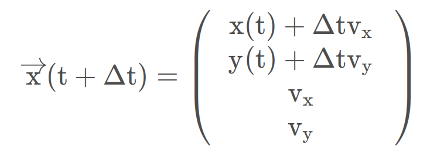

#### CA模型(恒定加速度)(即不考虑加速度)
* 状态空间
$$
\vec{x}(t)=(x, y, v_x, v_y, a_x, a_y)^T
$$

* 矩阵
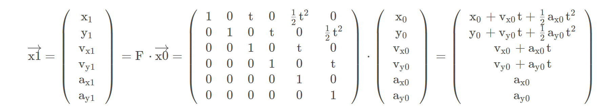

### 非线性模型

#### CTRV模型(恒定转率和速度)
* 前提：假定速度v和偏航角速度ω没有关系
* 优势：CTRV可以预测转弯(CA和CV不行)
* 状态空间
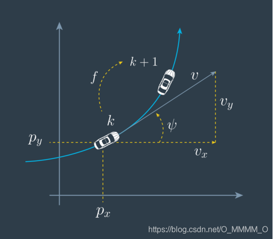
$$
\vec{x}(t)=(p_x, p_y, v, ψ, \dot{ψ})^T \\
or \\
\vec{x}(t)=(x, y, v, θ, ω)^T
$$
   
    p_x, p_y:位置
    v:速度
    ψ:角度 [0,2pi)
    $\dot{ψ}$:偏航角速度
 

* 推导
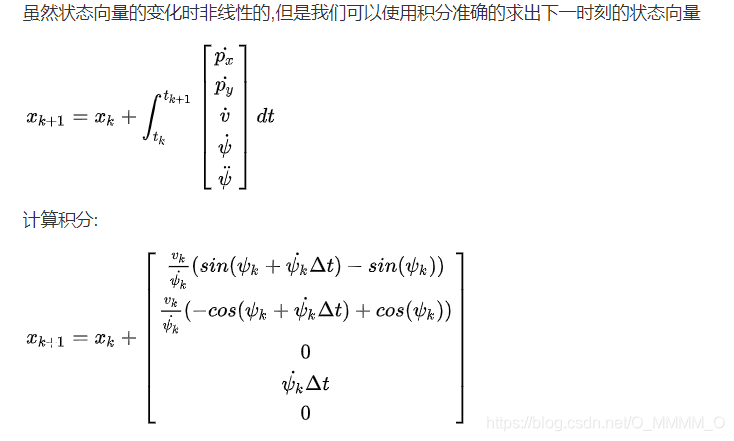
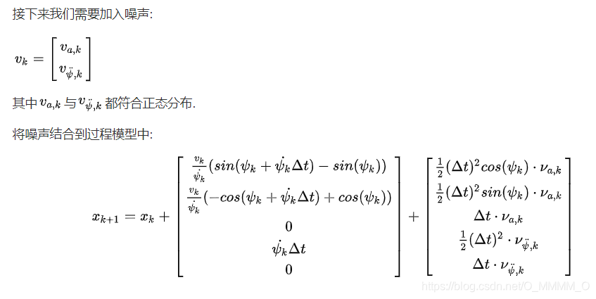

## 测量平差
* 定义：测量平差是测绘学中的核心理论与技术领域，旨在通过数学和统计方法处理带有误差的观测数据，以消除矛盾、优化结果并评估精度。其核心是通过建立数学模型和统计模型，从冗余观测中提取最优估计值。

### 分类 —— 函数模型和随机模型

#### 函数模型
* 定义：描述观测量（如传感器测量值）与未知参数（如系统状态量）之间的数学关系
* 作用：反映了系统的确定性部分

#### 随机模型
* 定义：随机模型描述观测误差和系统噪声的统计特性(如噪声的方差、协方差矩阵等)
* 作用：反映了系统的不确定性和随机性
* 两者关系：函数模型提供系统行为的确定性描述，而随机模型补充了不确定性的统计信息

### 在卡尔曼中的体现
* 动力学方程（状态转移方程）和观测方程均属于函数模型，P和R的确定均为随机模型。
* 卡尔曼滤波通过函数模型预测状态，再通过随机模型调整增益以优化估计

## 历元
* 定义：离散时间处理中的一个关键时间节点(类似于时间戳)，是一个时刻
* 在卡尔曼中：每个历元进行预测和更新

## 滑动窗口滤波

### 定义和原理
* 定义：一种时间域滤波方法，通过对一定数量的连续数据点进行统计处理，来平滑原始信号，减少随机噪声的影响
* 原理：维护一个固定大小的数据窗口，每当有新的数据到来时，移除最旧的数据点，并将新数据点加入窗口中，然后对窗口内的数据进行处理（如求平均）以得到滤波后的输出

# 经典卡尔曼
* 前提：线性高斯系统下
* 通过状态量(上一时刻)和观测量(当前时刻)的加权预测出下一时刻的量
* 预测 + 更新(即量测)
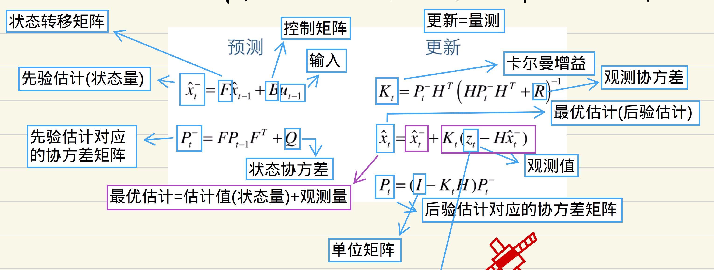
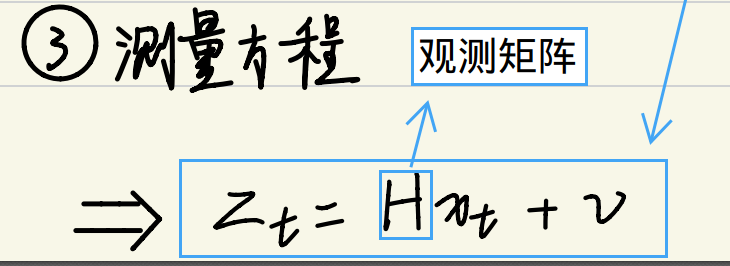
具体看那个pdf

# 扩展卡尔曼

## 目的
解决非线性&非高斯系统下的预测

## 思路
通过局部线性解决全局非线性 -> 在每一次预测和更新时进行泰勒展开

## 方法
使用状态转移矩阵的雅可比矩阵(求偏导)和观测矩阵的雅可比矩阵(求偏导)

## 和经典卡尔曼对比
* 预测

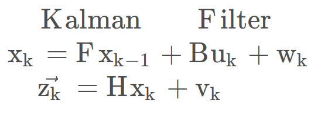
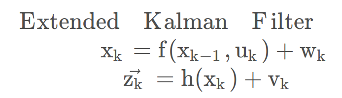

* 更新

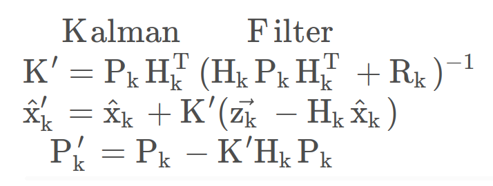
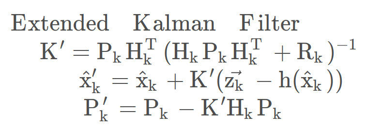

f和h：对应的F(状态转移矩阵)和H(观测矩阵)的雅可比矩阵

# 渐消记忆滤波

## 目的
解决模型不精确或状态突变的场景

## 思路
通过放大历史协方差 $P_{k-1}$​，让滤波器更相信当前的观测值，避免估计滞后或发散

## 方法 —— 引入渐消记忆因子(遗忘因子)s

### 先验协方差修正公式
$$
P_k = A_k s P_{k-1} A_k^T + Q_k
$$

引入 s≥1，放大历史协方差 $P_{k−1}$ ​，使当前预测的 $P_k$ ​更大，最终导致卡尔曼增益 $K_k$ 增大，系统更信任观测量

### s的计算

#### 精确计算
$$
s = max\left\{1, \frac{1}{n}tr(N_k M_k^{-1})\right\}
$$

tr:矩阵求迹

* $ M_k $:预测协方差(预测的不确定性)
$$
M_k = H_k A_k P_{k-1} A_k^T H_k^T
$$
$ H_k(...)H_k^T $:将先验协方差映射到观测空间
**本质：** 若模型精确，$M_k$应接近实际残差协方差；若模型失配，$M_k$会显著小于实际残差协方差 
 

* $ N_k $:残差协方差(实际观测与预测的偏差)
$$
N_k = P_{vk} -H_k Q_k H_K^T - R_k \\
P_{vk}(总残差协方差) = E(V_k V_k^T) (开窗估计法)\\
V_k(预测残差) = A_k x_k - L_k(实际观测值)
$$
**本质**
  * 通过从总残差协方差 $P_{vk}$​ 中扣除已知的噪声($Q_k$​ 和 $R_k$​)，剩余部分即为模型未解释的误差，用于动态调整滤波器权重
  * 相比 $M_k$, $N_k$ 包含了更新的结果
 

* **物理意义** 
  * $ N_k $​ 和 $ M_k $​迹的比值为先验状态协方差矩阵在量测和预测时的比值
  * 当残差协方差 $ N_k $​ 显著大于预测协方差 $ M_k $​，说明模型预测不可靠，需增大 s 以信任观测

#### 简化计算
$$
s = max\left\{1, \frac{tr(N_k)}{tr(M_k)}\right\}
$$

### 残差协方差P~vk~的改进

#### 传统开窗平均估计
$$
P_{vk} = \frac{1}{k}\sum\limits_{i=1}^{k}V_i V_i^T 
$$

#### 指数加权改进
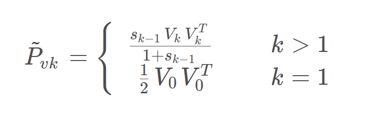
* 效果：对突变更敏感，快速调整协方差估计
 
 

* 强跟踪卡尔曼滤波(即单重渐消记忆因子卡尔曼滤波)
    * 系统在突变后仍能保持稳定跟踪，避免传统滤波器的滞后或发散
    * eg：假设运动状态匀速开始，突然变为加速，此时先验残差增加，自适应因子增加，导致先验P矩阵增加

# 自适应滤波

## 目的
通过自适应因子调节先验P矩阵，平衡历史状态和观测值的权
* Tips:遗忘因子、渐消记忆因子都是自适应因子的一种

$$
P_k = A_k α_k P_{k-1} A_k^T + Q_k
$$

## 误差判别统计量
* 通过构建误差判别统计量估计自适应因子
* 误差判别统计量有状态不符值统计量、速度不符值统计量、预测残差统计量和方差分量比统计量

### 状态不符值统计量
$$
\widehat{x}_k - x_k = (Δ\widehat{x}_1^2 + Δ\widehat{x}_2^2 + ... + Δ\widehat{x}_k^2)^{\frac{1}{2}} \\
Δ\widehat{x}_k(判别统计量) = \frac{\widehat{x}_k - x_k}{\sqrt{tr(P_k)}}
$$

$ \widehat{x_k} $:后验估计
$ x_k $:先验估计

* 分析
  * $ \widehat{x_k} $ 是基于先验估计的
  * 观测量中的参数要多于状态量中的参数
  * $ \widehat{x_k} $ 要尽可能精确，否则统计量 $ Δ\widehat{x_k} $​不能反映动力学模型的误差
  * 统计量 $ Δ\widehat{x_k} $ 反映整体误差，任何状态分量的扰动都将视为整体存在扰动

### 速度不符值统计量

* 相邻历元k~k-1时间内的速度为
  $$
  \dot{\widehat{x}}_k = \frac{\widehat{x}_k - \widehat{x}_{k-1}}{\sqrt{tr(P_k)}}
  $$

* 滤波速度
  $$
  Δ\dot{\widehat{x}_k} = \frac{\dot{\widehat{x}_k} - \dot{x_k}}{\sqrt{tr(P_k)}}
  $$

  $P_k$:对应于 $\dot{\widehat{x_k}}$ 的协方差矩阵

* 分析
  * 若 $Δ\dot{\widehat{x}_k}$ 显著异常，则表明预测速度存在异常，或动力学模型存在较大误差
  * 计算 $Δ\dot{\widehat{x}_k}$ 需要观测量的参数多于状态量

### 预测残差统计量
$$
ΔV_k = (\frac{V_k^T V_k}{tr(P_{vk})})^\frac{1}{2}
$$

* 分析
  * 不需要在滤波前计算状态量
  * 不需要观测量的参数多于状态量
  * 与统计量 $Δ\dot{\widehat{x_k}}$ ​相比，可能含有更多的测量误差(不只是观测误差)

### 方差分量比统计量

* 如果将 $t_k$ ​时刻的观测值 $L_k$ ​和状态先验 $x_k$ ​看成两组观测向量，则他们的方差分量应能反映其相应的观测精度和模型精度(量测与预测)，于是可用方差分量比构造误差判别统计量。
  $$
  \widehat{σ}_{vk}^2 = \frac{V_k^T P_k V_k}{r_k} \\
  \widehat{σ}_{xk}^2 = \frac{V_{xk}^T P_{xk} V_{xk}}{r_x}
  $$

  $\widehat{σ}_{vk}$:观测值 $L_k$ 的方差分量
  $\widehat{σ}_{xk}$:先验估计 $x_k$ 的方差分量
  $r_k$:观测值的冗余数目
  $r_x$:先验值的冗余数目
  $V_k$:k时刻观测值的残差向量
  $V_{xk}$:k时刻先验估计的残差向量 &emsp; $ V_{xk} = \widehat{x}_k - x_k $
 

* 模型误差统计量
$$
S_k = \frac{\widehat{σ}_{vk}^2}{\widehat{σ}_{xk}^2} ≈ \frac{V_{xk}^T P_{xk} V_{xk}}{r_x \widehat{σ}_{vk}^2}
$$

* 分析
  * 计算 $S_k$ 需要冗余观测，否则统计量不能有效反应模型误差
  * $V_k = V_{xk}$ (均对应相同的后验估计 $\widehat{x}_k$)
  * 若采用迭代计算 $S_k$，则计算量稍大于 $Δ\dot{\widehat{x}_k}$ 和 $Δ\dot{\widehat{V}_k}$ 

## 自适应因子

### 三段式自适应因子
$$
α_k=\left\{
\begin{matrix}
 1 & Δx_k ≤ c_0  \\
 \frac{c_0}{Δx_k} (\frac{c_1 - |Δx_k|}{c_1 - c_0})^2 & c_0 ≤ Δx_k ≤ c_1 \\
 0 & Δx_k > c_1
\end{matrix}
\right.
$$

$c_0$: 常数，取值范围 [1.0, 1.5]
$c_1$: 常数，取值范围 [3.0, 8.0]

* 分析
  * $Δx_k ≤ c_0$: $α_k=1$(完全信任模型)，模型预测误差较小，滤波完全依赖动力学模型，观测数据仅用于微调。
  * $c_0 ≤ Δx_k ≤ c_1$: (逐步降低模型权重)，在误差中等时平滑过渡
  * $Δx_k > c_1$: $α_k=0$(完全舍弃模型)，模型预测严重失配，完全依赖观测量修正

### 二段式自适应因子
$$
α_k=\left\{
\begin{matrix}
 1 & Δx_k ≤ c  \\
 \frac{c}{Δx_k} & Δx_k > c
\end{matrix}
\right.
$$

$c$: 常数，取值范围 [1.0, 2.5]

* 相比于三段式自适应因子，二段式自适应因子永不为0，即状态量会影响后验估计，其影响程度的减小缓于三段式。

### 指数函数表示的自适应因子
$$
α_k=\left\{
\begin{matrix}
 1 & Δx_k ≤ c  \\
 e^{-(Δx_k - c)^2} & Δx_k > c
\end{matrix}
\right.
$$

$c$: 也为常数

### 选权法表示的自适应因子
$$
α_k=\left\{
\begin{matrix}
 1 & Δx_k ≤ c  \\
 0 & Δx_k > c
\end{matrix}
\right.
$$

# Sage-Husa自适应滤波 —— 开窗法(滑动窗口)

## 两种残差向量 —— 观测残差向量和预测残差向量(新息向量)
$$
\widehat{V}_k = z_k - H_k \widehat{x}_k \\
V_k = z_k - H_k x_k
$$

$\widehat{V}_k$: 观测残差向量(基于后验估计)，观测值 - 后验估计产出的误差
$V_k$: 新息向量(预测残差向量)(基于先验估计)(未经过观测值修正)，观测值 - 先验估计产出的误差，更能反映系统的扰动误差

* 两者关系
$$
\widehat{V}_k = (I - H_k K_k)V_k
$$

* 两个向量对应的协方差矩阵
$$
\widehat{P}_{\widehat{V}_k} = R_k - H_k \widehat{P}_k H_k^T \\
P_{V_k} = R_k + H_k \widehat{P}_k H_k^T
$$
  * 观测协方差 $\widehat{P}_{\widehat{V}_k}$ :由于经过了卡尔曼更新(卡尔曼更新公式中两者为负相关)，所以是减号
  * 预测协方差 $P_{V_k}$ :观测噪声和预测误差互相独立，所以是加号

## 观测噪声协方差矩阵$R_k$的开窗估计
可采用预测残差向量or观测残差向量两种方式估计

### 预测残差向量开窗估计法
$$
P_{V_k} = \frac{1}{N}\sum\limits_{j=0}^{N}V_{k-j} V_{k-j}^T
$$

* $t_k$ 时刻的观测协方差矩阵为
$$
R_k = P_{V_k} - H_k P_k H_k^T
$$

### 观测残差向量开窗估计法
$$
P_{\widehat{V}_k} = \frac{1}{N}\sum\limits_{j=1}^{N+1}\widehat{V}_{k-j} \widehat{V}_{k-j}^T
$$

* $t_k$ 时刻的观测协方差矩阵为
$$
R_k = P_{\widehat{V}_{k-1}} - H_{k-1} \widehat{P}_{k-1} H_{k-1}^T
$$

* 协方差矩阵 $R_k$ 解释
  * 预测残差是基于先验估计，所以下标均为k
  * 观测残差是基于后验估计，拿不到当前时刻的后验估计，所以只能拿前N个历元估计当前时刻的后验估计，所以下标为k-1
 

* 分析
  * 预测残差开窗中包含历史状态的误差(因为是基于先验估计)。若 $x_k$ 误差越大，则 $V_k$ 误差越大，算出的 $R_k$ 稳定性越差
  * 预测残差开窗中的预测协方差 $H_k P_k H_k^T$ 可能过大，导致出现负定现象(即 $R_k$ 失去正定性 即 $R_k$ 中出现负数)，没有意义(现实中噪声方差是不可能为负的)
  * 两种方法都是对前N个历元观测信息进行了平均，要求当前时刻观测环境要与历史的N个观测环境一致(这种自适应估计，很难真正实现‘自适应’)
  * 两种方法都要求矩阵同类别、同分布、同维度

## 动态模型噪声矩阵(状态协方差)$Q_k$的开窗估计

$$
P_{V_{x_k}} = K_k P_{V_k} K_k^T
$$

* 推导
  $$
  V_{x_k} = -K_k V_k \\
  P_{V_i} = \frac{1}{N} \sum\limits_{j=0}^{N}i V_i V_i^T
  $$

