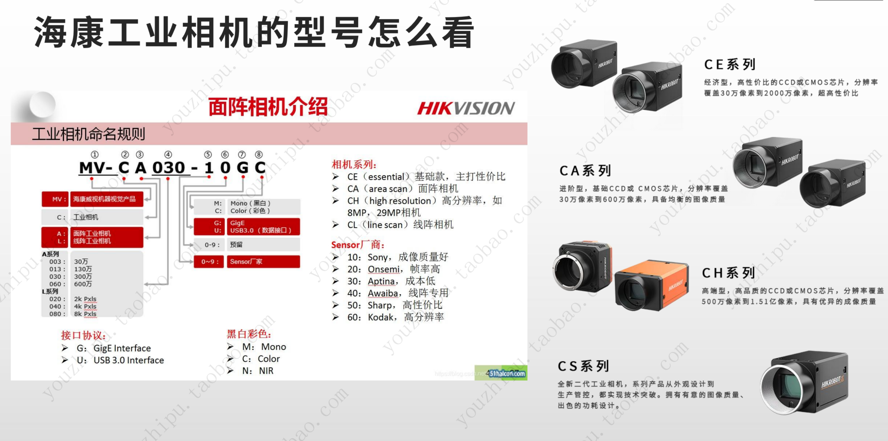
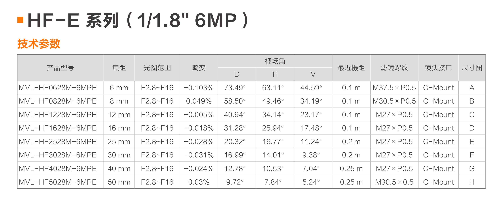

### 相机参数
团队用的相机：CS016-10UC(旧:CA016-10UC)

### 镜头参数
团队用的镜头：mvl-hf系列

MVL-HF0628-6MPE：
* MVL：
* HF：
* 06：焦距为 6mm
* 28：最大光圈为2.8
* 6MPE：素级别为 600 万像素，能够配合 600 万像素的相机使用

Tips：一般通过相机选镜头，的海康官网有在线选镜头（把相机型号输进去会自动匹配出对应的合适的镜头）

